# StockSage

StockSage 是一个本地可运行的 AI 股票研究工作台，采用“模型做受约束决策、后端确定性执行”的混合架构，整合多 Agent 分析、SEC 财报 RAG、市场数据工具和可追踪的后台研究任务。

> 仅用于学习、研究和工程演示，不构成投资建议；IBKR 集成始终保持只读。

## 核心能力

- **上下文意图识别与多 Agent 研究**：结合最近 3 轮对话、LLM、Embedding 与高精度规则，直接选择受控的五类研究路由；MARKET、FUNDAMENTALS、NEWS 路线由后端先确定性取证，再交给无工具领域 Agent 归纳。DEEP 模式要求 Bull/Bear 提交绑定 Evidence ID 的结构化论点；每轮并行完成后，Research Manager 严格判断 `CONTINUE` 或 `STOP`，自适应决定是否继续，服务端只保留 5 轮硬上限，不设置默认轮数或非法输出 fallback。随后由 Manager 匿名逐论点评分、Java 策略锁定评级，再解释裁决并接受运行时 Harness 验收。
- **可溯源 RAG**：SEC EDGAR 财报经过 Parent-Child 分块、Milvus 向量与 Lucene 标准 BM25 混合检索、RRF 融合和 rerank 后，为回答提供编号引用。SQL 镜像决定可引用的正文与版本；来源替换、失败清理和历史数据处理见[发布契约](docs/reviews/2026-09-14-code-audit.md#rag-来源发布与清理)。
- **受控 Skill 与工具**：Skill 当前只接受 `INLINE_DETERMINISTIC` 的 `CAPABILITY` 步骤，按后端 allowlist、预算和 fallback 执行，不承载 Agent、最终回答或后台任务；模型不能调用写入知识库的工具。
- **后台研究任务**：Redis Stream、MySQL checkpoint 与 SSE 回放支持后台执行、断线恢复和进度追踪；证据不足时返回 `NOT_RATED`。
- **投研工作台**：提供自选股、K 线、单标的与事件研究、报告版本/审核，以及 IBKR 只读持仓诊断；多标的对比在真实执行器完成前明确标记为未开放。
- **质量评估**：Trace 分开记录技术状态和业务 Task Outcome，并提供检索评估、RAGAS、Agent golden set 与可选 Phoenix trace；普通路线的参数传递、证据验收、上下文预算及真实 API 评估见[执行说明](docs/architecture/ordinary-agent-execution.md)。缺少标签时 Task Success 和 Tool Call F1 显示 `NO_DATA`，不按 0 或 PASS 处理。

## 架构

```mermaid
flowchart LR
    UI["Vue Chat / Workbench"] --> API["Spring Boot Backend"]
    API --> INTENT["Intent Recognition<br/>LLM + Embedding + Pattern"]
    HISTORY["Recent 3 Turns"] --> INTENT
    INTENT -->|validated targetRoute| CO["Coordinator"]
    INTENT -->|DIRECT / FUNDAMENTALS + resolvedQuery| RAG["Hybrid RAG"]
    RAG -->|ragHitCount| CO
    CO --> PLAN["RoutePlanCatalog<br/>server-owned actions"]
    PLAN --> EVIDENCE["Server-owned read-only evidence"]
    EVIDENCE --> AG["No-tool Specialist Agents"]
    PLAN --> DEEP["DEEP Research"]
    EVIDENCE --> DATA["FastAPI Data Service"]
    AG --> ANSWER["No-tool Final Answer"]
    RAG --> ANSWER
    RAG --> STORE["Milvus + Lucene BM25<br/>(MySQL source)"]
    DEEP --> QUEUE["Redis Stream"]
    QUEUE --> WORKER["Research Worker"]
    WORKER --> SNAP["Evidence Snapshots<br/>stable Evidence IDs"]
    SNAP --> DEBATE["Structured Bull / Bear<br/>THESIS + REBUTTAL"]
    DEBATE --> CONTROL["Manager CONTINUE / STOP<br/>after each round"]
    CONTROL -->|CONTINUE, hard cap 5| DEBATE
    CONTROL -->|STOP or hard cap| SCORE["Manager Blind Scoring<br/>per thesis"]
    SCORE --> DECIDE["Java DecisionPolicy<br/>locked verdict"]
    DECIDE --> REPORT["Manager Narrative + Harness"]
    REPORT --> DB["MySQL Checkpoints / Reports"]
```



| 目录 | 技术与职责 |
|---|---|
| `stocksage-backend` | Java 17、Spring Boot、Spring AI / Spring AI Alibaba；对话、Agent、RAG、任务和报告 |
| `stocksage-data-service` | Python、FastAPI；行情、指标、新闻、EDGAR 与 XBRL 数据 |
| `stocksage-frontend` | Vue 3、Vite、Element Plus；Chat 与 Workbench |
| [evals](evals/README.md) | 财报入库工具、评测数据与历史报告；离线评测脚本已移除 |

运行依赖 MySQL、Redis 和 Milvus；本地 embedding 默认使用 Ollama `bge-m3`。

## 快速启动

准备 JDK 17+、Python 3.11+、Node.js 20+、Docker Desktop、Milvus standalone Compose 和 DashScope API Key。

### 1. 配置

```powershell
git clone https://github.com/Tancaject/StockSage.git
cd StockSage

Copy-Item .env.example .env
Copy-Item stocksage-backend\src\main\resources\application-local.properties.example `
  stocksage-backend\src\main\resources\application-local.properties
```

在 `application-local.properties` 中填写 DashScope API Key 和 MySQL 密码。真实密钥只放在环境变量或本地配置中；使用管理、入库或评估接口时，还需设置 `STOCKSAGE_ADMIN_TOKEN`。

启用 Phoenix 后默认只导出步骤类型、文本长度、计数、耗时与 traceId，不导出用户 ID、会话 ID 或正文。需要查看问题、工具结果和路由说明原文时，显式设置 `STOCKSAGE_PHOENIX_CAPTURE_CONTENT=true`；这些内容可能包含用户隐私，会写入所配置的观测服务。选项统一见[后端配置](stocksage-backend/src/main/resources/application.properties)。

### 2. 启动基础设施

```powershell
.\infra.ps1 up -MilvusComposePath "D:\path\to\milvus\docker-compose.yml"
```

### 3. 启动三个服务

分别在三个 PowerShell 窗口运行：

```powershell
# Data service (:8001)
cd stocksage-data-service
python -m venv .venv
.\.venv\Scripts\Activate.ps1
pip install -r requirements.txt
uvicorn main:app --port 8001 --reload
```

```powershell
# Backend (:8080)
cd stocksage-backend
.\mvnw.cmd spring-boot:run
```

```powershell
# Frontend (:5173)
cd stocksage-frontend
npm install
npm run dev
```

打开 [Chat](http://localhost:5173) 或 [Workbench](http://localhost:5173/workbench)。演示账号：`demo@stocksage.local` / `demo1234`。Data service OpenAPI 位于 [http://localhost:8001/docs](http://localhost:8001/docs)。
