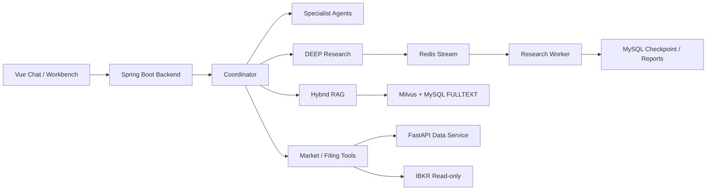

# StockSage

StockSage 是一个面向股票研究场景的 AI 投研工作台，将多 Agent 分析、SEC 财报 RAG、市场数据工具和可追踪的后台研究任务整合在一个本地可运行系统中。

> 本项目仅用于学习、研究和工程演示，不构成投资建议。IBKR 集成保持只读，不提供下单、撤单或改单能力。

## 核心能力

- **多 Agent 研究**：Coordinator 将问题路由到行情、基本面、新闻和深度研究路径；DEEP 模式由 Bull Researcher、Bear Researcher 与 Research Manager 生成结构化报告。
- **运行时完成 Harness**：DEEP 研究使用结构化 Evidence Ledger、确定性证据/报告门、有限定向恢复和可持久化业务终态，证据不足时明确“暂不评级”，不伪装成 HOLD。
- **可溯源 RAG**：支持 SEC EDGAR 财报入库、Parent-Child 分块、向量与关键词混合检索、RRF 融合、rerank 和引用追踪。
- **可靠的后台任务**：Redis Stream 驱动深度研究，MySQL checkpoint 支持阶段恢复，SSE 支持实时进度与断线回放。
- **投研工作台**：提供自选股、K 线、事件分析、对比研究、报告版本和 IBKR 只读持仓诊断。
- **质量与可观测性**：统一记录模型、工具和研究链路，配套 golden set、检索评估、RAGAS 与可选 Phoenix trace。

## 系统架构



### 研究链路

1. 前端通过 `POST /api/chat/stream` 提交问题并消费 SSE。
2. Coordinator 选择 `DIRECT`、`MARKET`、`FUNDAMENTALS`、`NEWS` 或 `DEEP` 路径。
3. 普通路径预取工具与 RAG 证据后生成回答；DEEP 路径提交后台研究任务。
4. 后台 worker 完成证据收集、多空辩论、综合和报告持久化。
5. 前端通过 trace 和任务事件流展示进度、来源与最终结论。

## 技术栈

| 模块 | 技术 |
|---|---|
| Frontend | Vue 3、Vite、Element Plus |
| Backend | Java 17、Spring Boot、Spring AI / Spring AI Alibaba |
| Data Service | Python、FastAPI、AKShare、BaoStock、SEC EDGAR |
| Storage | MySQL、Redis、Milvus |
| Local AI / Evaluation | Ollama `bge-m3`、RAGAS、Phoenix |

## 项目结构

| 目录 | 职责 |
|---|---|
| `stocksage-backend` | 对话、Agent 编排、RAG、后台研究、报告与用户数据 |
| `stocksage-data-service` | 行情、技术指标、新闻、EDGAR、XBRL 与文档解析 |
| `stocksage-frontend` | Chat 与 Workbench 用户界面 |
| `rag-eval` | 检索和回答质量评估 |
| `sql` | 数据库初始化与历史迁移 |

## 快速启动

### 环境要求

- JDK 17+
- Python 3.11+
- Node.js 20+
- Docker Desktop
- 可用的 Milvus standalone Compose 配置
- DashScope API Key

### 1. 克隆并准备配置

```powershell
git clone https://github.com/Tancaject/StockSage.git
cd StockSage

Copy-Item .env.example .env
Copy-Item stocksage-backend\src\main\resources\application-local.properties.example `
  stocksage-backend\src\main\resources\application-local.properties
```

在 `application-local.properties` 中设置 DashScope API Key 和 MySQL 密码。真实密钥不要提交到仓库。

### 2. 启动基础设施

`infra.ps1` 负责启动 MySQL、Redis、Ollama，并复用已有 Milvus Compose：

```powershell
.\infra.ps1 up -MilvusComposePath "D:\path\to\milvus\docker-compose.yml"
.\infra.ps1 status -MilvusComposePath "D:\path\to\milvus\docker-compose.yml"
```

新数据库执行：

```powershell
cmd /c "mysql -u root -p < sql\init.sql"
```

### 3. 启动应用服务

分别打开三个 PowerShell 窗口：

```powershell
# Data service
cd stocksage-data-service
python -m venv .venv
.\.venv\Scripts\Activate.ps1
pip install -r requirements.txt
uvicorn main:app --port 8001 --reload
```

```powershell
# Backend
cd stocksage-backend
.\mvnw.cmd spring-boot:run
```

```powershell
# Frontend
cd stocksage-frontend
npm install
npm run dev
```

### 4. 访问应用

| 页面 | 地址 |
|---|---|
| Chat | [http://localhost:5173](http://localhost:5173) |
| Workbench | [http://localhost:5173/workbench](http://localhost:5173/workbench) |
| Backend health | [http://localhost:8080/actuator/health](http://localhost:8080/actuator/health) |
| Data service docs | [http://localhost:8001/docs](http://localhost:8001/docs) |

演示账号：`demo@stocksage.local` / `demo1234`

## 核心 API

| Endpoint | 说明 |
|---|---|
| `POST /api/chat/stream` | SSE 流式对话与研究执行 |
| `GET /api/research-tasks/{taskId}/events` | 后台研究任务事件流 |
| `GET /api/workbench/stocks/{ticker}/cockpit` | 股票驾驶舱聚合数据 |
| `POST /api/docs/edgar/ingest` | SEC 财报入库 |
| `GET /api/trace/{traceId}` | 研究链路追踪 |

`/api/docs/**`、`/api/eval/**` 等管理接口需要 `X-StockSage-Admin-Token`。后端不再提供可预测的默认 token；启动前必须显式设置 `STOCKSAGE_ADMIN_TOKEN`，未配置或将 `STOCKSAGE_ADMIN_ENABLED=false` 时管理接口会 fail-closed 并返回 `503`。Data service 的完整 OpenAPI 文档由 FastAPI 提供。

## RAG 管线

```text
SEC / 本地文档
  -> 幂等检查与 Parent-Child 分块
  -> Ollama bge-m3 embedding
  -> Milvus vector search + MySQL FULLTEXT
  -> RRF 融合与 DashScope rerank
  -> parent 上下文扩展
  -> 带编号引用的回答
```

默认 embedding 维度为 `1024`。切换 embedding provider 或向量维度后，需要重建 Milvus collection 并重新入库。

完整的 golden set、评估命令和质量 gate 见 [RAG_EVALUATION.md](RAG_EVALUATION.md)。

## 验证

推荐使用统一检查入口：

```powershell
.\init.ps1 -Mode fast
```

它会依次运行 backend 测试、frontend 构建和 Python compile smoke。单模块验证：

```powershell
.\init.ps1 -Mode backend
.\init.ps1 -Mode frontend
.\init.ps1 -Mode python
```

完整 RAG 评估需要 backend、data-service、MySQL、Redis、Milvus 和 Ollama 全部运行。

Harness 的离线规则门禁与真实 DEEP 链路分开执行：

```powershell
# 生产 Java Policy 的固定 golden set
python rag-eval\run_harness_eval.py --fail-on-gate

# backend/data-service/MySQL/Redis/Milvus 与模型配置可用时
python rag-eval\run_harness_live_eval.py --fail-on-gate
```

离线集包含 80 个语义唯一的生产 Policy 场景（Evidence 48、Report 32），精确校验
outcome、违规码、恢复动作和是否允许评级；少于 60 条、覆盖矩阵不完整、fixture 重复
或数据集 hash 缺失都会使门禁失败。

在线结果写入忽略目录 `rag-eval/results/`，只保留脱敏后的任务终态、Harness
decision、恢复次数、工具动作名称与耗时，不保存回答正文、证据正文或凭据。需要把两层
Harness 结果并入统一 Agent Eval 时，分别传入 `--harness` 和 `--harness-live`。

## 设计文档

- [RAG 评估与质量门禁](RAG_EVALUATION.md)
- [DEEP 后台任务设计决策](docs/superpowers/specs/2026-07-09-ws1-decisions.md)
- [身份与数据隔离设计](docs/superpowers/specs/2026-07-04-identity-multitenancy-design.md)
- [投研运行时 Harness 设计与实施计划](docs/architecture/research-harness-design.md)

## 能力边界

- A 股 K 线和技术指标优先使用 AKShare，必要时降级到 BaoStock；部分财务与板块能力仍依赖 BaoStock 可用性。
- 美股实时行情与持仓诊断依赖本地 IBKR Client Portal Gateway，且始终保持只读。
- 完整 RAG 与后台研究依赖本地基础设施和模型服务；外部数据源不可用时会明确降级，不伪造结果。
- 本项目聚焦研究辅助和工程实践，不面向真实交易或生产级高并发部署。
