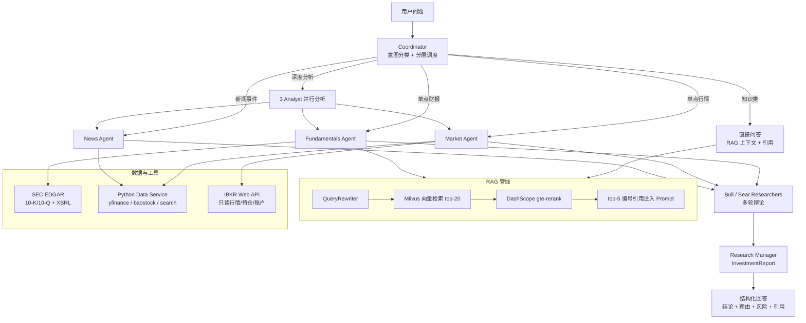

# StockSage 交付材料

## 架构图

## 简历项目描述

**StockSage - 多 Agent 智能投研助手**

基于 Spring Boot、Spring AI、FastAPI、Milvus、Redis、MySQL 和 DashScope 构建面向美股投研场景的多 Agent AI 助手。系统通过 Coordinator 对用户问题进行分层调度，区分知识问答、单点行情、SEC 财报分析、新闻事件分析和深度投资研究；深度分析路线由 Fundamentals、Market、News 三个 Analyst 生成报告，再由 Bull/Bear Researcher 进行多轮辩论，最终由 Research Manager 输出结构化 InvestmentReport。

核心能力包括 SEC EDGAR 10-K/10-Q 财报接入、XBRL 结构化财务数据、Query Rewriting、Milvus 向量检索、DashScope gte-rerank、带 `[1]` 引用溯源的 RAG prompt 注入、SSE 流式对话、工具调用 trace、Redis 短期记忆、MySQL 长期画像和 IBKR Web API 只读账户/行情能力。项目重点解决金融问答中“数据新鲜度、事实可追溯、多步骤分析可观测、复杂问题分层调度”的工程问题。

## 面试高频问答素材

### 1. 为什么不用单 Agent 直接回答？

单 Agent 容易在简单问题上过度调用工具，也容易在复杂问题上把行情、财报、新闻和投资判断混在一起。StockSage 先用 Coordinator 分层：概念问题直接回答，单点问题只调对应 Agent，深度投资问题才进入 3 Analyst + Bull/Bear 辩论 + Research Manager 的完整流程。这样可以降低成本、减少无关工具调用，并让复杂分析的中间结果可追踪。

### 2. RAG 为什么要做 Query Rewriting 和 Rerank？

用户问题通常是口语化的，例如“苹果最近风险大不大”，直接向量检索可能召回不稳定。QueryRewriter 会把问题改写为适合检索的关键词组合，例如保留 ticker、公司名、filing type、section、财务术语。随后 Milvus 召回 top-20，再用 DashScope `gte-rerank` 重排取 top-5，兼顾召回率和最终上下文精度。

### 3. 为什么不用 Spring AI 的 RetrievalAugmentationAdvisor？

项目选择手写 RagService，把检索结果作为“参考性 SystemMessage”注入，而不是使用默认 Advisor。原因是 Advisor 的上下文增强策略可能在知识库不足时诱导模型拒答；投研场景还需要综合工具观察、新闻搜索和模型已有金融知识。手写管线能精确控制 query rewrite、topK、rerank、引用格式和 prompt 策略。

### 4. 如何保证回答可追溯？

RAG 注入时每个片段都会编号 `[1]`、`[2]`，并附带来源字段：ticker、filing_type、section、date、title、source。System prompt 明确要求模型在使用片段事实时标注对应编号，避免把未使用的来源硬贴到回答里。Trace 中也记录了召回片段和工具观察，方便事后审计。

### 5. 多 Agent 的状态如何传递？

使用 `AnalysisState` 承载 query、Fundamentals/Market/News 报告、Bull/Bear 论据、debateRounds、citations 和最终 `InvestmentReport`。这避免了把所有中间状态散落在字符串里，也方便后续把每个 Agent 的输出持久化、可视化或接入评估。

### 6. 如何处理最新信息？

系统提示会注入当前日期，工具层会对“最新、近期、今天”等时效问题修正过去年份查询词。News Agent 使用 `searchNews` / `webSearch` 获取最新信息；短期搜索结果可以异步入库并设置 TTL，避免过期新闻长期污染知识库。

## 演示脚本

1. 启动基础服务：MySQL、Redis、Milvus、Python data service、Spring Boot backend、Vue frontend。
2. 打开前端聊天页，先问：“什么是市盈率？” 展示 Coordinator 识别为知识类问题，直接结合 RAG 回答，不进入多 Agent 深度流程。
3. 问：“NVDA 最近 K 线走势如何？” 展示 Market Agent 路由，只调用行情和技术指标相关工具。
4. 问：“苹果最新 10-K 里的风险因素有哪些？” 展示 Fundamentals Agent 路由，触发 SEC EDGAR 财报入库、RAG 检索和 `[1]` 引用。
5. 问：“苹果现在值不值得长期投资？” 展示完整深度链路：Fundamentals / Market / News 三个 Analyst 输出报告，Bull/Bear 多轮辩论，Research Manager 生成 InvestmentReport。
6. 打开 Trace 视图，展示 RAG 召回、工具调用耗时、Agent 辩论步骤和最终 token/耗时摘要。
7. 强调免责声明：所有分析仅供学习和研究参考，不构成投资建议。
