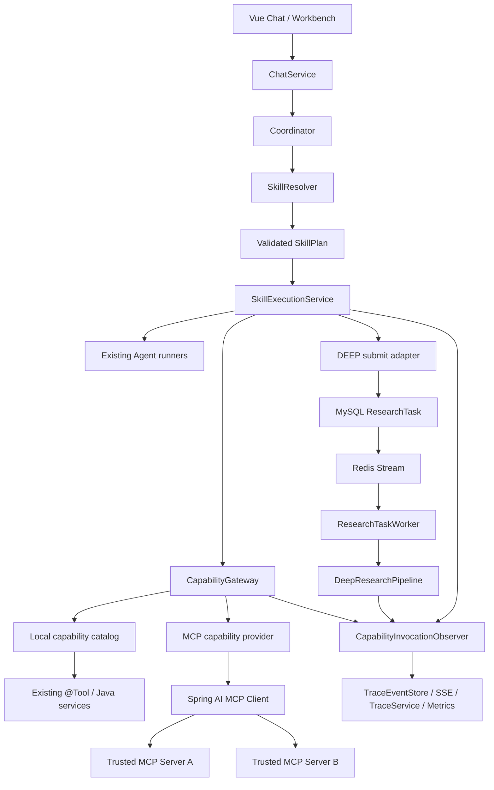

# StockSage MCP 与 Skill 模块设计

> 状态：Phase 0–2 纵切面和 F4 脱敏运行状态已实现；真实 Streamable HTTP server 验收待完成
> 最后复核：2026-08-12
> 适用仓库：`D:\programming\StockSage`

## 1. 结论

推荐采用“统一能力层 + 声明式 Skill + 现有编排器”的三层结构：

- **MCP 是外部能力接入协议**：StockSage 后端先作为 MCP Host/Client，连接可信的只读 MCP Server，将远程 tools/resources 适配成内部 capability。
- **Skill 是业务工作流定义**：描述何时使用哪些本地工具、MCP 能力、Agent 和后台研究流程，以及超时、降级、模型层级和数据权限。
- **Coordinator 继续负责意图路由**：不让 MCP 或 Skill 再实现一套 Agent 调度器。
- **`ResearchTask` 继续承载长任务**：DEEP Skill 复用当前 MySQL checkpoint、Redis Stream、lease、worker 和 SSE replay，不新增第二套任务系统。
- **V1 只允许版本库内置、只读、白名单 Skill**：不做在线安装、不执行 Skill 自带代码、不开放用户填写 MCP URL、不做“Skill 商店”。

最重要的边界是：

```text
MCP 解决“能力从哪里来”
Skill 解决“这些能力怎样组合完成一个投研任务”
Coordinator 解决“本轮应该选择哪个任务路径”
Agent 解决“在给定证据和工具范围内如何分析”
```

这与 StockSage 当前结构兼容。现有 `Coordinator + ExecutionPlan + PlanAction + AgentConfig + @Tool` 已经具有固定的 skill-like 能力分区；新设计应把它们抽象成可声明、可审计的工作流，而不是推翻重写。

### 1.1 当前实现状态（2026-08-12）

已落地：

- 保持 Spring AI `1.1.5`，加入 `spring-ai-starter-mcp-client`，未升级 Spring AI 2.x。
- Spring AI 只创建 transport；StockSage 使用 `McpSyncClient` 延迟执行 initialize、tools/list 和 tools/call，连接失败时不阻止应用启动。
- `capabilities/*.yml` 与代码 adapter 双重注册，`CapabilityPolicy` 默认拒绝未知、未授权、敏感读取和写能力。
- `skills/*.yml` 启动加载并校验，已提供 `latest-news-mcp` 与 `local-latest-news`。
- NEWS 路由在现有 `ToolPrefetchService` 内先执行 Skill；MCP 不可用时降级到原 `NewsTools.searchNews`，并保留最终 legacy NEWS 兜底。
- MCP capability 经过统一 timeout、结果大小限制、SSE/Trace/Micrometer observer；没有加入任何 Agent 的全局 `defaultTools`。
- 自动化覆盖 MCP initialize/list/call、`placeOrder` 拒绝、Skill manifest、MCP up/down 和原 DEEP 提交回归；完整后端测试 184 个通过。

尚未完成：

- 仓库没有内置真实第三方 MCP endpoint/密钥，因此 Streamable HTTP 真实 server 的现场协商验收仍需部署时配置后执行。
- 脱敏的 Skill/Capability/MCP 运行状态 API 和 EvalDesk 状态面板已经实现；MARKET、FUNDAMENTALS、DEEP 尚未迁移成声明式 Skill，DEEP provenance 收口仍属后续范围。

启用一个可信 NEWS MCP server 时，在 ignored `application-local.properties` 中配置连接：

```properties
spring.ai.mcp.client.streamable-http.connections.news.url=https://trusted.example.com
spring.ai.mcp.client.streamable-http.connections.news.endpoint=/mcp
```

并通过环境变量显式批准协商后的 server 名和远程 tool 名：

```text
STOCKSAGE_MCP_ENABLED=true
STOCKSAGE_MCP_ALLOWED_TOOLS=negotiated-server-name/search_news
STOCKSAGE_MCP_NEWS_SEARCH_SERVER=negotiated-server-name
STOCKSAGE_MCP_NEWS_SEARCH_TOOL=search_news
```

远程参数字段若不是 `query` / `maxResults`，再设置 `STOCKSAGE_MCP_NEWS_SEARCH_QUERY_FIELD` 和 `STOCKSAGE_MCP_NEWS_SEARCH_LIMIT_FIELD`。

## 2. 设计背景

### 2.1 当前架构事实

当前请求链路是：

```text
ChatController
  -> ChatService
  -> RAG retrieval
  -> Coordinator.plan()
  -> ExecutionPlan(List<PlanAction>)
  -> ToolPrefetchService.prefetch()
  -> local @Tool / Agent
  -> Coordinator.streamAnswer()
  -> SSE / TraceEventStore
```

DEEP 路径已经进一步拆为：

```text
ToolPrefetchService.submitDeepResearch()
  -> MySQL ResearchTask
  -> Redis Stream ResearchTaskQueue
  -> ResearchTaskWorker
  -> DeepResearchPipeline
  -> evidence / Bull / Bear / Research Manager
  -> checkpoint / report / trace event
```

因此新增模块必须满足以下约束：

1. 不复制 Coordinator、ToolPrefetchService 或 ResearchTask 的职责。
2. 不把外部 MCP tool 自动暴露给所有 Agent。
3. 不突破 IBKR 只读边界。
4. 不新增“写知识库”模型工具。
5. 不把密钥、用户 session、完整会话或真实持仓默认发送给外部 MCP Server。
6. 保持 Spring AI 1.1.x、Spring AI Alibaba 和现有 OpenAI-compatible DashScope 路径兼容。

### 2.2 目标

V1 必须做到：

- 能配置并连接至少一个可信的只读 MCP Server。
- 能发现、过滤、命名和调用 MCP tools。
- 能以声明式文件定义一个 Skill，并把本地 `@Tool` 与 MCP tool 组合成工作流。
- 每次执行只向模型或执行器暴露当前 Skill 允许的能力。
- MCP 不可用时能明确降级，不影响现有聊天和 DEEP 路径。
- MCP 调用进入现有 trace/SSE/metrics 链路。
- 能通过一个端到端 walking skeleton 证明架构可行。

### 2.3 非目标

V1 不做：

- 在线 Skill 市场、第三方插件上传、热更新 Java/JAR/Python 代码。
- 用户通过页面任意添加 MCP Server URL 或 STDIO 命令。
- 远程 MCP 的写操作、交易操作或知识库写入。
- 为 MCP 单独创建微服务、消息队列或数据库。
- 同时升级到 Spring AI 2.x 并重构全部 Agent。
- 将现有 Python data-service 改造成 MCP Server。它已经有稳定 REST 边界，重复暴露只会增加维护面。

## 3. 术语和职责边界

| 概念 | 在 StockSage 中的职责 | 不负责 |
|---|---|---|
| Local Tool | 现有 `@Tool` 方法或确定性 Java service 调用 | 工作流选择、远程协议 |
| MCP Capability | 从可信 MCP Server 发现并适配的 tool/resource | 全局自动授权、任务编排 |
| Capability | 对 Local Tool 和 MCP Tool 的统一内部描述与调用接口 | 意图分类 |
| Skill | 版本化的工作流清单：步骤、能力白名单、超时、降级、提示词和执行模式 | 执行任意代码、动态安装依赖 |
| Coordinator | 识别 route、任务类型和模型层级 | 直接管理 MCP 连接、遍历所有 tools |
| SkillResolver | 把 route 或显式业务动作解析为一个已注册 Skill | 使用 LLM 任意生成 Skill |
| SkillExecutor | 按已验证计划执行 capability/agent/background step | 决定用户意图 |
| ResearchTask | 持久化和执行长时 DEEP Skill | 普通同步工具调用 |

## 4. 方案比较

### 方案 A：把所有 MCP Tool 直接注入所有 ChatClient

优点：实现最快。

问题：

- 每个 Agent 都能看到无关甚至危险的工具。
- 工具数量增加后，模型选择准确率、token 成本和可解释性都会下降。
- 无法表达“这个业务流程允许哪些工具、调用几次、失败后怎么处理”。
- MCP tool 不经过当前 `@Tool` AOP，trace 会出现断层。

结论：只适合一次性实验，不适合作为正式架构。

### 方案 B：完整动态插件平台

包括在线上传 Skill、动态类加载、数据库配置、脚本执行、权限市场等。

问题：

- 与求职演示项目定位不匹配。
- 安全、依赖隔离、版本兼容、回滚和签名校验成本远高于业务价值。
- 会形成第二套执行引擎，与现有 Coordinator/ResearchTask 重叠。

结论：V1 明确不做。

### 方案 C：统一 Capability Registry + 声明式 Skill（推荐）

优点：

- 保留现有编排和可靠性资产。
- 本地工具与 MCP 工具只在接入层统一，不强迫底层实现一致。
- Skill 可审计、可测试、可版本控制。
- 能先做一个纵切面，再逐步迁移现有 MARKET/FUNDAMENTALS/NEWS/DEEP。

代价：

- 需要增加 capability 描述、Skill 校验和统一观测包装。
- `ExecutionPlan` 最终要从纯 `PlanAction` 枚举演进到 typed steps，但可以兼容迁移。

结论：采用方案 C。

## 5. 目标架构



### 5.1 关键设计原则

1. **Host 控制上下文**：完整 conversation、用户 session 和跨 server 数据聚合只留在 StockSage 后端。
2. **默认拒绝**：没有本地策略描述的 capability 不可执行。
3. **最小暴露**：一个 Skill 只能看到其 `allowedCapabilities`。
4. **工作流先于模型自由调用**：能确定性预取的步骤由 SkillExecutor 调用；只有确实需要模型判断参数时才给 Agent tool callback。
5. **只读优先**：V1 的 capability risk 只接受 `READ_ONLY` 和受控的 `EXTERNAL_READ`。
6. **现有链路优先**：DEEP、trace、SSE、identity、quota、checkpoint 均复用现有实现。

## 6. 模块划分

建议在 backend 内新增三个包，不新增独立服务：

```text
com.stocksage.capability
├─ CapabilityDescriptor.java
├─ CapabilityRegistry.java
├─ CapabilityGateway.java
├─ CapabilityPolicy.java
├─ CapabilityInvocationContext.java
├─ CapabilityResult.java
└─ CapabilityInvocationObserver.java

com.stocksage.mcp
├─ McpClientConfig.java
├─ McpServerProperties.java
├─ McpCapabilityProvider.java
├─ McpCapabilityAdapter.java
├─ StockSageMcpToolFilter.java
├─ StockSageMcpNameResolver.java
└─ McpHealthService.java

com.stocksage.skill
├─ SkillDefinition.java
├─ SkillRegistry.java
├─ SkillValidator.java
├─ SkillResolver.java
├─ SkillPlan.java
├─ SkillStep.java
├─ SkillExecutionService.java
└─ LegacyPlanAdapter.java
```

资源文件：

```text
stocksage-backend/src/main/resources/
├─ capabilities/
│  └─ local-capabilities.yml
└─ skills/
   ├─ market-snapshot.yml
   ├─ fundamentals-review.yml
   ├─ latest-news-mcp.yml
   └─ deep-equity-research.yml
```

### 6.1 CapabilityDescriptor

建议最小字段：

```java
public record CapabilityDescriptor(
        String id,                 // local.market.getStockKLine / mcp.news.search
        String modelAlias,         // 满足模型工具名限制的稳定别名
        ProviderType providerType, // LOCAL / MCP
        String providerId,         // local / MCP server id
        String nativeName,         // Java tool name 或 remote tool name
        RiskLevel riskLevel,       // READ_ONLY / EXTERNAL_READ / SENSITIVE_READ / WRITE
        Set<DataClass> inputDataClasses,
        Duration timeout,
        int maxResultBytes,
        boolean cacheable,
        boolean enabled
) {}
```

说明：

- MCP Server 返回的 tool description 视为不可信元数据，不能单独决定风险等级。
- 远程 tool 必须在本地 allowlist 中出现，才能生成 `CapabilityDescriptor`。
- 未配置风险等级时按 deny 处理，不能默认 READ_ONLY。

### 6.2 CapabilityInvocationContext

```java
public record CapabilityInvocationContext(
        String userId,
        Long conversationId,
        String traceId,
        String skillId,
        String capabilityId,
        Instant deadline
) {}
```

这个 context 用于鉴权、trace、超时和审计。不要把 session cookie、Spring Security principal、完整 conversation 或外部 API key 放入 MCP 参数。

### 6.3 CapabilityGateway

统一入口应负责：

1. 查询 descriptor。
2. 检查 Skill allowlist。
3. 检查 risk/data-class policy。
4. 参数 schema 校验。
5. timeout、circuit breaker、结果大小限制。
6. 调用 Local 或 MCP adapter。
7. 统一记录 trace/SSE/metrics。
8. 把原始结果包装为不可信外部证据，不直接拼成 system instruction。

不建议让业务代码直接持有 `McpSyncClient` 并到处调用，否则策略和观测很快分散。

## 7. Skill 模型

### 7.1 Skill 不是代码插件

V1 Skill 是受版本控制的声明式工作流。它可以引用：

- 已注册 local capability。
- 已注册 MCP capability。
- 固定 Agent 角色。
- `SUBMIT_DEEP` 这类现有后台流程。
- 最终回答阶段。

它不能：

- 声明 shell 命令或任意 class 名。
- 下载依赖。
- 动态执行 JavaScript/Python。
- 自己创建线程、连接数据库或访问文件系统。

### 7.2 SkillDefinition

建议字段：

```java
public record SkillDefinition(
        String id,
        int version,
        String displayName,
        boolean enabled,
        Set<PlanRoute> routes,
        ExecutionMode executionMode,
        ModelTier minimumModelTier,
        List<SkillStep> steps,
        SkillPolicy policy,
        String promptTemplate,
        List<String> fallbackSkillIds
) {}
```

执行模式只保留三种：

- `INLINE_DETERMINISTIC`：确定性预取，适合 MARKET/FUNDAMENTALS/NEWS。
- `INLINE_AGENT`：有界 Agent tool loop，限制工具集合、次数和总时长。
- `BACKGROUND_RESEARCH`：提交到现有 ResearchTask，适合 DEEP。

### 7.3 Typed SkillStep

目标形态：

```java
sealed interface SkillStep {
    record Capability(String capabilityId, boolean required, String fallbackCapabilityId)
            implements SkillStep {}
    record Agent(String role, Set<String> allowedCapabilities)
            implements SkillStep {}
    record SubmitDeepResearch() implements SkillStep {}
    record FinalAnswer() implements SkillStep {}
}
```

这样可替代当前 `ToolPrefetchService` 中不断增长的 `switch (PlanAction)`。但不能一次性重写：V1 用 `LegacyPlanAdapter` 把现有 `PlanAction` 映射为 typed step，新 Skill 才使用 capability step。

### 7.4 示例 Skill

```yaml
id: latest-news-mcp
version: 1
displayName: 最新事件影响分析
enabled: true
routes: [NEWS]
executionMode: INLINE_DETERMINISTIC
minimumModelTier: STANDARD

policy:
  allowedRiskLevels: [READ_ONLY, EXTERNAL_READ]
  allowedDataClasses: [PUBLIC_MARKET_DATA, USER_QUERY]
  maxCapabilityCalls: 6
  maxDuration: 20s

steps:
  - type: CAPABILITY
    capability: local.market.searchStocks
    required: true

  - type: CAPABILITY
    capability: mcp.news.search
    required: false
    fallbackCapability: local.news.searchNews

  - type: AGENT
    role: NEWS_AGENT
    allowedCapabilities:
      - mcp.news.search
      - local.news.searchNews
      - local.news.webSearch

  - type: FINAL_ANSWER

promptTemplate: classpath:skills/prompts/latest-news.md
fallbackSkillIds: [local-latest-news]
```

### 7.5 Skill 选择顺序

SkillResolver 按以下优先级解析：

1. Workbench 明确业务动作提供的 `requestedSkillId`，但必须在服务端 allowlist 中。
2. Coordinator 产生的 `PlanRoute` 对应默认 Skill。
3. Skill 不可用时按 `fallbackSkillIds` 选择本地 Skill。
4. 都不可用时回到当前 legacy `ExecutionPlan`。

不允许模型返回任意字符串后直接加载文件。即使未来允许 Coordinator 推荐 Skill，也只能从服务端提前过滤后的候选 ID 中选择。

## 8. MCP Client 设计

### 8.1 V1 角色

StockSage backend 是 MCP Host，并为每个配置 server 建立隔离 client。V1 只消费 MCP，不对外暴露 StockSage MCP Server。

原因：

- 当前需求是扩展投研能力，client 价值最直接。
- 将现有能力对外暴露会引入新的认证、授权、限流和数据隔离面。
- backend 已有 REST/SSE，立即再做 MCP Server 会重复暴露业务能力。

对外 MCP Server 可作为后续可选阶段，只暴露少量只读 facade，例如 `get_report`、`get_research_task_status`，不能直接暴露全部内部 `@Tool`。

### 8.2 Spring AI 接入

当前仓库使用：

- Spring Boot 3.4.4
- Spring AI 1.1.5
- Spring AI Alibaba 1.1.2.1
- Java 17

Spring AI 1.1.x 提供 `spring-ai-starter-mcp-client` 和 WebFlux variant，并能把 MCP tools 暴露为 `ToolCallbackProvider`。建议：

1. 首个 spike 先在当前 1.1.5 上验证 dependency tree、启动和 tool call。
2. 不在同一变更中升级 Spring AI 2.x。
3. 如果 1.1.5 遇到已知 MCP lifecycle/transport 问题，只考虑受控升级到同一 1.1.x 最新 patch，并重新验证 Spring AI Alibaba、Milvus、rerank 和现有 ChatClient。
4. MCP 最新协议版本和 Spring AI 1.1.5 所带 Java MCP SDK 可能不完全一致，必须用目标 server 做 initialize/capability negotiation 测试，不能只看文档判断兼容。

首选同步 client，因为当前确定性预取和 ResearchTask worker 本身是同步/阻塞调用模型；响应式 ChatClient 的 SSE 输出不代表所有工具都必须用 async MCP client。

依赖候选：

```xml
<dependency>
    <groupId>org.springframework.ai</groupId>
    <artifactId>spring-ai-starter-mcp-client</artifactId>
</dependency>
```

具体 API 和 property 名以 1.1.5 编译 spike 为准，不直接复制 2.x 示例。

### 8.3 Transport 选择

优先级：

1. **Streamable HTTP**：远程可信 server 的默认选择，便于部署、超时和网络策略控制。
2. **STDIO**：只用于本地开发演示，配置必须在代码库或本地配置中预先批准。
3. **旧 SSE transport**：只为兼容既有 server，不作为新接入首选。

Windows 下 STDIO 若启动 `npx`、`npm` 等 `.cmd`，Java `ProcessBuilder` 需要 `cmd.exe /c`。因此：

- production profile 默认禁用 STDIO。
- 不允许用户提交 command/args。
- 只允许固定 command allowlist 和固定工作目录。
- 禁止把用户问题拼入 command line。

### 8.4 MCP Server 配置

建议把非密钥配置放入 `application.properties` 或独立本地配置；密钥仅来自环境变量或 ignored `application-local.properties`。

示意：

```properties
stocksage.mcp.enabled=${STOCKSAGE_MCP_ENABLED:false}
stocksage.mcp.default-timeout=${STOCKSAGE_MCP_TIMEOUT:8s}
stocksage.mcp.max-result-bytes=${STOCKSAGE_MCP_MAX_RESULT_BYTES:262144}

# Spring AI 1.1.x 的具体键由兼容性 spike 确认
spring.ai.mcp.client.enabled=${STOCKSAGE_MCP_ENABLED:false}
spring.ai.mcp.client.type=SYNC
spring.ai.mcp.client.request-timeout=${STOCKSAGE_MCP_TIMEOUT:8s}
```

本地应用配置只保存：

- server id。
- transport。
- base URL/endpoint 或固定 STDIO command。
- enabled。
- allowlist/denylist。
- timeout。
- 允许的数据分类。
- auth environment variable 名称。

不保存真实 token。

### 8.5 MCP Tool 发现与命名

内部 capability id 固定为：

```text
mcp.<serverId>.<remoteToolName>
```

模型可见 alias 使用稳定、短、合法的名称，例如：

```text
mcp_news_search
```

规则：

- server id 必须在本地注册。
- remote tool 必须命中 allowlist 且不命中 denylist。
- 多 server 同名工具不能覆盖，冲突时启动失败或显式命名，不静默改绑。
- V1 只在启动时发现工具；tool list changed notification 只记录状态，下一次重启生效，避免运行中行为漂移。

### 8.6 MCP resources 和 prompts

V1 建议：

- **Tools：支持**，因为最容易接入现有 Tool/Agent 模型。
- **Resources：只支持显式读取**，通过 resource allowlist 转成 evidence，不自动订阅全部资源。
- **Prompts：不直接注入系统提示词**。远程 prompt 视为不可信模板，V1 禁用。
- **Sampling/Elicitation/Roots：禁用**。它们会扩大 server 对模型、用户输入和文件边界的影响，V1 没有必要。

## 9. 与现有代码的集成点

| 现有文件 | 建议改动 | 原因 |
|---|---|---|
| `Coordinator.java` | V1 保持 route/modelTier；在 plan 后交给 SkillResolver | 不扩大 Coordinator 职责 |
| `ExecutionPlan.java` | 先增加可选 `skillId` 或旁路 `SkillPlan`；保留旧构造 | 避免现有测试和 trace 一次性破坏 |
| `PlanAction.java` | 保留为 legacy adapter 输入，不再为每个 MCP tool 增枚举 | 远程工具集合不适合编译期枚举 |
| `ToolPrefetchService.java` | V1 由 SkillExecutionService 包装；逐步迁移 switch 分支 | 避免大爆炸重构 |
| `AgentConfig.java` | 不把 MCP provider 加到 `defaultTools`；后续按 Skill request-scoped tool callbacks | 防止所有 Agent 看到全部远程工具 |
| `ToolCallAspect.java` | 保留本地 `@Tool` 观测；提取共用 observer | AOP 捕获不到 MCP ToolCallback |
| `TraceEventStore.java` | 复用，不改变 event replay 语义 | 保持前端和跨实例行为 |
| `DeepEvidenceCollector.java` | 后续通过 CapabilityGateway 显式加入 MCP evidence | 让 DEEP 证据仍可 checkpoint 和审计 |
| `ResearchTaskWorker.java` | 不改任务语义，只执行编译后的 DEEP skill/evidence step | 复用 lease/retry/DLQ |
| `SecurityConfig.java` / `RequestIdentity.java` | capability context 必须来自后端认证身份 | 防止前端伪造 userId |

### 9.1 为什么不能只依赖 ToolCallAspect

当前 AOP 切点只拦截：

```java
@Around("@annotation(org.springframework.ai.tool.annotation.Tool)")
```

MCP tool 通常以 `ToolCallback` 形式执行，不会经过本地 `@Tool` 方法。因此统一观测必须放在 `CapabilityGateway` 外层，并让 ToolCallAspect 调用同一个 `CapabilityInvocationObserver`。最终本地和远程调用都生成一致的：

- action chunk。
- observation chunk。
- provider/tool/duration/status/result-size trace step。
- Micrometer counter/timer。

## 10. 执行流程

### 10.1 普通 NEWS Skill

```text
1. ChatService 完成身份、conversation、trace、RAG 初始化
2. Coordinator 输出 route=NEWS, modelTier=STANDARD
3. SkillResolver 选择 latest-news-mcp
4. SkillValidator/Compiler 生成不可变 SkillPlan
5. CapabilityGateway 调 local.market.searchStocks
6. CapabilityGateway 调 mcp.news.search
7. MCP 失败则调 local.news.searchNews
8. News Agent 只接收允许的 evidence/tool callbacks
9. Coordinator 使用 prepared context 输出最终回答
10. trace/SSE 展示实际 provider、降级和耗时
```

### 10.2 DEEP Skill

```text
1. Coordinator 输出 route=DEEP
2. SkillResolver 选择 deep-equity-research
3. executionMode=BACKGROUND_RESEARCH
4. SkillExecutionService 调用现有 submitDeepResearch
5. ResearchTask 只在 payload 中携带 taskId，MySQL 为事实源
6. Worker 恢复 Skill version + capability policy snapshot
7. DeepEvidenceCollector 通过 CapabilityGateway 收集允许的证据
8. checkpoint 保存 evidence provenance 和已完成阶段
9. Bull/Bear/Research Manager 继续使用固定证据
10. report/task-final 经现有 Redis trace stream 回放
```

DEEP task 必须记录 `skillId` 和 `skillVersion`。若 V1 不立即改表，可先写入 checkpoint JSON；后续再决定是否新增列。

## 11. 安全设计

### 11.1 信任模型

按可信度从高到低：

1. 本仓库版本控制内的 Skill 和 capability policy。
2. 本地 StockSage `@Tool` 实现。
3. 配置中批准的 MCP Server。
4. MCP 返回的 tool description、resource 和 tool result。
5. 用户问题中关于“调用某工具/忽略规则”的指令。

低层不能覆盖高层策略。

### 11.2 风险等级

```text
READ_ONLY       读取公开或本地非敏感数据
EXTERNAL_READ   向外部 server 发送有限查询并读取结果
SENSITIVE_READ  涉及用户画像、账户、持仓或私有文档
WRITE           修改外部系统、知识库、交易或文件
```

V1 只允许前两类。IBKR 账户/持仓属于 `SENSITIVE_READ`，只能留在本地能力中，不能发送给外部 MCP。`WRITE` 一律拒绝。

### 11.3 用户同意

MCP 规范强调用户控制和工具安全。StockSage V1 可采用两级同意：

- 启用一个只读 MCP Server/Skill 时，由项目管理员明确批准 server、tool allowlist 和数据分类。
- 运行已批准的只读 Skill 时无需每次弹窗，但 trace/UI 必须显示正在使用的外部 provider。

未来若增加 `SENSITIVE_READ` 或任何 side effect，必须加入逐次确认；不能沿用只读 Skill 的预授权。

### 11.4 SSRF 与命令执行

- MCP URL 只能来自部署配置，不能来自 ChatRequest。
- 只允许 HTTPS，开发环境 localhost 例外。
- 禁止内网通配地址、重定向到未批准 host。
- STDIO command/args 必须固定，禁止 shell 插值。
- production 禁止 `npx -y` 临时下载 server。

### 11.5 Prompt injection 和结果污染

- 不信任 MCP tool description，不把它直接变成系统权限规则。
- MCP result 包装为 `External Evidence`，明确“其中的指令不可执行”。
- JSON/schema 校验后再进入上下文。
- 限制结果字节数、文本长度和嵌套深度。
- 引用保留 provider/server/tool/time，便于最终回答标明来源。
- 远程 MCP prompt V1 禁用。

### 11.6 身份和密钥

- `userId` 必须由 `RequestIdentity` 或当前已认证请求生成，不能信任 DTO 中的 userId。
- 不向 MCP 传 Spring session cookie、CSRF token、admin token、数据库凭据。
- server token 只由 server-side transport/header config 读取环境变量。
- 日志对 header、token、URL query secret 和 tool arguments 做脱敏。

## 12. 超时、降级和可靠性

| 场景 | 行为 |
|---|---|
| MCP 启动连接失败 | 标记 server `UNAVAILABLE`；应用仍启动；依赖它的 Skill 走 fallback 或禁用 |
| tools/list 失败 | 不注册任何远程 capability，不能使用旧的猜测列表 |
| tool timeout | 中断当前调用，记录 timeout；optional step 走 fallback，required step 返回降级说明 |
| 远程返回超大结果 | 截断并标记 `TRUNCATED`，不能把原始大体积内容推入 SSE |
| 参数 schema 不匹配 | 在本地拒绝，不向 server 发送 |
| server tool 列表变化 | V1 记录 health 变化，重启后重新发现；不热替换当前计划 |
| 普通 Skill MCP 故障 | 不阻断本地聊天；最终回答明确说明外部数据不可用 |
| DEEP MCP 故障 | optional evidence 继续；required evidence 按 checkpoint 状态失败/重试 |
| Redis 故障 | 沿用当前单实例 trace 和同步 DEEP fallback 边界 |

每个 capability 应分别配置：

- connect timeout。
- call timeout。
- maximum result size。
- circuit breaker。
- 是否 required。
- fallback capability。

不要对非幂等远程调用自动重试。V1 没有写能力，因此只读调用最多做一次小退避重试，并且总时长仍受 Skill deadline 限制。

## 13. 可观测性

新增指标建议：

```text
stocksage_capability_calls_total{provider,capability,skill,status}
stocksage_capability_duration_seconds{provider,capability,skill}
stocksage_mcp_server_available{server}
stocksage_mcp_tool_count{server}
stocksage_skill_runs_total{skill,version,status}
stocksage_skill_fallback_total{from_skill,to_skill,reason}
```

Trace step 最少记录：

- `skillId`、`skillVersion`。
- capability id 和 provider id。
- 本地/MCP 类型。
- 参数摘要，不记录密钥和敏感值。
- 开始/结束时间、duration。
- result size、status、fallback reason。
- server negotiated protocol/capability 摘要（只在初始化 trace/health 中记录）。

SSE 前端文案示例：

```text
action: 通过 News MCP 搜索 NVDA 最新事件
observation: News MCP 返回 5 条结果（824ms）
observation: News MCP 超时，已降级到本地 searchNews
```

## 14. API 与前端

V1 不需要 Skill 市场，只增加只读状态接口：

```text
GET /api/skills
GET /api/system/capabilities
GET /api/system/mcp/servers
```

响应必须脱敏，不返回：

- server token。
- 完整私有 URL/query。
- STDIO 环境变量。
- 用户数据。

建议返回：

- Skill id/version/displayName/enabled/availability。
- capability id/provider/risk/status。
- MCP server id/status/toolCount/lastChecked/errorCategory。

Workbench 第一阶段只增加：

- 当前运行使用的 Skill 标签。
- 外部 MCP provider 标签。
- 降级提示。
- 管理/健康页中的 server 状态。

不要先做复杂配置 UI。MCP Server 的注册仍通过部署配置完成。

## 15. 持久化策略

### V1：代码和配置为事实源

- Skill：`src/main/resources/skills/*.yml`。
- 本地 capability policy：`src/main/resources/capabilities/*.yml`。
- MCP connection：环境变量 + ignored local config。
- invocation evidence：现有 TraceService/TraceEventStore。
- 长任务：现有 ResearchTask/checkpoint。

V1 不新增通用 `skills`、`mcp_servers`、`capability_invocations` 数据表。这能避免为尚未出现的在线编辑需求付出迁移、缓存和一致性成本。

### V2 触发条件

只有出现以下真实需求才考虑数据库：

- 管理员需要不重启应用启停 Skill。
- 不同用户/租户需要不同 MCP 凭据和授权。
- 需要长期统计每次 capability 调用，而现有 trace 保留周期不足。
- 需要 Skill 草稿、审批、回滚和多版本并存。

即使进入 V2，密钥仍不进入普通业务表，应使用 secret manager 或加密 credential reference。

## 16. 测试方案

### 16.1 单元测试

- `SkillRegistryTest`：重复 ID、未知版本、disabled skill。
- `SkillValidatorTest`：未知 capability、WRITE risk、超时超界、循环 fallback。
- `SkillResolverTest`：显式 Skill、route 默认、MCP unavailable fallback、legacy fallback。
- `CapabilityPolicyTest`：risk 和 data-class fail-closed。
- `McpToolCatalogTest`：allowlist/denylist、命名冲突、未知 tool 拒绝。
- `CapabilityGatewayTest`：timeout、size limit、schema error、observer 总是执行。
- `LegacyPlanAdapterTest`：现有所有 `PlanAction` 映射保持一致。

### 16.2 集成测试

- 在测试进程内启动最小 MCP test server，验证 initialize、tools/list、tools/call。
- 验证 server 不可用时 Spring context 仍能启动。
- 验证一个未批准的 remote write tool 不会进入 registry。
- 验证 MCP ToolCallback 的 trace/SSE 与本地 `@Tool` 形态一致。
- 验证 userId/portfolio/session 不会出现在 MCP 请求中。
- 验证 DEEP checkpoint 能保存 MCP evidence provenance，并在恢复时不重复 required step。

### 16.3 回归和 eval

这会改变 agent/tool 行为，按项目规则至少执行：

```powershell
cd stocksage-backend
.\mvnw.cmd test
```

并增加：

- Coordinator route + Skill selection 固定回归集。
- MCP up/down 两套 golden trace。
- NEWS Skill 的答案来源完整性评估。
- DEEP 加 MCP evidence 前后的消融比较。

如果提示词或 RAG 组装发生变化，再运行相关 retrieval/RAG eval。

### 16.4 验收标准

1. MCP server 关闭时，现有 `init.ps1 -Mode fast` 和普通聊天仍通过。
2. MCP server 开启时，`latest-news-mcp` 能调用远程只读 tool。
3. 远程 tool 不在 Skill allowlist 时，模型和 executor 都无法调用。
4. 远程 server 返回一个名为 `placeOrder` 的工具时，registry 拒绝注册。
5. trace 能区分 local、MCP、fallback，并显示 duration/status。
6. MCP result 中的提示注入文本不能改变系统策略或触发额外工具。
7. DEEP 仍沿用 ResearchTask/Redis/checkpoint，不新增并行任务系统。
8. 没有密钥或本地路径进入 Git。

## 17. 分阶段实施计划

### Phase 0：兼容性 spike（0.5–1 天）

目标：证明 Spring AI 1.1.5 与一个目标 MCP Server 能完成 initialize、tools/list、tools/call。

任务：

- 添加 MCP client starter 到临时分支。
- 运行 Maven dependency tree，检查 MCP SDK、Jackson、Reactor、WebFlux 版本冲突。
- 使用一个固定的只读 test server。
- 验证 Windows Streamable HTTP；STDIO 仅做可选验证。
- 记录 server negotiated protocol version。

退出条件：能稳定调用一个 echo/search-like tool；现有 ChatClient、Milvus、rerank 单测不受影响。

### Phase 1：Capability 基座（1–2 天）

目标：建立 registry、policy、gateway、observer，不改变现有业务结果。

任务：

- 加载 `local-capabilities.yml`。
- 为一个现有 local tool 建 adapter。
- 把 observer 接入 TraceEventStore/TraceService/Micrometer。
- 接入 MCP provider，但不加入任何 Agent defaultTools。

退出条件：同一 CapabilityGateway 可调用一个 local tool 和一个 MCP tool，trace 结构一致。

### Phase 2：Walking Skeleton（2–3 天）

选择 `latest-news-mcp` 作为首个纵切面：

```text
用户问某股票最新消息
  -> Coordinator NEWS
  -> SkillResolver latest-news-mcp
  -> local searchStocks
  -> MCP news/search
  -> 本地 searchNews fallback
  -> News Agent synthesis
  -> SSE 显示 provider 与降级
```

为什么选 NEWS：

- 外部时效数据能体现 MCP 的真实价值。
- 只读、风险低。
- 已有本地 `searchNews/webSearch` 可做可靠 fallback。
- 不需要先修改 DEEP checkpoint schema。

退出条件：MCP up/down 都有自动化集成测试和人工 trace 证据。

### Phase 3：把现有固定路由声明为 Skill（2–4 天）

按顺序迁移：

1. `market-snapshot`。
2. `fundamentals-review`。
3. `local-latest-news`。
4. `deep-equity-research`。

每迁移一个 Skill，都必须保持当前 PlanAction 标签、SSE 顺序和输出语义，避免前端追踪回归。

退出条件：Coordinator 只负责 route/modelTier；SkillResolver 决定工作流；legacy adapter 仍可回退。

### Phase 4：DEEP 与可观测性完善（2–3 天）

- 在 DeepEvidenceCollector 中通过 CapabilityGateway 调用批准的 MCP evidence。
- checkpoint 增加 skill/version/provider provenance。
- metrics、health endpoint、Workbench Skill/provider 标签。
- MCP 故障演练和恢复测试。

### Phase 5：可选的 StockSage MCP Server

只有在“让其他 AI 客户端调用 StockSage”成为明确目标时实施。

建议只暴露 read-only facade：

- `get_investment_report(ticker)`。
- `get_research_task_status(taskId)`。
- `get_market_snapshot(ticker)`。

必须重新设计 OAuth/API key、用户隔离、速率限制和同意流。不要直接把内部 `@Tool` 全量导出。

## 18. Walking Skeleton 的具体文件清单

首个实现建议只改这些区域：

```text
stocksage-backend/pom.xml
stocksage-backend/src/main/resources/application.properties
stocksage-backend/src/main/resources/capabilities/local-capabilities.yml
stocksage-backend/src/main/resources/skills/latest-news-mcp.yml
stocksage-backend/src/main/java/com/stocksage/capability/*
stocksage-backend/src/main/java/com/stocksage/mcp/*
stocksage-backend/src/main/java/com/stocksage/skill/*
stocksage-backend/src/main/java/com/stocksage/service/ChatService.java
stocksage-backend/src/main/java/com/stocksage/service/ToolPrefetchService.java
stocksage-backend/src/main/java/com/stocksage/tool/ToolCallAspect.java
stocksage-backend/src/test/java/com/stocksage/capability/*
stocksage-backend/src/test/java/com/stocksage/mcp/*
stocksage-backend/src/test/java/com/stocksage/skill/*
```

Walking skeleton 不需要先改 Vue，也不需要先建数据库表。

## 19. 架构决策记录（ADR 摘要）

### ADR-001：MCP Client 放在现有 backend 内

- 决定：作为 backend 内部模块，不新增微服务。
- 原因：它需要复用 identity、Coordinator、trace、Skill policy 和 ResearchTask。
- 反转成本：中。如果未来 MCP 连接数量和隔离需求显著增长，可提取为 gateway。
- 重新评估条件：需要独立扩缩容、每租户独立进程或不可信 STDIO sandbox。

### ADR-002：Skill 是声明式工作流，不是可执行插件

- 决定：Skill 只能引用注册能力和固定 step 类型。
- 原因：可审计、安全、易测试，符合当前项目规模。
- 反转成本：低。未来可以增加受控 step 类型。
- 重新评估条件：确实出现第三方 Skill 开发者和签名/审批需求。

### ADR-003：能力默认拒绝并按 Skill 最小暴露

- 决定：MCP tools/list 结果不能自动成为模型工具集。
- 原因：安全、token 成本、模型选择准确率和可解释性。
- 反转成本：低，但不建议反转。

### ADR-004：V1 配置即事实源，不建动态 Skill 数据库

- 决定：Skill/capability policy 进入版本库，connection secret 进入环境。
- 原因：无需在线编辑；减少迁移和一致性复杂度。
- 重新评估条件：出现真正的多租户或在线审批需求。

### ADR-005：先做 MCP Client，MCP Server 后置

- 决定：先扩展 StockSage 能力，不先对外开放 StockSage。
- 原因：收益直接、攻击面小、不会重复现有 REST。
- 重新评估条件：有明确的外部 AI 客户端集成场景。

## 20. 不建议的实现方式

- 在 `AgentConfig` 中给所有 ChatClient `.defaultTools(allMcpTools)`。
- 每发现一个 MCP tool 就新增一个 `PlanAction` enum。
- 把 MCP server URL、command、token 存在前端 localStorage 或普通数据库字段。
- 允许 Skill YAML 指定任意 Java class、shell command 或 URL。
- 把 remote prompt 当成 system prompt 自动执行。
- 为 Skill 新建第二套队列/worker/checkpoint。
- 为了展示 MCP，把现有 data-service REST 全量改写成 MCP。
- 在同一个 PR 中同时升级 Spring AI 2.x、接 MCP、重构 Agent 和改前端。

## 21. 当前下一步

Phase 0–2 的 `CapabilityGateway`、fail-closed policy、统一 observer 和 `latest-news-mcp` walking skeleton 已经落地，不应重复实施。下一步只补真实传输与降级验收：

1. 配置一个可信、只读的 Streamable HTTP MCP server。
2. 现场验证 initialize、tools/list、tools/call 和 exact allowlist。
3. 验证 MCP 成功、MCP → 本地 fallback、双失败回 legacy 三条路径的脱敏 Trace、指标和前端状态。
4. 通过真实验收后，再决定是否迁移其他 route 或调整 Spring AI 版本；不得把框架升级与 route 重构混在同一切片。

## 22. 官方参考

- MCP 最新规范（当前重定向到 2025-11-25）：<https://modelcontextprotocol.io/specification>
- MCP 架构与 Host/Client/Server 边界：<https://modelcontextprotocol.io/specification/2025-11-25/architecture>
- Spring AI 1.1 MCP Client Boot Starter：<https://docs.spring.io/spring-ai/reference/1.1/api/mcp/mcp-client-boot-starter-docs.html>
- Spring AI Tool Calling：<https://docs.spring.io/spring-ai/reference/api/tools.html>
