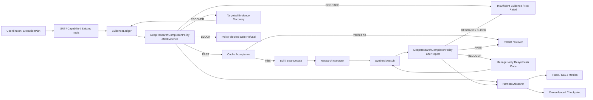

# StockSage 投研运行时 Harness 设计与实施计划

> 状态：Accepted；G0–G4 implemented；DEEP live 与 PIT acceptance passed，G5 ready for scoped implementation
> 日期：2026-07-24
> 路线图：`TODO.md` 阶段 G
> 首个纵切面：DEEP 股票研究

## 1. 决策

StockSage 采用“阶段门禁式领域 Harness”，在现有 Agent 编排链路中增加统一的运行时完成判定与有限恢复能力。

第一版包含：

- `ResearchHarness`：执行 Policy、记录决定并把有限恢复动作交回现有管线。
- `ResearchCompletionPolicy`：纯判定接口，不调用工具、不持久化。
- `DeepResearchCompletionPolicy`：首个领域策略。
- `EvidenceLedger`：结构化证据清单。
- `HarnessSnapshot`：可恢复的策略版本、判定和恢复预算。
- `HarnessObserver`：复用现有 Trace、SSE 和 Micrometer。

Harness 不替换现有模块：

```text
Coordinator       -> 选择 route 和 model tier
ExecutionPlan     -> 固定 Plan-and-Execute 动作
SkillPolicy       -> Skill 能调用哪些 capability、预算和期限
CapabilityPolicy  -> 单次 capability 的授权、风险、超时和结果边界
DeepResearchPipeline
                  -> ResearchTask 生命周期、阶段推进和恢复动作执行
ResearchCompletionPolicy
                  -> 证据/报告是否足以进入下一阶段
Bull/Bear/Manager -> 在已验收证据范围内完成研究推理
```

最重要的职责边界是：

```text
SkillPolicy 管“允许做什么”
CompletionPolicy 管“做完以后结果够不够”
DeepResearchPipeline 管“如何推进和恢复”
```

## 2. 背景与当前缺口

StockSage 已有可靠性基础：

- 受约束的 `Coordinator + ExecutionPlan`，不是自由 ReAct。
- Skill/Capability 白名单、风险级别、调用预算、deadline、超时和 fallback。
- DEEP 确定性证据收集与 Bull/Bear/Manager 协作。
- Redis Stream、MySQL ResearchTask、lease、heartbeat、checkpoint、reclaim 和 DLQ。
- Trace、SSE `Last-Event-ID` 回放、Micrometer、Planner/RAG Eval。

缺少的是统一的运行时完成契约。当前具体问题：

1. `DeepEvidenceCollector` 以原始字符串和布尔值判断证据；推荐门槛是 `fundamentalsOk || marketOk`。
2. 计算出的 `newsOk` 没有进入 `EvidenceCollection`，空结果与调用失败的语义不完整。
3. 非空 ticker 被当成已解析，没有统一的 canonical target、market、issuer 和歧义状态。
4. `ResearchManager.parseReport()` 在非法 JSON 时回退为 `HOLD`，无法区分“证据平衡的 HOLD”和“技术失败的 HOLD”。
5. citation 是自由文本，无法确定它是否对应本次真实收集的证据。
6. `ReportMarkdownRenderer` 会在 citation 为空时补出默认财务、行情、RAG 和新闻来源，可能展示本轮未实际使用的来源。
7. 报告缓存没有 Completion Policy 版本；新闻被排除在复用哈希之外，也没有按证据新鲜度重新验收。
8. 离线示例报告可在模型失败后持久化为成功结果，但缺少独立业务终态，容易与正式完整报告混淆。
9. `ResearchMemoryService` 主要按来源非空和模型标签判断是否摄取，尚不能依据 Harness 验收状态阻止降级报告进入长期研究记忆。

## 3. 目标

### 3.1 功能目标

- 对证据、综合报告和缓存报告执行确定性完成判定。
- 将缺失条件映射为有限、白名单、可恢复的动作。
- 区分完整报告、证据不足、离线兜底和策略阻断。
- 在进程崩溃和 lease 接管后保留恢复预算。
- 让运行时、Trace、checkpoint、缓存、Research Memory 和 Eval 使用同一组稳定规则。
- 保持已有后台任务、SSE 回放和 IBKR 只读边界。

### 3.2 非目标

V1 不做：

- 通用 Agent Loop 或自由 ReAct。
- 通用 Hook/Plugin/Policy DSL。
- 第二套队列、worker、checkpoint 或事件总线。
- LLM 自主生成恢复工具名或任意重试计划。
- 在请求热路径中使用 LLM-as-Judge。
- Skill 在线编辑、第三方 Harness 安装或动态 Java 类加载。
- IBKR 下单、改单、撤单等写行为。
- 一次性把所有本地工具迁移为 Capability。

## 4. 目标架构



正常路径只增加纯内存判定和观察记录。只有 `RECOVER` 才增加一次定向数据调用或一次 Manager 重新综合。

## 5. 核心契约

### 5.1 TargetIdentity

```java
public record TargetIdentity(
        String canonicalTicker,
        String market,
        String issuer,
        ResolutionStatus status,
        String resolutionSource
) {
}
```

`ResolutionStatus`：

```text
RESOLVED
AMBIGUOUS
UNRESOLVED
MISMATCHED
```

第一阶段可用现有 `TickerResolutionService` 生成兼容身份；后续再补 issuer/置信度，不在 G0 同时重写 ticker resolver。

### 5.2 EvidenceEnvelope 与 EvidenceLedger

```java
public record EvidenceEnvelope(
        String evidenceId,
        EvidenceDimension dimension,
        String targetKey,
        String capabilityId,
        String providerId,
        EvidenceStatus status,
        Requiredness requiredness,
        Instant observedAt,
        Instant dataAsOf,
        String sourceRef,
        String payloadHash,
        int resultBytes,
        long durationMs,
        boolean truncated
) {
}

public record EvidenceLedger(
        TargetIdentity target,
        List<EvidenceEnvelope> items
) {
}
```

维度：

```text
IDENTITY
FUNDAMENTALS
MARKET_PRICE
MARKET_HISTORY
VALUATION
TECHNICAL
NEWS
RAG
```

状态：

```text
SUCCESS
EMPTY
TIMEOUT
UNAVAILABLE
DENIED
FAILED
INVALID
STALE
TRUNCATED
```

规则：

- raw content 继续保存在 `AnalysisState` 的现有报告字段中。
- Ledger 只保存验收与溯源元数据，避免在 checkpoint 中重复存储正文。
- `evidenceId` 在同一研究运行内稳定；恢复或缓存读取时不能重新编号。
- `payloadHash` 对规范化内容计算，不把返回顺序抖动当成新事实。
- 零结果必须是 `EMPTY`，不能与 `TIMEOUT/FAILED` 合并。
- Tool/MCP 内容始终作为不可信数据，不能改变 Policy 或生成 RecoveryAction。

### 5.3 Policy 与 Decision

```java
public interface ResearchCompletionPolicy {

    String policyId();

    int policyVersion();

    HarnessDecision afterEvidence(
            RunContext context,
            EvidenceLedger evidence
    );

    HarnessDecision afterReport(
            RunContext context,
            EvidenceLedger evidence,
            SynthesisResult synthesis
    );
}

public record HarnessDecision(
        HarnessOutcome outcome,
        List<HarnessViolation> violations,
        List<RecoveryAction> recoveryActions
) {
}
```

`HarnessOutcome`：

```text
PASS
RECOVER
DEGRADE
BLOCK
```

`RecoveryAction` 只能来自本地枚举：

```text
RETRY_FUNDAMENTALS
RETRY_MARKET
RETRY_NEWS
USE_APPROVED_FALLBACK
RESYNTHESIZE_REPORT
RETURN_NOT_RATED
RETURN_SAFE_REFUSAL
```

模型、MCP Server 和远程返回内容不能创建或修改 RecoveryAction。

### 5.4 SynthesisResult

```java
public record SynthesisResult(
        InvestmentReport report,
        ParseStatus parseStatus,
        List<ValidationIssue> issues
) {
}
```

`ParseStatus`：

```text
VALID
INVALID_JSON
INVALID_SCHEMA
EMPTY_OUTPUT
MODEL_FAILURE
```

不能把非 `VALID` 结果静默包装为有效 `HOLD`。

### 5.5 HarnessSnapshot

```java
public record HarnessSnapshot(
        String policyId,
        int policyVersion,
        HarnessPhase lastPhase,
        HarnessOutcome lastOutcome,
        List<ViolationCode> violations,
        Map<RecoveryType, Integer> recoveryAttempts
) {
}
```

要求：

- 跟随 `AnalysisState` 序列化到现有 checkpoint JSON。
- 执行恢复动作前先严格持久化对应 recovery count。
- owner-fenced 保存失败时停止当前 attempt，不能仅记录日志后继续。
- takeover 后恢复次数不归零。
- 不新增 `ResearchTask.Stage`；当前 checkpoint 防回退依赖枚举顺序。

## 6. DeepResearchCompletionPolicy V1

策略 ID：

```text
deep-equity-v1
```

### 6.1 证据门

| 条件 | Requiredness | 失败后的决定 |
|---|---|---|
| canonical target 已解析 | REQUIRED | `BLOCK` |
| 所有证券证据 targetKey 一致 | REQUIRED | `BLOCK` |
| 至少一个有效、可溯源的基本面来源 | REQUIRED | 首次 `RECOVER`，再次 `DEGRADE` |
| 至少一个带 as-of/provider 的行情或价格基准 | REQUIRED | 首次 `RECOVER`，再次 `DEGRADE` |
| 新闻调用结果区分成功零结果与调用失败 | OPTIONAL for general DEEP | 允许继续，但写入缺口 |
| 必需来源具有 sourceRef、observedAt、payloadHash | REQUIRED | `DEGRADE` 或 `BLOCK` |
| 必需数据未超过该维度的新鲜度规则 | REQUIRED | `DEGRADE` |
| capability 为已批准的只读能力 | REQUIRED | `BLOCK` |

完整五档评级要求：

```text
identity PASS
AND fundamentals PASS
AND market/valuation PASS
AND target consistency PASS
AND provenance PASS
```

新闻缺失时：

- 一般 DEEP 可继续，但最终报告必须在 `unknowns` 与 `dataFreshness` 中说明。
- NEWS 路由或明确事件分析的完成契约中，新闻是 required；该规则在 G5 单独实现，不在 G1 引入新的 Intent 子系统。

### 6.2 报告门

报告通过条件：

- recommendation 是 `BUY/OVERWEIGHT/HOLD/UNDERWEIGHT/SELL` 之一。
- `analystSummary`、`rationale`、`riskFactors`、`unknowns`、`dataFreshness` 非空。
- 每个 EvidenceItem 至少引用一个 `sourceEvidenceId`。
- `sourceEvidenceId` 属于本次 Ledger，且对应状态可用于结论。
- 不引用其他 ticker、其他用户或其他研究运行的证据。
- 缺失可选维度时，报告明确展示缺口。
- 非 `HOLD` 评级同时具备基本面和行情证据。
- `HOLD` 只能表示有效证据下的平衡判断，不能表示 JSON/模型失败。

建议扩展：

```java
InvestmentReport {
    ReportQualityStatus qualityStatus;
    String completionPolicyId;
    Integer completionPolicyVersion;
}

InvestmentReport.EvidenceItem {
    List<String> sourceEvidenceIds;
}
```

`ReportQualityStatus`：

```text
VERIFIED
NOT_RATED
OFFLINE_FALLBACK
LEGACY_UNVERIFIED
```

报告第一次结构错误：

```text
RECOVER -> 只重新调用 Research Manager 一次
```

第二次仍错误：

```text
DEGRADE -> NOT_RATED
```

不得重跑已完成的 Bull/Bear 辩论。

## 7. 任务终态映射

`ResearchTask.Status` 继续表达技术生命周期：

```text
PENDING
RUNNING
SUCCEEDED
FAILED
```

新增独立业务结果 `ResearchTask.ResultKind`：

```text
FULL_REPORT
INSUFFICIENT_EVIDENCE
OFFLINE_FALLBACK
POLICY_BLOCKED
```

建议使用 Flyway：

```text
V5__research_task_result_kind.sql
```

映射：

| Harness/运行结果 | ResearchTask.Status | ResultKind | 报告版本 |
|---|---|---|---|
| 两个门均 PASS | SUCCEEDED | FULL_REPORT | 持久化 |
| 证据不足 | SUCCEEDED | INSUFFICIENT_EVIDENCE | 不持久化评级报告 |
| 预期的策略阻断 | SUCCEEDED | POLICY_BLOCKED | 不持久化评级报告 |
| 离线演示兜底 | SUCCEEDED | OFFLINE_FALLBACK | 可持久化，但明确标记 |
| 基础设施或代码异常 | FAILED | null | 不持久化 |

策略阻断是系统成功执行了安全规则，不应进入 DLQ；Policy 自身抛出未预期异常才属于技术失败。

## 8. 缓存与 Research Memory

### 8.1 缓存验收

`InvestmentReportVersionService` 的 cache key/acceptance 增加：

```text
completionPolicyId
completionPolicyVersion
canonical target
required evidence hashes
evidence as-of/freshness boundary
```

新闻不直接使用原始返回文本计算哈希；使用排序后的稳定来源标识、URL/公告 ID、发布时间和 payloadHash。

缓存命中后仍执行轻量报告门：

- qualityStatus 必须是 `VERIFIED`。
- policy id/version 必须与当前一致。
- required evidence 未过期。
- sourceEvidenceIds 仍能解析。

旧报告：

- 仍可在历史页面查看。
- 反序列化时缺少 qualityStatus 则视为 `LEGACY_UNVERIFIED`。
- 不直接复用为新策略下的完整报告。

### 8.2 Research Memory

`ResearchMemoryService.eligible(...)` 增加：

```text
qualityStatus == VERIFIED
AND resultKind == FULL_REPORT
AND sourceEvidenceIds non-empty
```

以下结果不得进入长期研究记忆：

- `NOT_RATED`
- `OFFLINE_FALLBACK`
- `LEGACY_UNVERIFIED`
- `INSUFFICIENT_EVIDENCE`
- `POLICY_BLOCKED`

## 9. 可观测性

### 9.1 SSE/Trace

复用 `TraceEventStore`，新增非终止型：

```text
type = harness
```

事件只需要：

```text
DECISION
RECOVERY_STARTED
RECOVERY_FINISHED
FINAL_OUTCOME
```

metadata：

```text
schemaVersion
taskId
policyId
policyVersion
phase
decision
violationCodes
recoveryActions
recoveryAttempt
durationMs
```

可恢复失败不能使用 `type=error`，否则会提前终止 SSE relay。

`AgentStep.attributes` 持久化同一份脱敏摘要。禁止记录：

- 用户原始查询和 RAG/工具正文。
- userId、ticker、traceId 作为指标标签。
- leaseToken、MCP URL、token、密钥。
- provider 原始异常栈和隐藏思维链。

### 9.2 Metrics

```text
stocksage.harness.decisions{policy,phase,outcome}
stocksage.harness.violations{policy,code}
stocksage.harness.recoveries{policy,action,result}
stocksage.harness.evaluation.duration{policy,phase}
```

所有标签必须是有限枚举。

## 10. 实施阶段

### G0（P0）：结构化契约与只观察运行

目标：建立 Harness 类型系统，不改变当前用户结果。

新增：

```text
stocksage-backend/src/main/java/com/stocksage/harness/
  ResearchCompletionPolicy.java
  ResearchHarness.java
  HarnessModels.java
  EvidenceLedger.java
  DeepResearchCompletionPolicy.java
  HarnessObserver.java
```

修改：

```text
stocksage-backend/src/main/java/com/stocksage/model/dto/AnalysisState.java
stocksage-backend/src/main/java/com/stocksage/service/DeepEvidenceCollector.java
```

任务：

- [x] 定义 TargetIdentity、EvidenceEnvelope、EvidenceLedger、Decision、Violation 和 RecoveryAction。
- [x] 将 `DeepEvidenceCollector` 的每次调用映射成结构化状态，同时保留旧访问器。
- [x] 让新 Policy 与旧 `sufficientForRecommendation` 并行计算，只写 Trace/metrics。
- [x] 增加一个临时 `stocksage.harness.deep.enforce=false` 开关；正式切换后删除，不建设长期多模式框架。
- [x] 增加规则表单元测试和序列化兼容测试。

退出条件：

- [x] 现有 Pipeline 继续使用 legacy gate，用户输出路径不变。
- [x] 每次新的 DEEP 证据采集（包括未解析标的）都有结构化 Ledger。
- [x] 相同 Ledger 重复判定结果完全一致。
- [x] Trace 中能比较 legacy/new decision，且脱敏测试覆盖 query/user/ticker/traceId。

G0 验证（2026-07-24）：

- 定向 Harness/Collector/serialization 测试：13/13。
- 完整 backend regression：223/223。
- Live provider DEEP trace 尚未执行；G0 不启用 enforcement。

### G1（P0）：启用 DEEP 证据门与定向恢复

修改：

```text
stocksage-backend/src/main/java/com/stocksage/service/DeepResearchPipeline.java
stocksage-backend/src/main/java/com/stocksage/service/ToolPrefetchService.java
stocksage-backend/src/main/java/com/stocksage/service/DeepEvidenceCollector.java
stocksage-backend/src/main/java/com/stocksage/service/ReportMarkdownRenderer.java
```

任务：

- [x] 后台 worker 和 Redis 故障 inline fallback 使用同一个 `DeepResearchCompletionPolicy`。
- [x] `PASS` 才允许 cache/debate。
- [x] `RECOVER` 只补采缺失维度，每类最多一次。
- [x] `DEGRADE` 输出确定性“证据不足/暂不评级”，不生成五档 recommendation。
- [x] `BLOCK` 输出安全拒答，不被通用异常分支转成离线样例报告。
- [x] citation/dataFreshness 只展示 Ledger 中真实来源，不再自动补齐未使用来源。
- [x] 保留 Capability/Skill 的现有授权、deadline 和调用预算，不在 Harness 中重复实现。

退出条件：

- [x] unresolved/mismatched ticker 不进入辩论。
- [x] 基本面或行情缺失后只补采对应维度一次。
- [x] 再次失败时不产生五档评级。
- [x] 新闻零结果与新闻调用失败有不同结构化状态、决策与用户结果。

### G2（P0）：报告门与一次 Manager 修复

修改：

```text
stocksage-backend/src/main/java/com/stocksage/agent/ResearchManager.java
stocksage-backend/src/main/java/com/stocksage/agent/ResearchDebateService.java
stocksage-backend/src/main/java/com/stocksage/model/dto/InvestmentReport.java
stocksage-backend/src/main/java/com/stocksage/service/DeepResearchPipeline.java
stocksage-backend/src/main/java/com/stocksage/service/ReportMarkdownRenderer.java
```

任务：

- [x] `ResearchManager` 返回 `SynthesisResult`，不再把解析失败伪装成有效 HOLD。
- [x] EvidenceItem 增加 `sourceEvidenceIds`。
- [x] 报告门验证结构、引用集合、target 一致性和缺失维度声明。
- [x] 第一次可修复错误只重新综合 Manager；不重跑 Bull/Bear。
- [x] 第二次失败返回 `NOT_RATED`。
- [x] checkpoint 恢复得到的已综合报告也重新执行当前 Policy 验收。

退出条件：

- [x] 非法 JSON 被当作有效 HOLD 的次数为 0。
- [x] 未知 evidenceId 被持久化的次数为 0。
- [x] Manager 修复调用最多一次。
- [x] Bull/Bear 已完成轮次不因报告修复重跑。

### G3（P0–P1）：恢复预算、业务终态、缓存与记忆闭环

新增/修改：

```text
stocksage-backend/src/main/resources/db/migration/V5__research_task_result_kind.sql
stocksage-backend/src/main/java/com/stocksage/model/entity/ResearchTask.java
stocksage-backend/src/main/java/com/stocksage/service/ResearchTaskCheckpointService.java
stocksage-backend/src/main/java/com/stocksage/service/InvestmentReportVersionService.java
stocksage-backend/src/main/java/com/stocksage/service/ResearchMemoryService.java
stocksage-backend/src/main/java/com/stocksage/service/OfflineDemoSampleService.java
```

任务：

- [x] HarnessSnapshot 随 AnalysisState checkpoint 保存。
- [x] 新增严格、owner-fenced 的 Harness snapshot 写入；失败立即停止 attempt。
- [x] 新增 `ResearchTask.ResultKind` 和 Flyway V5。
- [x] report JSON 增加 qualityStatus/policy id/version，保持旧 JSON 可读。
- [x] policy version 与稳定 Evidence hash 纳入缓存验收。
- [x] cache hit 在返回前重新执行报告门。
- [x] Research Memory 只摄取 VERIFIED/FULL_REPORT。
- [x] 离线示例始终标为 OFFLINE_FALLBACK，不能成为 VERIFIED。

退出条件：

- [x] takeover 后 recovery count 不归零。
- [x] 旧 owner 不能覆盖 HarnessSnapshot 或终态。
- [x] Redis 事件过期后，任务 API 仍能返回 ResultKind。
- [x] 不同 policyVersion 的报告不能互相复用。
- [x] 降级/离线/旧版报告进入 Research Memory 的次数为 0。

### G4（P1）：Harness Eval、前端解释与强制切换

新增/修改：

```text
rag-eval/harness_golden_set.jsonl
rag-eval/run_harness_eval.py
rag-eval/agent_eval_summary.py
rag-eval/agent_eval_gates.json
stocksage-frontend/src/
```

任务：

- [x] 建立 80 条生产 Policy Golden Set：48 条 Evidence Gate + 32 条 Report Gate，覆盖 6 种证据状态、5 种解析状态、target/授权/来源完整性、独立恢复预算、报告结构及 missing/unknown/unusable evidence citation。
- [x] Golden Case V2 强制完整 expected contract、ID 与语义输入唯一、总数不少于 60、Evidence/Report 不少于 40/20，并输出覆盖矩阵与数据集 SHA-256；不能通过复制改名扩容。
- [x] 过期数据仍属于后续 Market/News/RAG Policy 的 freshness 规则，不计入当前 Deep Policy Golden 覆盖；takeover 恢复由 Docker PIT 验证，不混入单步 Policy Golden Set。
- [x] Agent Eval 增加 completion/harness 分区；未运行不得伪装成通过。
- [x] Workbench/Trace 时间线展示“证据验收、补采、降级、最终结果”。
- [x] 用可重复的 golden expected/actual 决策报告替代临时 legacy/new 对比。
- [x] 离线硬门禁通过后启用 enforce，并删除临时观察开关和旧 OR/string 判断。
- [x] 通过真实 HTTP/SSE 链路运行固定 DEEP 用例，验收 ResultKind、Harness Trace、恢复预算、工具动作与端到端延迟。

硬门禁：

- [x] 关键违规拦截率 `= 1.00`。
- [x] 未解析标的生成投资评级 `= 0`。
- [x] 缺失必需证据生成投资评级 `= 0`。
- [x] 未知 evidenceId 持久化 `= 0`。
- [x] recovery budget 越界 `= 0`。
- [x] takeover 重复 recovery `= 0`。
- [x] owner-fence 违规 `= 0`。
- [x] 业务终态 DB 可恢复率 `= 1.00`。
- [x] SSE replay 决策顺序一致率 `= 1.00`。

性能门禁在取得当前基线后设定；不使用配置值冒充实测结果。

### G5（P1）：扩展 MARKET、NEWS 和 RAG

前置条件：G0–G4 完成且 DEEP live/eval 门禁通过。

当前状态：Policy 骨架与单元测试已加入，但未接入 MARKET/NEWS/RAG route。
离线门禁、真实 provider DEEP Trace 与 Testcontainers PIT 已通过；G5 可以按独立
route 切片实施，但本次验收工作没有改变这些 route 的运行时行为。

任务：

- [ ] `MarketCompletionPolicy`：canonical target、as-of、实时/延迟状态、最新交易日 K 线、指标样本量。
- [ ] `NewsCompletionPolicy`：URL/source、发布时间、target/topic/time-window 匹配，零结果与失败分离。
- [ ] RAG gate：统一 target filter、过期/source_id/空内容过滤、citation membership 和 no-answer。
- [ ] 将 DEEP evidence 调用逐步迁移到 `CapabilityGateway`，复用已实现的授权、超时、截断和 observer。
- [ ] 出现第二个稳定策略后，再给 Skill manifest 增加 `completionPolicyId`，并由 `SkillValidator` 校验本地注册策略。

不得：

- [ ] 为每条 route 建第二套任务状态机。
- [ ] 把通用 Harness Registry 暴露成动态插件系统。
- [ ] 让远程 MCP metadata 自动注册 CompletionPolicy。
- [ ] 把 LLM-as-Judge 放进正常请求热路径。

## 11. 测试计划

### 11.0 评测原则

2026-07-24 联网复核后的原则：

- golden target 必须调用与生产 Pipeline 相同的 Java `DeepResearchCompletionPolicy`，不能由另一种语言复制规则后自证正确。
- 同时评估单步 decision、完整 recovery trajectory 和最终持久化 outcome；不能只检查最终回答文本。
- 对比实验固定任务集、评分、工具与预算，并记录 policy/harness 版本。
- 确定性结构和安全规则使用 code-based grader；LLM-as-Judge 只用于离线语义质量补充。
- 自动门禁之外仍要抽查失败 Trace，区分真实 Harness 缺陷与 grader/golden case 缺陷。

依据：

- Anthropic, [Demystifying evals for AI agents](https://www.anthropic.com/engineering/demystifying-evals-for-ai-agents)
- OpenAI, [A shared playbook for trustworthy third party evaluations](https://openai.com/index/trustworthy-third-party-evaluations-foundations/)
- OpenAI, [Harness engineering: leveraging Codex in an agent-first world](https://openai.com/index/harness-engineering/)
- LangSmith, [Application-specific evaluation approaches](https://docs.langchain.com/langsmith/evaluation-approaches)

### 11.1 单元测试

- `HarnessGoldenSetTest`
  - 从同一份严格 V2 JSONL 加载 48 个 evidence cases 和 32 个 report cases。
  - 直接调用生产 `DeepResearchCompletionPolicy`。
  - 精确断言 outcome、violation code 顺序、recovery action 顺序和 `allowsRecommendation`。
  - 强制最少 60 条、ID/语义 fixture 唯一、阶段与类别配额，并输出 engine、policy id/version、覆盖矩阵和数据集 SHA-256。
  - 任一完整 decision contract 差异、覆盖缺口或 unsafe PASS 使 Maven 失败。
- `DeepResearchCompletionPolicyTest`
  - identity unresolved/ambiguous/mismatched。
  - fundamentals/market/news 各状态组合。
  - target/source/provider/observedAt/payloadHash provenance 规则。
  - 已知但 failed/empty/unapproved/跨标的的 evidenceId 不能支撑报告。
  - PASS/RECOVER/DEGRADE/BLOCK 决定。
- `ResearchHarnessTest`
  - 每类 recovery 最多一次。
  - Policy 保持纯判定。
  - 决定事件脱敏。
- `ResearchManagerTest`
  - valid HOLD 与 invalid JSON 明确区分。
  - sourceEvidenceIds membership。
- `ResearchTaskCheckpointServiceTest`
  - HarnessSnapshot JSON round trip。
  - strict owner-fenced save。
- `InvestmentReportVersionServiceTest`
  - policy version/cache acceptance。
  - legacy report 不复用。
- `ResearchMemoryServiceTest`
  - 仅 VERIFIED/FULL_REPORT eligible。

### 11.2 Pipeline/集成测试

- PASS 才进入 debate。
- RECOVER 只重跑缺失维度。
- DEGRADE/BLOCK 不进入 debate。
- Manager 修复不重跑 Bull/Bear。
- ownership loss 后无 checkpoint、终态或事件写入。
- takeover 后恢复预算延续。
- cache hit 重新验收。
- Redis Trace Stream 回放顺序和 DB terminal fallback。
- offline fallback 不被标为 VERIFIED。

复用并扩展：

```text
DeepResearchPipelineTest
ResearchTaskCheckpointFencingTest
ResearchDebateServiceResumeTest
CheckpointTakeoverIT
ResearchTaskEventsIT
TraceEventBridgeIT
```

### 11.3 验证命令

实现每个阶段后：

```powershell
cd stocksage-backend
.\mvnw.cmd -Dtest=DeepResearchCompletionPolicyTest,ResearchHarnessTest test
.\mvnw.cmd test
```

涉及 checkpoint/Redis/MySQL：

```powershell
cd stocksage-backend
.\mvnw.cmd verify -Pit
```

涉及 Eval：

```powershell
python -m unittest discover rag-eval
python rag-eval\run_harness_eval.py --fail-on-gate
python rag-eval\run_harness_live_eval.py --fail-on-gate
```

`run_harness_eval.py` 只是跨平台编排器：默认通过 Maven Wrapper 执行
`HarnessGoldenSetTest`，结果写入忽略目录 `rag-eval/results/`。Agent Eval 只接受
`engine=java-production-policy`、`schema_version=harness_eval_v1` 且
`case_schema_version=harness_golden_case_v2` 的 completion 结果。结果还必须满足
case count 至少 60、coverage status 为 `pass`、数据集 hash 非空、完整决策/违规码/
恢复动作精确匹配率均为 1.0、unsafe PASS 为 0。

2026-07-24 deterministic acceptance：

- Golden Set 80/80：Evidence 48、Report 32、16 个语义类别。
- `EvidenceStatus` 6/6、`ParseStatus` 5/5、4 种 outcome 和全部 active
  violation/recovery action 均有覆盖；`RAG_MISSING`、`RETRY_NEWS`、
  `USE_APPROVED_FALLBACK` 因生产 V1 Policy 不可达而显式列为 exemption。
- 完整 decision contract、violation code、recovery action 精确匹配率均为 1.0，
  duplicate fixture 为 0，unsafe PASS 为 0。

`run_harness_live_eval.py` 使用 Workbench 生产提示模板，经登录、CSRF、`/api/chat/stream`
和 ResearchTask/Trace/Cockpit API 跑真实 DEEP 链路。它输出
`schema=harness_live_eval_v1`、`engine=stocksage-live-http`，并以以下规则验收：

- 任务必须到达 `SUCCEEDED` 技术终态且 ResultKind 属于显式集合。
- `FULL_REPORT` 必须同时有最终 `EVIDENCE=PASS` 和 `REPORT=PASS`。
- 降级或阻断 ResultKind 必须与相应 Harness decision 一致。
- 同一恢复动作不得超过一次。
- 结果只保留脱敏元数据，不保存最终回答、证据正文或凭据。

Agent Eval 的 `live_completion` 分区仅在 engine/schema 正确、完成率与安全终态率均为
1.0、unsafe result 为 0 且 live status 为 `pass` 时通过；`partial` 不算硬门禁通过。

2026-07-24 live acceptance：

- 固定 NVDA DEEP 用例进入后台研究任务，而不是普通对话路径。
- `SUCCEEDED / COMPLETE / FULL_REPORT`，最终 `EVIDENCE=PASS`、
  `REPORT=PASS`，recovery count 为 0。
- 端到端 127.938 秒；Trace 18 步、非 Harness 工具/Agent action 15 个。
- 外部环境中 Ollama embedding 未运行、IBKR gateway 未登录，部分模型免费额度调用
  返回 403；Coordinator/轮数规划按设计降级，最终仍产生安全完整报告。
- `.\mvnw.cmd verify -Pit` 通过 15/15，覆盖 queue、takeover/owner-fence、
  tenancy isolation 与 Trace bridge。

最终：

```powershell
.\init.ps1 -Mode fast
git diff --check
```

Agent、prompt、RAG 或报告行为发生变化时，必须附相关 regression/eval 或 manual trace 证据；live 服务未运行时要明确标记未验证。

## 12. 迁移与回滚

采用 branch-by-abstraction：

1. 新契约与旧布尔判断并行。
2. 只记录差异。
3. 证据门切换到新 Policy。
4. 报告门和持久化闭环切换。
5. Eval 通过后删除旧逻辑。

回滚边界：

- G0/G1 可关闭临时 enforce 开关，回到旧行为。
- 新 report JSON 字段全部可选，旧报告保持可读。
- Flyway V5 只新增 nullable/default-safe 业务结果列，不改变现有 Status/Stage。
- 不插入新的 `ResearchTask.Stage`，避免破坏 ordinal 防回退逻辑。
- 不删除旧 citation 文本字段；新 sourceEvidenceIds 增量加入。
- 任一阶段出现质量回退时停止扩展其他 route。

## 13. 风险与取舍

### 正面结果

- 证据充分性从隐式 prompt 约定变成可测试契约。
- HOLD 不再承担技术失败兜底。
- 缺失证据可定向补采，不必重跑整个研究流程。
- cache、checkpoint、Trace、Memory 与 Eval 使用同一质量标准。
- 面试叙事从“多 Agent 能跑”提升为“多 Agent 有确定性验收、恢复和审计”。

### 代价

- 需要为现有直接工具调用补结构化 evidence metadata。
- Manager 输出契约和报告 JSON 会增加字段。
- 一次可修复的 Manager 重综合会增加延迟和模型成本。
- 业务终态需要一个小型 Flyway migration。
- 新鲜度规则需要按市场和数据类型逐步校准。

### 重新评估条件

只有出现以下需求时，才考虑更通用的 Harness Registry 或 Hook 系统：

- 至少三个成熟 workflow 使用不同 CompletionPolicy。
- 需要第三方团队开发和审批 Policy。
- 需要运行时热切换 Policy 版本。
- 现有 Java bean 注册无法满足部署隔离或租户策略要求。

在这些条件出现前，保持本地 Java Policy + 明确测试是更合适的设计。

## 14. ADR 摘要

### ADR-G1：使用领域 CompletionPolicy，不复制通用 Agent Loop

- 状态：Accepted。
- 原因：当前缺口是运行时验收，不是推理循环。
- 后果：Harness 只在阶段边界判定，编排仍由现有服务负责。

### ADR-G2：Policy 保持纯判定

- 状态：Accepted。
- 原因：便于单元测试、离线 Eval 和确定性复现。
- 后果：所有工具、重试、持久化和事件由 Pipeline/Harness adapter 执行。

### ADR-G3：恢复动作有限且本地白名单

- 状态：Accepted。
- 原因：防止模型或远程内容扩展工具范围和成本。
- 后果：每类证据最多补采一次，Manager 最多重新综合一次。

### ADR-G4：技术生命周期与业务结果分离

- 状态：Accepted。
- 原因：SUCCEEDED 不等于产出了完整投资评级。
- 后果：ResearchTask 新增 ResultKind，Status/Stage 语义保持不变。

### ADR-G5：不在热路径使用 LLM-as-Judge

- 状态：Accepted。
- 原因：延迟、成本、稳定性和可解释性不适合作为 V1 硬门禁。
- 后果：运行时只做结构、来源集合和确定性规则；语义蕴含留给离线 Eval。

## 15. 下一步

G0–G4 与前置验收已完成。后续进入 G5 的独立切片：

1. 先补齐并接入 MARKET Policy 的 as-of、target 与样本量契约，使用专属 golden/live cases 验收。
2. 再接入 NEWS Policy 的 target/topic/time-window、零结果与失败分离契约。
3. 最后接入 RAG Policy 的 target filter、citation membership、过期过滤与 no-answer 契约。
4. 再评估 DEEP evidence 向 `CapabilityGateway` 的渐进迁移，以及 Skill `completionPolicyId`；不引入第二套状态机或热路径 LLM Judge。
