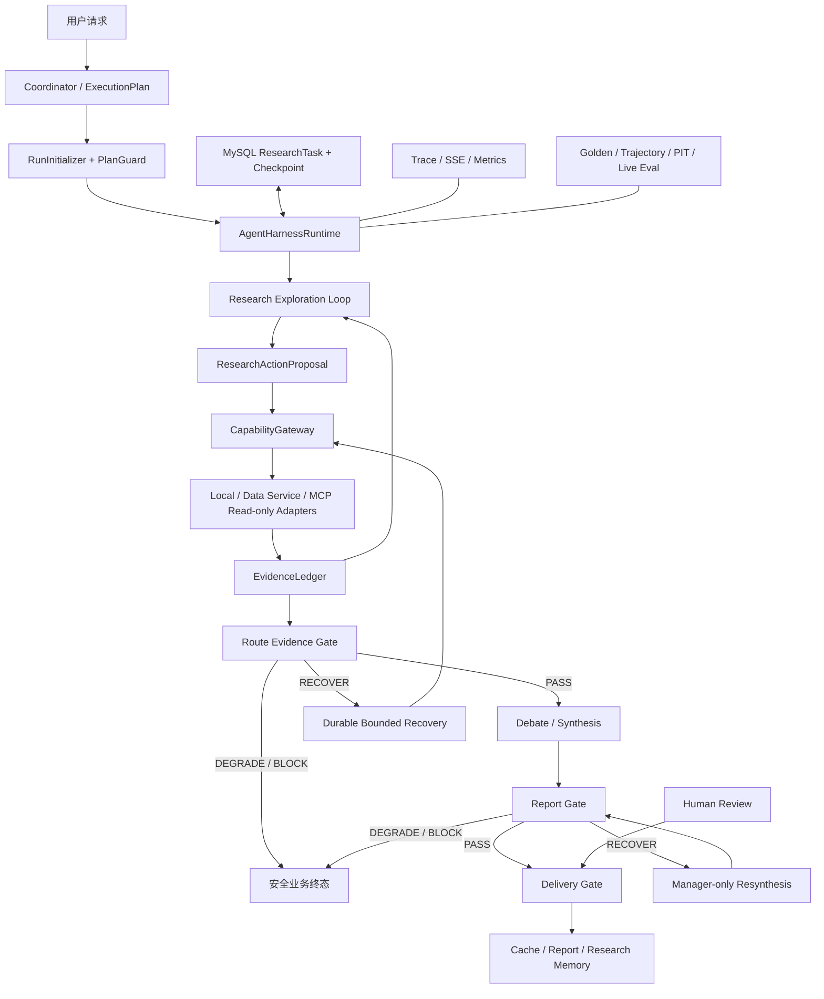
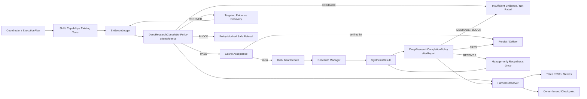

# StockSage Agent Harness 目标架构与渐进式实施计划

> 状态：Accepted；H0 代码、确定性门禁和 Docker/Testcontainers/PIT 已完成；
> 5-case live 诊断已停止并修复其中发现的 Trace 归属缺陷，固定 30-case release
> gate 尚未完成，生产验收仍未关闭。
> G0–G4 是已实现的 Completion Harness 基础，不代表完整 Agent Harness 已达到生产成熟度；
> H1 与 G5 在 live 明确通过前保持暂停。
> 首版日期：2026-07-24
> 最近修订：2026-07-31
> 路线图：`TODO.md` 阶段 G/H
> 业务边界：财报分析与股票投研助手；首个强约束纵切面为 DEEP 股票研究

## 0. 2026-07-31 设计升级

### 0.1 核心判断

当前 `ResearchHarness + ResearchCompletionPolicy` 已经解决了 DEEP 链路的“结果够不够”
问题，但它只是完整 Harness 的 Completion 子系统。StockSage 的目标 Harness 应定义为：

> 包围现有 Coordinator、ExecutionPlan、Skill、Capability、ResearchTask、Pipeline、
> Checkpoint、CompletionPolicy、Review、Trace 和 Eval 的 Agent 运行控制面。

它不替模型决定研究过程，也不枚举所有可能的分析路线。它只固定以下外部可验证边界：

1. 任务规格在运行开始时被冻结，不能被模型或远程内容悄然改写。
2. 所有有副作用或访问外部系统的动作经过受控 Capability 边界。
3. 状态、预算和恢复意图可持久化，进程崩溃后不会跳过未完成门禁。
4. 证据和报告经过确定性最低正确性检查，不满足时明确降级或阻断。
5. 机器验收、人类审核和可发布信任等级彼此分离。
6. 每个发布结论都能追溯到真实运行过的 Eval，而不是配置值或未执行项。

因此采用：

```text
稳定外壳 + 自由探索内核 + 渐进式约束
```

- 稳定外壳固定权限、状态、证据、终态、审计和发布边界。
- 自由探索内核允许 Agent 在预算内提出子问题、选择已授权能力、比较矛盾证据、
  调整搜索顺序和主动暴露未知项。
- 新规则先观察、再影子评估、最后才执法；没有事故或 Eval 证据支持的规则不进入硬门禁。

### 0.2 目标架构



现有 MySQL `ResearchTask` 和 checkpoint 继续是真相源；Redis 只承担队列、lease 辅助和
事件流。V1 不引入第二套任务系统、第二条事件总线、Temporal、LangGraph 或通用 Hook DSL。

### 0.3 固定外层生命周期与动态内层探索

外层生命周期是强类型的：

```text
INITIALIZE
→ PLAN_VALIDATED
→ EXPLORING
→ EVIDENCE_GATE
→ RECOVERING ↺
→ SYNTHESIS
→ REPORT_GATE
→ DELIVERY_GATE
→ TERMINAL
```

内层探索只提交建议，不直接取得权限：

```java
public record ResearchActionProposal(
        String stepId,
        String researchQuestion,
        String capabilityId,
        Map<String, Object> boundedArguments,
        String expectedEvidenceDimension,
        String stopCondition
) {
}
```

Harness 可以拒绝、截断或串行化提议，但不规定 Agent 必须按固定问题树思考，也不保存
隐藏思维链。只记录决策摘要、动作、公开输入字段、结构化结果元数据和错误码。

### 0.4 最小稳定契约

运行开始时冻结：

```java
public record ResearchRunSpec(
        String runId,
        String userId,
        PlanRoute route,
        String workflowId,
        int workflowVersion,
        TargetIdentity target,
        Instant dataAsOf,
        PolicyBundle policies,
        RunBudget budget,
        Set<String> allowedCapabilities,
        String idempotencyKey
) {
}
```

持久化快照至少包含：

```java
public record RunSnapshot(
        String runSpecHash,
        HarnessPhase phase,
        Set<String> completedStepKeys,
        EvidenceLedger evidence,
        HarnessSnapshot completion,
        BudgetState budget,
        RecoveryEffect pendingRecovery
) {
}
```

当前代码不立即引入上述所有 Java 类型。H0 先修复已经存在的 `HarnessSnapshot` 恢复语义；
只有第二条 route 进入稳定 Shadow 后，才抽取共享 `ResearchRunSpec/RunSnapshot`，避免为
假想需求建立万能上下文对象。

### 0.5 恢复是持久化 effect，而不是一个计数器

恢复动作必须具有稳定 effect key：

```text
runId + policyId + policyVersion + recoveryAction + attempt
```

生命周期：

```text
PLANNED → STARTED → EFFECT_RECORDED → REVALIDATED
```

这是完整的逻辑生命周期。H0 当前所有恢复 effect 都是只读调用，而且
`DeepEvidenceCollector.recover()` 在一次进程内调用中完成“调用、Ledger 替换和 Policy
重新验收”，因此先只持久化两个有行为差异的边界：

```text
PLANNED → REVALIDATED
```

`PLANNED` 之后任何不确定崩溃窗口都用同一 effect key at-least-once 重放；
`REVALIDATED` 才允许进入下一阶段。`STARTED/EFFECT_RECORDED` 暂作为 Trace 语义保留，
只有出现非只读恢复、长时间异步 provider job，或必须区分“调用完成但尚未验收”的真实
运维需求时才升级为持久化状态，避免当前多写两次数据库却不增加安全性。

不变量：

- `PLANNED` 必须在产生外部调用前 owner-fenced 落盘。
- 接管者看到非 `REVALIDATED` 恢复时，必须恢复该动作并重新执行 Evidence Gate；
  不能因为“存在 checkpoint”就直接进入 Debate。
- 外部 provider 通常只能保证 at-least-once；通过稳定 effect key、结果哈希和 Ledger
  去重做到“逻辑上只应用一次”。
- `RECOVER/BLOCK` 绝不能进入 Debate；恢复预算耗尽后只能 `DEGRADE/BLOCK`。
- 旧 checkpoint 缺少恢复状态时可读取；如果无法证明上次 RECOVER 已重新验收，
  必须 fail-safe 地重新验收或降级，不能假设成功。

Live Eval 按稳定 effect key 计算“逻辑恢复次数”，并单独保留物理 replay 次数；相同 key
的 at-least-once 重放不能误报为恢复预算越界，不同 key 仍必须计为两次。旧 Trace 尚无
effect key 时，可以折叠相邻、同 policy/version/phase/action 且均为 `RECOVER` 的完全
同构记录，供运维诊断 replay 次数；但这种推断没有发布可信性，只要出现无 key 的
`recoveryActions`，release gate 就必须 fail-closed。H0 已把稳定 effect key 写入当前
DEEP Trace；真实 live case 只有观测到该 key 并满足逻辑恢复预算时才允许通过。H1 只在
其他 route 接入时统一这套 Trace 契约，不重新定义 DEEP 的已验证语义。

### 0.6 约束分级

Harness 只保留少而精的规则，按风险分成四级：

| 级别 | 用途 | 例子 | 失败行为 |
|---|---|---|---|
| Hard Invariant | 合规、安全、确定性正确性 | IBKR 只读、ticker 一致、证据成员关系、恢复预算、owner fence | `BLOCK` 或技术失败 |
| Route Policy | 业务完成定义 | DEEP 必须有基本面与行情证据、NEWS 的时间窗 | `RECOVER/DEGRADE` |
| Advisory | 模型可自主权衡的质量建议 | 多找一类反方证据、补充行业比较 | 只写 Trace，不阻断 |
| Experiment / Shadow | 尚未证实的新规则 | 新鲜度阈值、新的 claim 检查 | 只统计差异 |

升级规则的必要条件：

1. 有真实缺陷、事故、用户反馈或 Eval 失败作为证据。
2. 能定义可重复测试和明确误杀率。
3. 有安全降级或回滚路径。
4. 先经过 Shadow；除紧急安全修复外，不直接成为 Hard Invariant。

### 0.7 机器质量、人审与发布信任分离

三个状态回答不同问题：

```text
MachineQualityStatus: 机器规则是否验证通过
HumanReviewStatus:    人类是否批准、否决或要求补研究
ArtifactTrustLevel:   当前产物允许被如何使用
```

H0 的最小强制规则：

- `REJECTED` 和 `NEEDS_RESEARCH` 对机器 `VERIFIED` 拥有否决权。
- 被否决报告不能 cache reuse、不能新写入 Research Memory；已写入的记忆必须撤销。
- `DRAFT/IN_REVIEW` 可继续作为当前用户的机器验证产物，但不能被标记为
  `HUMAN_APPROVED`，也不能对外宣称人工批准。
- 后续只有在真实工作流需要时，才增加“仅 APPROVED 可进入高信任记忆/发布”的可配置策略；
  不在当前演示项目中强制所有报告先人工审批。

### 0.8 Capability 边界

所有外部 effect 最终收口为：

```text
authorize
→ input schema / target 校验
→ budget reserve
→ adapter call
→ timeout / circuit breaker
→ content sanitization / truncation
→ EvidenceEnvelope
→ audit record
```

按能力而非每次调用启动容器：

- 本地只读 Adapter：进程内逻辑隔离。
- Python data-service：独立服务、固定 API、最小网络与凭据边界。
- MCP：server/tool 精确白名单、只读风险级别、出口限制和超时。
- 凭据只在 Adapter 边界注入，不进入 prompt、Trace、checkpoint 或 SSE。
- 新 Capability 默认 fail-closed；是否可并发按具体调用参数判定，不按工具名永久分类。

### 0.9 Route Profile，而不是最低公分母 Policy

共享生命周期，不共享含大量 nullable 字段的万能完成定义：

```java
public interface HarnessProfile<C, E, R> {
    SpecValidator<C> specValidator();
    EvidencePolicy<C, E> evidencePolicy();
    RecoveryExecutor<C, E> recoveryExecutor();
    ResultPolicy<C, E, R> resultPolicy();
    TerminalMapper<R> terminalMapper();
}
```

迁移顺序：

```text
DEEP 参考实现修复
→ NEWS Shadow / Enforce
→ MARKET Shadow / Enforce
→ RAG Shadow / Enforce
→ 视真实需求决定是否拆出独立 FUNDAMENTALS Profile
```

`DIRECT` 保留轻量安全契约，不为了形式统一强套完整研究 Harness。

### 0.10 验证分层

| 层级 | 回答的问题 | 是否阻断 PR/发布 |
|---|---|---|
| Policy Golden | 同一输入是否得到确定性正确决定 | 阻断 PR |
| Trajectory Simulation | 缺证据、恢复、耗尽预算的完整轨迹是否正确 | 阻断 PR |
| Crash/PIT | 每个持久化/副作用窗口崩溃后是否等价恢复 | 阻断相关改动 |
| Live Eval | 真实 HTTP/SSE/provider 是否完成且安全 | 阻断发布晋级 |
| Semantic Eval | claim 是否被证据支持、报告质量是否提升 | 离线质量信号；不进热路径 |

`pass` 是唯一成功门禁状态。`partial`、`incomplete`、未运行、样本不足、policy drift 或
数据集 hash 缺失都必须返回非零退出码，不能以“部分可用”冒充发布通过。

### 0.10.1 H0 长任务稳定性外壳

生产验收暴露的稳定性约束只包围执行边界，不替 Agent 预设研究问题树：

- SSE 背压只允许丢弃无业务语义的 heartbeat；工具/领域事件和回答 token 保持无损。
- Bull/Bear 轮次聚合与 Manager 综合/修复各自有默认 300 秒外层硬截止；超时取消上游、
  释放 worker，但不限制截止时间内的研究顺序、证据比较或论证内容。
- worker 失败后先释放 lease 和执行占用，再等待 2 秒进入进程内快速重试队列；
  进程退出时，Redis PEL 仍保留同一任务作为持久恢复来源。
- Live runner 收到会话/Trace 标识后立即用临时文件、`fsync` 和原子替换保存逐 case
  checkpoint。断流后只对账 ResearchTask、Cockpit 和终态 Harness Trace；已有 task
  identity 时绝不重复 POST，无法证明终态时停止批次并保留 checkpoint。
- 后台任务 Trace 的终态由拥有 task lease 的 pipeline 在业务终态提交后写入；
  同一任务的 SSE subscriber 断开只结束传输，不再把继续执行并成功的任务标为
  `cancelled`。旁观已有任务的独立请求仍只关闭自己的 observer Trace。
- `--case-limit N` 只创建明确的 smoke 运行：最多提交前 N 条，保留 checkpoint，
  输出独立 `smoke_status`，同时强制 `release_eligible=false` 和
  `live_release_case_limit_applied`。

这些约束处理无界等待、背压、租约占用和重复提交，不规定模型必须调用哪些能力或按什么
顺序探索。只有新的事故或 Eval 证据证明边界不足时，才继续增加硬约束。

### 0.11 渐进实施与验收

#### H0（当前，P0）：修复现有安全不变量

- [x] 恢复 effect 生命周期持久化；takeover 不得跳过 RECOVER 和重新验收。
- [x] 跨 Evidence/Report 阶段保留 suspended recovery、稳定 effect key 和单调预算，
  每个非空 checkpoint 都重新执行当前 Evidence Gate 并重算当前证据 hash。
- [x] 为保存恢复意图前后、外部调用前后、重新验收前后补崩溃窗口测试。
- [x] `REJECTED/NEEDS_RESEARCH` 退出 cache reuse 和 Research Memory，并撤销已有记忆。
- [x] cache reuse 对原始持久化 JSON、当前 Ledger 和当前 Policy 执行完整 Report Gate。
- [x] 报告版本、助手消息和 owner-fenced 任务终态在同一数据库事务中发布；事务提交后
  才清 checkpoint、发 terminal SSE 和触发 Research Memory capture。
- [x] `run_harness_live_eval.py --fail-on-gate` 对所有非 `pass` 状态返回非零。
- [x] Live Eval 区分逻辑恢复与相同 effect 的物理 replay，不用重放次数冒充预算越界。
- [x] 缺少稳定 effect key 的恢复轨迹只能用于诊断，不能通过 release gate。
- [x] 固定 30 个唯一 DEEP case、policy id/version 和规范化 JSONL SHA-256；样本数、
  manifest、hash 或运行时 policy metadata 漂移均 fail-closed。
- [x] SSE 只让 heartbeat 在背压下可丢，业务事件和回答流保持无损。
- [x] 模型阶段有默认 300 秒外层截止，超时会取消上游并归还 worker。
- [x] worker 释放 lease/执行占用后再触发本地快速重试，Redis PEL 保留持久兜底。
- [x] Live runner 原子 checkpoint、断流对账、恢复时不重复提交，未决 case 阻断后续批次。
- [x] 后台 task pipeline 拥有 Trace 终态，SSE 取消不再覆盖后台业务终态。
- [x] 受限 smoke 有显式 case 上限且永远不能通过 release gate。
- [x] 保持 80-case Golden `unsafe_pass_count=0`。

H0 的代码、确定性门禁和 Docker/Testcontainers/PIT 已于 2026-07-31 完成。按用户
要求，live 在前 5 条后停止；该 smoke 不满足 30-case release contract，且修复后尚未
追加 live 复验。因此 H0 的生产发布验收仍未关闭，H1 与 MARKET/NEWS/RAG Policy
均不得提前激活。

2026-07-31 验证证据：

- `.\mvnw.cmd clean verify -Pit "-DfailIfNoTests=true"` 成功：
  Surefire 71 个 suite、312/312；Failsafe 9 个 suite、17/17；均无 failure、error、skip。
- Python eval regression 56/56。
- Java production Policy 80/80，decision/violation/recovery exact-match 均为 1.0，
  coverage `pass`，unsafe PASS 为 0。
- 5-case smoke 的 5 个业务任务均为 `SUCCEEDED/FULL_REPORT`，安全终态率和完整报告率
  均为 1.0，未创建第 6 个任务。NVDA/AAPL/MSFT/AMZN 完整通过；GOOGL 的 Evidence/
  Report 均 PASS，但主动停止旧 runner 使其 Trace 被错误标为 `cancelled`，因此
  smoke 的 Harness 结果是 4/5，不能记为通过。
- 上述缺陷已修复为“后台 pipeline 拥有 Trace 终态”，并由 25 个定向 Java 测试、
  当前完整 Java/Testcontainers 门禁和 56 个 Python eval 回归覆盖；遵循用户的
  5-case 时间边界，没有追加新的 live case，故 live 修复仍缺一次运行态复验。
- 脱敏结果保存在忽略目录
  `rag-eval/results/harness_live_eval_20260731_h0_smoke5_disconnect.json`；
  先前中断的 30-case 仍只作为事故证据，两者均不计入发布通过率。
- 中断运行观察到 DashScope FAST `403 AllocationQuota.FreeTierOnly`；这是外部配额
  access issue，必须与产品缺陷分开记录，但不会放宽 live gate。

#### H1（P1）：DEEP walking skeleton 完整化

- 冻结最小 `ResearchRunSpec/PolicyBundle`，运行期间 policy 不漂移。
- 将 DEEP 的外部证据调用逐步收口到现有 `CapabilityGateway`。
- 增加预算、effect key 和 terminal kind 的统一 Trace。
- 为 Research Memory 物理向量删除增加有界重试与 Outbox/DLQ，关闭合规删除最终完成证明。
- 不改变 Coordinator、ResearchTask、Redis Stream 或 Bull/Bear/Manager 的职责。

#### H2（P1）：其他 route 先 Shadow

- 为 NEWS、MARKET、RAG 分别建立强类型 fixture、golden set 和 live cases。
- Shadow 只记录新旧差异，不改变用户响应与业务终态。
- 每个 route 达到 `unsafe_pass_count=0`、误杀可解释、延迟在预算内后再单独 Enforce。

#### H3（P1–P2）：逐 route 执法与 Claim Ledger

- NEWS → MARKET → RAG 逐个 canary，支持快速退回 Shadow。
- 对关键财务数字记录 `claim → value/unit/period/ticker → evidenceId → source field`。
- 数值、期间、单位和 ticker 用确定性校验；语义蕴含只作离线辅助评测。

#### H4（P2）：生产证据，而不是继续堆组件

- 每个 enforced route 有足量固定 live cases，DEEP 不少于当前规定的 30 例。
- 完成真实双进程 kill/restart、Redis/MySQL/provider 故障、容量和 SLO 验证。
- 定期发布 Harness scorecard：安全错误、错误阻断、恢复成功、任务完成、P95、人工否决率。

### 0.12 约束审查与收敛

每月或每次重大 Eval/事故后审查一次规则表：

1. 这条规则阻止了什么真实失败？
2. 最近 30/90 天触发多少次，多少是真阳性、多少是误杀？
3. 能否从 Hard 降为 Route/Advisory，或直接删除？
4. 是否与其他规则重复，能否合并？
5. Policy owner、版本、测试、回滚条件是否仍有效？

规则状态：

```text
PROPOSED → SHADOW → ENFORCED → RETIRED
```

任何规则都必须有 owner、原因、作用范围、首次引入时间、命中指标、测试和删除条件。
目标不是让规则只增不减，而是保持一个能解释、能测量、能删除的最小约束集合。

### 0.13 明确不做

- 不新增一个用 LLM 负责初始化的 Initiator Agent；初始化是确定性代码。
- 不开放无限 ReAct、任意工具名、动态 Java Policy 或远程 MCP 自动注册。
- 不预设所有财务分析问题树，也不把专家经验写成庞大 if/else。
- 不保存 chain-of-thought；只保存可审计的公开决策摘要和动作结果。
- 不让 LLM Judge 决定是否允许投资评级。
- 不一次性迁移全部 route，不因“企业级”标签引入微服务、服务网格或新工作流框架。

## 1. 决策

StockSage 的完整 Harness 采用“运行控制面”设计；现有“阶段门禁式领域 Harness”
继续作为其中的 Completion 子系统，在 Agent 编排链路中提供统一完成判定与有限恢复能力。

第一版包含：

- `ResearchHarness`：执行 Policy、记录决定并把有限恢复动作交回现有管线。
- `ResearchCompletionPolicy`：纯判定接口，不调用工具、不持久化。
- `DeepResearchCompletionPolicy`：首个领域策略。
- `EvidenceLedger`：结构化证据清单。
- `HarnessSnapshot`：可恢复的策略版本、判定和恢复预算。
- `HarnessObserver`：复用现有 Trace、SSE 和 Micrometer。

Harness 不替换现有模块：

```text
Coordinator       -> 选择 route 和 model tier
ExecutionPlan     -> 固定 Plan-and-Execute 动作
SkillPolicy       -> Skill 能调用哪些 capability、预算和期限
CapabilityPolicy  -> 单次 capability 的授权、风险、超时和结果边界
DeepResearchPipeline
                  -> ResearchTask 生命周期、阶段推进和恢复动作执行
ResearchCompletionPolicy
                  -> 证据/报告是否足以进入下一阶段
Bull/Bear/Manager -> 在已验收证据范围内完成研究推理
```

最重要的职责边界是：

```text
SkillPolicy 管“允许做什么”
CompletionPolicy 管“做完以后结果够不够”
DeepResearchPipeline 管“如何推进和恢复”
```

## 2. 背景与当前缺口

StockSage 已有可靠性基础：

- 受约束的 `Coordinator + ExecutionPlan`，不是自由 ReAct。
- Skill/Capability 白名单、风险级别、调用预算、deadline、超时和 fallback。
- DEEP 确定性证据收集与 Bull/Bear/Manager 协作。
- Redis Stream、MySQL ResearchTask、lease、heartbeat、checkpoint、reclaim 和 DLQ。
- Trace、SSE `Last-Event-ID` 回放、Micrometer、Planner/RAG Eval。

缺少的是统一的运行时完成契约。当前具体问题：

1. `DeepEvidenceCollector` 以原始字符串和布尔值判断证据；推荐门槛是 `fundamentalsOk || marketOk`。
2. 计算出的 `newsOk` 没有进入 `EvidenceCollection`，空结果与调用失败的语义不完整。
3. 非空 ticker 被当成已解析，没有统一的 canonical target、market、issuer 和歧义状态。
4. `ResearchManager.parseReport()` 在非法 JSON 时回退为 `HOLD`，无法区分“证据平衡的 HOLD”和“技术失败的 HOLD”。
5. citation 是自由文本，无法确定它是否对应本次真实收集的证据。
6. `ReportMarkdownRenderer` 会在 citation 为空时补出默认财务、行情、RAG 和新闻来源，可能展示本轮未实际使用的来源。
7. 报告缓存没有 Completion Policy 版本；新闻被排除在复用哈希之外，也没有按证据新鲜度重新验收。
8. 离线示例报告可在模型失败后持久化为成功结果，但缺少独立业务终态，容易与正式完整报告混淆。
9. `ResearchMemoryService` 主要按来源非空和模型标签判断是否摄取，尚不能依据 Harness 验收状态阻止降级报告进入长期研究记忆。

## 3. 目标

### 3.1 功能目标

- 对证据、综合报告和缓存报告执行确定性完成判定。
- 将缺失条件映射为有限、白名单、可恢复的动作。
- 区分完整报告、证据不足、离线兜底和策略阻断。
- 在进程崩溃和 lease 接管后保留恢复预算。
- 让运行时、Trace、checkpoint、缓存、Research Memory 和 Eval 使用同一组稳定规则。
- 保持已有后台任务、SSE 回放和 IBKR 只读边界。

### 3.2 非目标

V1 不做：

- 通用 Agent Loop 或自由 ReAct。
- 通用 Hook/Plugin/Policy DSL。
- 第二套队列、worker、checkpoint 或事件总线。
- LLM 自主生成恢复工具名或任意重试计划。
- 在请求热路径中使用 LLM-as-Judge。
- Skill 在线编辑、第三方 Harness 安装或动态 Java 类加载。
- IBKR 下单、改单、撤单等写行为。
- 一次性把所有本地工具迁移为 Capability。

## 4. 目标架构



正常路径只增加纯内存判定和观察记录。只有 `RECOVER` 才增加一次定向数据调用或一次 Manager 重新综合。

## 5. 核心契约

### 5.1 TargetIdentity

```java
public record TargetIdentity(
        String canonicalTicker,
        String market,
        String issuer,
        ResolutionStatus status,
        String resolutionSource
) {
}
```

`ResolutionStatus`：

```text
RESOLVED
AMBIGUOUS
UNRESOLVED
MISMATCHED
```

第一阶段可用现有 `TickerResolutionService` 生成兼容身份；后续再补 issuer/置信度，不在 G0 同时重写 ticker resolver。

### 5.2 EvidenceEnvelope 与 EvidenceLedger

```java
public record EvidenceEnvelope(
        String evidenceId,
        EvidenceDimension dimension,
        String targetKey,
        String capabilityId,
        String providerId,
        EvidenceStatus status,
        Requiredness requiredness,
        Instant observedAt,
        Instant dataAsOf,
        String sourceRef,
        String payloadHash,
        int resultBytes,
        long durationMs,
        boolean truncated
) {
}

public record EvidenceLedger(
        TargetIdentity target,
        List<EvidenceEnvelope> items
) {
}
```

维度：

```text
IDENTITY
FUNDAMENTALS
MARKET_PRICE
MARKET_HISTORY
VALUATION
TECHNICAL
NEWS
RAG
```

状态：

```text
SUCCESS
EMPTY
TIMEOUT
UNAVAILABLE
DENIED
FAILED
INVALID
STALE
TRUNCATED
```

规则：

- raw content 继续保存在 `AnalysisState` 的现有报告字段中。
- Ledger 只保存验收与溯源元数据，避免在 checkpoint 中重复存储正文。
- `evidenceId` 在同一研究运行内稳定；恢复或缓存读取时不能重新编号。
- `payloadHash` 对规范化内容计算，不把返回顺序抖动当成新事实。
- 零结果必须是 `EMPTY`，不能与 `TIMEOUT/FAILED` 合并。
- Tool/MCP 内容始终作为不可信数据，不能改变 Policy 或生成 RecoveryAction。

### 5.3 Policy 与 Decision

```java
public interface ResearchCompletionPolicy {

    String policyId();

    int policyVersion();

    HarnessDecision afterEvidence(
            RunContext context,
            EvidenceLedger evidence
    );

    HarnessDecision afterReport(
            RunContext context,
            EvidenceLedger evidence,
            SynthesisResult synthesis
    );
}

public record HarnessDecision(
        HarnessOutcome outcome,
        List<HarnessViolation> violations,
        List<RecoveryAction> recoveryActions
) {
}
```

`HarnessOutcome`：

```text
PASS
RECOVER
DEGRADE
BLOCK
```

`RecoveryAction` 只能来自本地枚举：

```text
RETRY_FUNDAMENTALS
RETRY_MARKET
RETRY_NEWS
USE_APPROVED_FALLBACK
RESYNTHESIZE_REPORT
RETURN_NOT_RATED
RETURN_SAFE_REFUSAL
```

模型、MCP Server 和远程返回内容不能创建或修改 RecoveryAction。

### 5.4 SynthesisResult

```java
public record SynthesisResult(
        InvestmentReport report,
        ParseStatus parseStatus,
        List<ValidationIssue> issues
) {
}
```

`ParseStatus`：

```text
VALID
INVALID_JSON
INVALID_SCHEMA
EMPTY_OUTPUT
MODEL_FAILURE
```

不能把非 `VALID` 结果静默包装为有效 `HOLD`。

### 5.5 HarnessSnapshot

```java
public record HarnessSnapshot(
        String policyId,
        String policyVersion,
        HarnessPhase lastPhase,
        HarnessOutcome lastOutcome,
        List<ViolationCode> violations,
        Map<RecoveryAction, Integer> recoveryAttempts,
        RecoveryLifecycle recoveryLifecycle,
        List<RecoveryAction> recoveryActions,
        String recoveryEffectKey
) {
}
```

要求：

- 跟随 `AnalysisState` 序列化到现有 checkpoint JSON。
- 执行恢复动作前先严格持久化已完成 recovery count、稳定 effect key、动作集合和
  `PLANNED` 状态；pending effect 本身预留本次预算。
- Evidence 重新验收期间必须挂起并保留已有 Report recovery；跨阶段恢复结束后合并
  两阶段 attempt，任何 takeover 都不能重置预算或丢失 effect key。
- H0 的只读恢复完成并重新通过 Gate 后推进到 `REVALIDATED`；四阶段逻辑生命周期的
  中间状态按 0.5 的升级条件渐进引入。
- owner-fenced 保存失败时停止当前 attempt，不能仅记录日志后继续。
- takeover 后恢复次数不归零，并从非终态 `pendingRecovery` 推导下一步；所有非空
  checkpoint 必须先按当前 Policy 重跑 Evidence Gate，当前 PASS 必须重算证据 hash，
  不能信任历史 checkpoint hash。
- 不新增 `ResearchTask.Stage`；当前 checkpoint 防回退依赖枚举顺序。

## 6. DeepResearchCompletionPolicy V1

策略 ID：

```text
deep-equity-v1
```

### 6.1 证据门

| 条件 | Requiredness | 失败后的决定 |
|---|---|---|
| canonical target 已解析 | REQUIRED | `BLOCK` |
| 所有证券证据 targetKey 一致 | REQUIRED | `BLOCK` |
| 至少一个有效、可溯源的基本面来源 | REQUIRED | 首次 `RECOVER`，再次 `DEGRADE` |
| 至少一个带 as-of/provider 的行情或价格基准 | REQUIRED | 首次 `RECOVER`，再次 `DEGRADE` |
| 新闻调用结果区分成功零结果与调用失败 | OPTIONAL for general DEEP | 允许继续，但写入缺口 |
| 必需来源具有 sourceRef、observedAt、payloadHash | REQUIRED | `DEGRADE` 或 `BLOCK` |
| 必需数据未超过该维度的新鲜度规则 | REQUIRED | `DEGRADE` |
| capability 为已批准的只读能力 | REQUIRED | `BLOCK` |

完整五档评级要求：

```text
identity PASS
AND fundamentals PASS
AND market/valuation PASS
AND target consistency PASS
AND provenance PASS
```

新闻缺失时：

- 一般 DEEP 可继续，但最终报告必须在 `unknowns` 与 `dataFreshness` 中说明。
- NEWS 路由或明确事件分析的完成契约中，新闻是 required；该规则在 G5 单独实现，不在 G1 引入新的 Intent 子系统。

### 6.2 报告门

报告通过条件：

- recommendation 是 `BUY/OVERWEIGHT/HOLD/UNDERWEIGHT/SELL` 之一。
- `analystSummary`、`rationale`、`riskFactors`、`unknowns`、`dataFreshness` 非空。
- 每个 EvidenceItem 至少引用一个 `sourceEvidenceId`。
- `sourceEvidenceId` 属于本次 Ledger，且对应状态可用于结论。
- 不引用其他 ticker、其他用户或其他研究运行的证据。
- 缺失可选维度时，报告明确展示缺口。
- 非 `HOLD` 评级同时具备基本面和行情证据。
- `HOLD` 只能表示有效证据下的平衡判断，不能表示 JSON/模型失败。

建议扩展：

```java
InvestmentReport {
    ReportQualityStatus qualityStatus;
    String completionPolicyId;
    Integer completionPolicyVersion;
}

InvestmentReport.EvidenceItem {
    List<String> sourceEvidenceIds;
}
```

`ReportQualityStatus`：

```text
VERIFIED
NOT_RATED
OFFLINE_FALLBACK
LEGACY_UNVERIFIED
```

报告第一次结构错误：

```text
RECOVER -> 只重新调用 Research Manager 一次
```

第二次仍错误：

```text
DEGRADE -> NOT_RATED
```

不得重跑已完成的 Bull/Bear 辩论。

## 7. 任务终态映射

`ResearchTask.Status` 继续表达技术生命周期：

```text
PENDING
RUNNING
SUCCEEDED
FAILED
```

新增独立业务结果 `ResearchTask.ResultKind`：

```text
FULL_REPORT
INSUFFICIENT_EVIDENCE
OFFLINE_FALLBACK
POLICY_BLOCKED
```

建议使用 Flyway：

```text
V5__research_task_result_kind.sql
```

映射：

| Harness/运行结果 | ResearchTask.Status | ResultKind | 报告版本 |
|---|---|---|---|
| 两个门均 PASS | SUCCEEDED | FULL_REPORT | 持久化 |
| 证据不足 | SUCCEEDED | INSUFFICIENT_EVIDENCE | 不持久化评级报告 |
| 预期的策略阻断 | SUCCEEDED | POLICY_BLOCKED | 不持久化评级报告 |
| 离线演示兜底 | SUCCEEDED | OFFLINE_FALLBACK | 可持久化，但明确标记 |
| 基础设施或代码异常 | FAILED | null | 不持久化 |

策略阻断是系统成功执行了安全规则，不应进入 DLQ；Policy 自身抛出未预期异常才属于技术失败。

### 7.1 原子发布边界

“报告已经落库”不等于“任务已经完成”。对后台完整报告和离线兜底，以下写入必须作为
一个发布单元提交：

```text
同一 user 串行化锁
→ 持久化或复用规范报告版本
→ 从最终持久化报告渲染交付文本
→ 持久化助手消息
→ owner-token CAS 标记 ResearchTask SUCCEEDED
→ COMMIT
→ 清理 checkpoint / 发 terminal SSE / AFTER_COMMIT 记忆捕获
```

同一用户、同一 snapshot 的并发任务允许复用一个报告版本，但两个任务都必须各自通过
owner CAS 到达终态。唯一键冲突、owner 丢失或消息写入失败必须回滚整个发布单元，不能留下
“有报告无终态”或“有终态无消息”的半发布状态。inline 完整报告不写助手消息，但报告版本
与任务终态仍处于同一事务。任何 SSE 都只能在事务成功返回后发送。

## 8. 缓存与 Research Memory

### 8.1 缓存验收

`InvestmentReportVersionService` 的 cache key/acceptance 增加：

```text
completionPolicyId
completionPolicyVersion
canonical target
required evidence hashes
evidence as-of/freshness boundary
```

新闻不直接使用原始返回文本计算哈希；使用排序后的稳定来源标识、URL/公告 ID、发布时间和 payloadHash。

缓存命中后仍执行当前完整 Report Gate，而不是只检查元数据：

- qualityStatus 必须是 `VERIFIED`。
- policy id/version 必须与当前一致。
- required evidence 未过期。
- 原始持久化 JSON 必须满足当前 schema、target 和 recommendation 规则。
- sourceEvidenceIds 必须属于当前 Ledger 且仍是 usable evidence。

旧报告：

- 仍可在历史页面查看。
- 反序列化时缺少 qualityStatus 则视为 `LEGACY_UNVERIFIED`。
- 不直接复用为新策略下的完整报告。

### 8.2 Research Memory

`ResearchMemoryService.eligible(...)` 增加：

```text
qualityStatus == VERIFIED
AND resultKind == FULL_REPORT
AND sourceEvidenceIds non-empty
AND reviewStatus NOT IN (REJECTED, NEEDS_RESEARCH)
```

以下结果不得进入长期研究记忆：

- `NOT_RATED`
- `OFFLINE_FALLBACK`
- `LEGACY_UNVERIFIED`
- `INSUFFICIENT_EVIDENCE`
- `POLICY_BLOCKED`
- `REJECTED`
- `NEEDS_RESEARCH`

当报告从可用状态转为 `REJECTED/NEEDS_RESEARCH` 时，审核事务之后必须触发幂等撤销：

- 删除或失效该 `reportVersionId` 对应的 Research Memory 记录。
- cache acceptance 立即拒绝该版本。
- 撤销失败要记录有限错误码并允许重试，不能继续把该报告当作可用记忆。

当前 H0 不要求 `DRAFT/IN_REVIEW` 必须先变成 `APPROVED` 才能作为机器验证产物，
但 UI、API 和 Trace 必须继续区分 `VERIFIED` 与 `APPROVED`。

H0 的 capture 会在独立事务中按 `reportVersionId + userId` 锁定并重读报告，不能依赖
可能陈旧的持久化事件对象；因此人工 `REJECTED/NEEDS_RESEARCH` 与新记忆写入共享同一
串行化边界。数据库 truth row 先变为 `REVOKED`，检索注入必须回查该真值；并发补偿索引
只能通过 `revokedAt IS NULL` 的条件更新推进，不能用陈旧实体复活已撤销记忆。向量新增和
删除都延后到数据库事务 `afterCommit`，避免回滚产生孤儿向量或删除仍有效的向量。

物理向量删除当前仍是 best effort：提交后删除失败会告警，但还没有
`deleteAttempts/nextRetryAt` 或 Outbox/DLQ，因此不能宣称已经具备有界删除重试。该缺口
不影响被否决内容进入 Prompt 的安全不变量，但影响合规删除的最终完成证明，必须在 H1
以可观测、有限次数、可进死信的补偿机制关闭。

## 9. 可观测性

### 9.1 SSE/Trace

复用 `TraceEventStore`，新增非终止型：

```text
type = harness
```

事件只需要：

```text
DECISION
RECOVERY_STARTED
RECOVERY_FINISHED
FINAL_OUTCOME
```

metadata：

```text
schemaVersion
taskId
policyId
policyVersion
phase
decision
violationCodes
recoveryActions
recoveryAttempt
recoveryEffectKey
durationMs
```

可恢复失败不能使用 `type=error`，否则会提前终止 SSE relay。

`AgentStep.attributes` 持久化同一份脱敏摘要。禁止记录：

- 用户原始查询和 RAG/工具正文。
- userId、ticker、traceId 作为指标标签。
- leaseToken、MCP URL、token、密钥。
- provider 原始异常栈和隐藏思维链。

### 9.2 Metrics

```text
stocksage.harness.decisions{policy,phase,outcome}
stocksage.harness.violations{policy,code}
stocksage.harness.recoveries{policy,action,result}
stocksage.harness.evaluation.duration{policy,phase}
```

所有标签必须是有限枚举。

## 10. 实施阶段

### G0（P0）：结构化契约与只观察运行

目标：建立 Harness 类型系统，不改变当前用户结果。

新增：

```text
stocksage-backend/src/main/java/com/stocksage/harness/
  ResearchCompletionPolicy.java
  ResearchHarness.java
  HarnessModels.java
  EvidenceLedger.java
  DeepResearchCompletionPolicy.java
  HarnessObserver.java
```

修改：

```text
stocksage-backend/src/main/java/com/stocksage/model/dto/AnalysisState.java
stocksage-backend/src/main/java/com/stocksage/service/DeepEvidenceCollector.java
```

任务：

- [x] 定义 TargetIdentity、EvidenceEnvelope、EvidenceLedger、Decision、Violation 和 RecoveryAction。
- [x] 将 `DeepEvidenceCollector` 的每次调用映射成结构化状态，同时保留旧访问器。
- [x] 让新 Policy 与旧 `sufficientForRecommendation` 并行计算，只写 Trace/metrics。
- [x] 增加一个临时 `stocksage.harness.deep.enforce=false` 开关；正式切换后删除，不建设长期多模式框架。
- [x] 增加规则表单元测试和序列化兼容测试。

退出条件：

- [x] 现有 Pipeline 继续使用 legacy gate，用户输出路径不变。
- [x] 每次新的 DEEP 证据采集（包括未解析标的）都有结构化 Ledger。
- [x] 相同 Ledger 重复判定结果完全一致。
- [x] Trace 中能比较 legacy/new decision，且脱敏测试覆盖 query/user/ticker/traceId。

G0 验证（2026-07-24）：

- 定向 Harness/Collector/serialization 测试：13/13。
- 完整 backend regression：223/223。
- Live provider DEEP trace 尚未执行；G0 不启用 enforcement。

### G1（P0）：启用 DEEP 证据门与定向恢复

修改：

```text
stocksage-backend/src/main/java/com/stocksage/service/DeepResearchPipeline.java
stocksage-backend/src/main/java/com/stocksage/service/ToolPrefetchService.java
stocksage-backend/src/main/java/com/stocksage/service/DeepEvidenceCollector.java
stocksage-backend/src/main/java/com/stocksage/service/ReportMarkdownRenderer.java
```

任务：

- [x] 后台 worker 和 Redis 故障 inline fallback 使用同一个 `DeepResearchCompletionPolicy`。
- [x] `PASS` 才允许 cache/debate。
- [x] `RECOVER` 只补采缺失维度，每类最多一次。
- [x] `DEGRADE` 输出确定性“证据不足/暂不评级”，不生成五档 recommendation。
- [x] `BLOCK` 输出安全拒答，不被通用异常分支转成离线样例报告。
- [x] citation/dataFreshness 只展示 Ledger 中真实来源，不再自动补齐未使用来源。
- [x] 保留 Capability/Skill 的现有授权、deadline 和调用预算，不在 Harness 中重复实现。

退出条件：

- [x] unresolved/mismatched ticker 不进入辩论。
- [x] 基本面或行情缺失后只补采对应维度一次。
- [x] 再次失败时不产生五档评级。
- [x] 新闻零结果与新闻调用失败有不同结构化状态、决策与用户结果。

### G2（P0）：报告门与一次 Manager 修复

修改：

```text
stocksage-backend/src/main/java/com/stocksage/agent/ResearchManager.java
stocksage-backend/src/main/java/com/stocksage/agent/ResearchDebateService.java
stocksage-backend/src/main/java/com/stocksage/model/dto/InvestmentReport.java
stocksage-backend/src/main/java/com/stocksage/service/DeepResearchPipeline.java
stocksage-backend/src/main/java/com/stocksage/service/ReportMarkdownRenderer.java
```

任务：

- [x] `ResearchManager` 返回 `SynthesisResult`，不再把解析失败伪装成有效 HOLD。
- [x] EvidenceItem 增加 `sourceEvidenceIds`。
- [x] 报告门验证结构、引用集合、target 一致性和缺失维度声明。
- [x] 第一次可修复错误只重新综合 Manager；不重跑 Bull/Bear。
- [x] 第二次失败返回 `NOT_RATED`。
- [x] checkpoint 恢复得到的已综合报告也重新执行当前 Policy 验收。

退出条件：

- [x] 非法 JSON 被当作有效 HOLD 的次数为 0。
- [x] 未知 evidenceId 被持久化的次数为 0。
- [x] Manager 修复调用最多一次。
- [x] Bull/Bear 已完成轮次不因报告修复重跑。

### G3（P0–P1）：恢复预算、业务终态、缓存与记忆闭环

> 2026-07-31 审查结论：G3 的基础字段和 owner-fenced 写入已经实现，但此前的
> “takeover 后 recovery count 不归零”只验证了计数持久化，没有证明接管者会消费
> 未完成的 RECOVER。该安全不变量在 H0 重新打开，不能再把 G3 视为完整闭环。

新增/修改：

```text
stocksage-backend/src/main/resources/db/migration/V5__research_task_result_kind.sql
stocksage-backend/src/main/java/com/stocksage/model/entity/ResearchTask.java
stocksage-backend/src/main/java/com/stocksage/service/ResearchTaskCheckpointService.java
stocksage-backend/src/main/java/com/stocksage/service/InvestmentReportVersionService.java
stocksage-backend/src/main/java/com/stocksage/service/ResearchMemoryService.java
stocksage-backend/src/main/java/com/stocksage/service/OfflineDemoSampleService.java
```

任务：

- [x] HarnessSnapshot 随 AnalysisState checkpoint 保存。
- [x] 新增严格、owner-fenced 的 Harness snapshot 写入；失败立即停止 attempt。
- [x] 新增 `ResearchTask.ResultKind` 和 Flyway V5。
- [x] report JSON 增加 qualityStatus/policy id/version，保持旧 JSON 可读。
- [x] policy version 与稳定 Evidence hash 纳入缓存验收。
- [x] cache hit 在返回前重新执行报告门。
- [x] Research Memory 只摄取 VERIFIED/FULL_REPORT。
- [x] 离线示例始终标为 OFFLINE_FALLBACK，不能成为 VERIFIED。
- [x] 接管者消费未完成 recovery effect，并在任何恢复后重新执行 Evidence Gate。
- [x] `REJECTED/NEEDS_RESEARCH` 不能复用、不能摄取并撤销已有 Research Memory。

退出条件：

- [x] takeover 后 recovery count 不归零。
- [x] takeover 后非终态 recovery 不会被跳过。
- [x] 旧 owner 不能覆盖 HarnessSnapshot 或终态。
- [x] Redis 事件过期后，任务 API 仍能返回 ResultKind。
- [x] 不同 policyVersion 的报告不能互相复用。
- [x] 降级/离线/旧版报告进入 Research Memory 的次数为 0。
- [x] 人工否决报告进入复用或 Research Memory 的次数为 0。

### G4（P1）：Harness Eval、前端解释与强制切换

新增/修改：

```text
rag-eval/harness_golden_set.jsonl
rag-eval/run_harness_eval.py
rag-eval/agent_eval_summary.py
rag-eval/agent_eval_gates.json
stocksage-frontend/src/
```

任务：

- [x] 建立 80 条生产 Policy Golden Set：48 条 Evidence Gate + 32 条 Report Gate，覆盖 6 种证据状态、5 种解析状态、target/授权/来源完整性、独立恢复预算、报告结构及 missing/unknown/unusable evidence citation。
- [x] Golden Case V2 强制完整 expected contract、ID 与语义输入唯一、总数不少于 60、Evidence/Report 不少于 40/20，并输出覆盖矩阵与数据集 SHA-256；不能通过复制改名扩容。
- [x] 过期数据仍属于后续 Market/News/RAG Policy 的 freshness 规则，不计入当前 Deep Policy Golden 覆盖；takeover 恢复由 Docker PIT 验证，不混入单步 Policy Golden Set。
- [x] Agent Eval 增加 completion/harness 分区；未运行不得伪装成通过。
- [x] Workbench/Trace 时间线展示“证据验收、补采、降级、最终结果”。
- [x] 用可重复的 golden expected/actual 决策报告替代临时 legacy/new 对比。
- [x] 离线硬门禁通过后启用 enforce，并删除临时观察开关和旧 OR/string 判断。
- [ ] 使用当前 30-case manifest 通过真实 HTTP/SSE 链路运行完整 DEEP release
  acceptance；历史单例只作诊断证据。

硬门禁：

- [x] 关键违规拦截率 `= 1.00`。
- [x] 未解析标的生成投资评级 `= 0`。
- [x] 缺失必需证据生成投资评级 `= 0`。
- [x] 未知 evidenceId 持久化 `= 0`。
- [x] recovery budget 越界 `= 0`。
- [x] takeover 重复 recovery `= 0`。
- [x] owner-fence 违规 `= 0`。
- [x] 业务终态 DB 可恢复率 `= 1.00`。
- [x] SSE replay 决策顺序一致率 `= 1.00`。

性能门禁在取得当前基线后设定；不使用配置值冒充实测结果。

### G5（P1）：扩展 MARKET、NEWS 和 RAG

前置条件：G0–G4 完成且 DEEP live/eval 门禁通过。

当前状态：Policy 骨架与单元测试已加入，但未接入 MARKET/NEWS/RAG route。
离线门禁与恢复/Trace 语义变更后的完整 Testcontainers/PIT 已通过；5-case smoke
不能替代尚未完成的 30-case provider gate，因此 G5 仍不得激活，H1 也不提前开始。
本次验收没有改变这些 route 的运行时行为。

任务：

- [ ] `MarketCompletionPolicy`：canonical target、as-of、实时/延迟状态、最新交易日 K 线、指标样本量。
- [ ] `NewsCompletionPolicy`：URL/source、发布时间、target/topic/time-window 匹配，零结果与失败分离。
- [ ] RAG gate：统一 target filter、过期/source_id/空内容过滤、citation membership 和 no-answer。
- [ ] 将 DEEP evidence 调用逐步迁移到 `CapabilityGateway`，复用已实现的授权、超时、截断和 observer。
- [ ] 出现第二个稳定策略后，再给 Skill manifest 增加 `completionPolicyId`，并由 `SkillValidator` 校验本地注册策略。

不得：

- [ ] 为每条 route 建第二套任务状态机。
- [ ] 把通用 Harness Registry 暴露成动态插件系统。
- [ ] 让远程 MCP metadata 自动注册 CompletionPolicy。
- [ ] 把 LLM-as-Judge 放进正常请求热路径。

## 11. 测试计划

### 11.0 评测原则

2026-07-24 联网复核后的原则：

- golden target 必须调用与生产 Pipeline 相同的 Java `DeepResearchCompletionPolicy`，不能由另一种语言复制规则后自证正确。
- 同时评估单步 decision、完整 recovery trajectory 和最终持久化 outcome；不能只检查最终回答文本。
- 对比实验固定任务集、评分、工具与预算，并记录 policy/harness 版本。
- 确定性结构和安全规则使用 code-based grader；LLM-as-Judge 只用于离线语义质量补充。
- 自动门禁之外仍要抽查失败 Trace，区分真实 Harness 缺陷与 grader/golden case 缺陷。

依据：

- Anthropic, [Demystifying evals for AI agents](https://www.anthropic.com/engineering/demystifying-evals-for-ai-agents)
- OpenAI, [A shared playbook for trustworthy third party evaluations](https://openai.com/index/trustworthy-third-party-evaluations-foundations/)
- OpenAI, [Harness engineering: leveraging Codex in an agent-first world](https://openai.com/index/harness-engineering/)
- LangSmith, [Application-specific evaluation approaches](https://docs.langchain.com/langsmith/evaluation-approaches)

### 11.1 单元测试

- `HarnessGoldenSetTest`
  - 从同一份严格 V2 JSONL 加载 48 个 evidence cases 和 32 个 report cases。
  - 直接调用生产 `DeepResearchCompletionPolicy`。
  - 精确断言 outcome、violation code 顺序、recovery action 顺序和 `allowsRecommendation`。
  - 强制最少 60 条、ID/语义 fixture 唯一、阶段与类别配额，并输出 engine、policy id/version、覆盖矩阵和数据集 SHA-256。
  - 任一完整 decision contract 差异、覆盖缺口或 unsafe PASS 使 Maven 失败。
- `DeepResearchCompletionPolicyTest`
  - identity unresolved/ambiguous/mismatched。
  - fundamentals/market/news 各状态组合。
  - target/source/provider/observedAt/payloadHash provenance 规则。
  - 已知但 failed/empty/unapproved/跨标的的 evidenceId 不能支撑报告。
  - PASS/RECOVER/DEGRADE/BLOCK 决定。
- `ResearchHarnessTest`
  - 每类 recovery 最多一次。
  - Policy 保持纯判定。
  - 决定事件脱敏。
- `ResearchManagerTest`
  - valid HOLD 与 invalid JSON 明确区分。
  - sourceEvidenceIds membership。
- `ResearchTaskCheckpointServiceTest`
  - HarnessSnapshot JSON round trip。
  - strict owner-fenced save。
- `InvestmentReportVersionServiceTest`
  - policy version/cache acceptance。
  - legacy report 不复用。
- `ResearchMemoryServiceTest`
  - 仅 VERIFIED/FULL_REPORT eligible。

### 11.2 Pipeline/集成测试

- PASS 才进入 debate。
- RECOVER 只重跑缺失维度。
- DEGRADE/BLOCK 不进入 debate。
- Manager 修复不重跑 Bull/Bear。
- ownership loss 后无 checkpoint、终态或事件写入。
- takeover 后恢复预算延续。
- cache hit 重新验收。
- Redis Trace Stream 回放顺序和 DB terminal fallback。
- offline fallback 不被标为 VERIFIED。

复用并扩展：

```text
DeepResearchPipelineTest
ResearchTaskCheckpointFencingTest
ResearchDebateServiceResumeTest
CheckpointTakeoverIT
ResearchTaskEventsIT
TraceEventBridgeIT
```

### 11.3 验证命令

实现每个阶段后：

```powershell
cd stocksage-backend
.\mvnw.cmd -Dtest=DeepResearchCompletionPolicyTest,ResearchHarnessTest test
.\mvnw.cmd test
```

涉及 checkpoint/Redis/MySQL：

```powershell
cd stocksage-backend
.\mvnw.cmd verify -Pit
```

涉及 Eval：

```powershell
python -m unittest discover rag-eval
python rag-eval\run_harness_eval.py --fail-on-gate
python rag-eval\run_harness_live_eval.py --fail-on-gate
```

`run_harness_eval.py` 只是跨平台编排器：默认通过 Maven Wrapper 执行
`HarnessGoldenSetTest`，结果写入忽略目录 `rag-eval/results/`。Agent Eval 只接受
`engine=java-production-policy`、`schema_version=harness_eval_v1` 且
`case_schema_version=harness_golden_case_v2` 的 completion 结果。结果还必须满足
case count 至少 60、coverage status 为 `pass`、数据集 hash 非空、完整决策/违规码/
恢复动作精确匹配率均为 1.0、unsafe PASS 为 0。

2026-07-24 deterministic acceptance：

- Golden Set 80/80：Evidence 48、Report 32、16 个语义类别。
- `EvidenceStatus` 6/6、`ParseStatus` 5/5、4 种 outcome 和全部 active
  violation/recovery action 均有覆盖；`RAG_MISSING`、`RETRY_NEWS`、
  `USE_APPROVED_FALLBACK` 因生产 V1 Policy 不可达而显式列为 exemption。
- 完整 decision contract、violation code、recovery action 精确匹配率均为 1.0，
  duplicate fixture 为 0，unsafe PASS 为 0。

`run_harness_live_eval.py` 使用 Workbench 生产提示模板，经登录、CSRF、`/api/chat/stream`
和 ResearchTask/Trace/Cockpit API 跑真实 DEEP 链路。它输出
`schema=harness_live_eval_v1`、`engine=stocksage-live-http`，并以以下规则验收：

- 发布数据集由 `harness_live_manifest.json` 固定为 30 个唯一 case、policy
  `deep-equity-v1/v2` 和规范化 JSONL SHA-256
  `137682582a19674681da154d4689f96aa4a3de4242300648f0c6af1fc03ab223`；
  JSON object 按 key 排序并以 LF 规范化后计算，因此 Windows CRLF 与 Linux LF
  checkout 得到同一 hash。
- 任务必须到达 `SUCCEEDED` 技术终态且 ResultKind 属于显式集合。
- `FULL_REPORT` 必须同时有最终 `EVIDENCE=PASS` 和 `REPORT=PASS`。
- `INSUFFICIENT_EVIDENCE` 只接受 Evidence 自身 `DEGRADE/BLOCK`，或
  `EVIDENCE=PASS` 后 Report `DEGRADE/BLOCK`；报告门缺失或 PASS 时不能伪装成证据不足。
- 其他降级或阻断 ResultKind 必须与相应 Harness decision 一致。
- 同一逻辑恢复 effect 不得超过一次；相同 effect key 的物理 replay 单独计数。
- 只要 Trace 中的 `recoveryActions` 缺少稳定 effect key，该 case 就 fail-closed；
  keyless 折叠结果只保留作诊断。
- 结果只保留脱敏元数据，不保存最终回答、证据正文或凭据。

Agent Eval 的 `live_completion` 分区仅在 engine/schema 正确、完成率与安全终态率均为
1.0、unsafe result 为 0 且 live status 为 `pass` 时通过；`partial` 不算硬门禁通过。

2026-07-24 历史 live 诊断证据（不满足当前发布门禁）：

- 固定 NVDA DEEP 用例进入后台研究任务，而不是普通对话路径。
- `SUCCEEDED / COMPLETE / FULL_REPORT`，最终 `EVIDENCE=PASS`、
  `REPORT=PASS`，recovery count 为 0。
- 端到端 127.938 秒；Trace 18 步、非 Harness 工具/Agent action 15 个。
- 外部环境中 Ollama embedding 未运行、IBKR gateway 未登录，部分模型免费额度调用
  返回 403；Coordinator/轮数规划按设计降级，最终仍产生安全完整报告。
- `.\mvnw.cmd verify -Pit` 通过 15/15，覆盖 queue、takeover/owner-fence、
  tenancy isolation 与 Trace bridge。

上述 live 结果只有一个 NVDA case，早于当前“至少 30 个固定 case、精确数据集 hash、
观测到 policy id/version”的发布门禁，因此只能证明链路曾经跑通，不能证明当前版本已经
通过 live release acceptance。恢复与 Trace 归属修复后的当前 `clean verify -Pit`
已通过 Surefire 312/312 与 Failsafe 17/17，关闭了容器集成门禁；它不能替代尚未完成的
30-case live provider 门禁。

最终：

```powershell
.\init.ps1 -Mode fast
git diff --check
```

Agent、prompt、RAG 或报告行为发生变化时，必须附相关 regression/eval 或 manual trace 证据；live 服务未运行时要明确标记未验证。

## 12. 迁移与回滚

采用 branch-by-abstraction：

1. 新契约与旧布尔判断并行。
2. 只记录差异。
3. 证据门切换到新 Policy。
4. 报告门和持久化闭环切换。
5. Eval 通过后删除旧逻辑。

回滚边界：

- G0/G1 可关闭临时 enforce 开关，回到旧行为。
- 新 report JSON 字段全部可选，旧报告保持可读。
- Flyway V5 只新增 nullable/default-safe 业务结果列，不改变现有 Status/Stage。
- 不插入新的 `ResearchTask.Stage`，避免破坏 ordinal 防回退逻辑。
- 不删除旧 citation 文本字段；新 sourceEvidenceIds 增量加入。
- 任一阶段出现质量回退时停止扩展其他 route。

## 13. 风险与取舍

### 正面结果

- 证据充分性从隐式 prompt 约定变成可测试契约。
- HOLD 不再承担技术失败兜底。
- 缺失证据可定向补采，不必重跑整个研究流程。
- cache、checkpoint、Trace、Memory 与 Eval 使用同一质量标准。
- 面试叙事从“多 Agent 能跑”提升为“多 Agent 有确定性验收、恢复和审计”。

### 代价

- 需要为现有直接工具调用补结构化 evidence metadata。
- Manager 输出契约和报告 JSON 会增加字段。
- 一次可修复的 Manager 重综合会增加延迟和模型成本。
- 业务终态需要一个小型 Flyway migration。
- 新鲜度规则需要按市场和数据类型逐步校准。

### 重新评估条件

只有出现以下需求时，才考虑更通用的 Harness Registry 或 Hook 系统：

- 至少三个成熟 workflow 使用不同 CompletionPolicy。
- 需要第三方团队开发和审批 Policy。
- 需要运行时热切换 Policy 版本。
- 现有 Java bean 注册无法满足部署隔离或租户策略要求。

在这些条件出现前，保持本地 Java Policy + 明确测试是更合适的设计。

## 14. ADR 摘要

### ADR-G1：使用领域 CompletionPolicy，不复制通用 Agent Loop

- 状态：Accepted。
- 原因：当前缺口是运行时验收，不是推理循环。
- 后果：Harness 只在阶段边界判定，编排仍由现有服务负责。

### ADR-G2：Policy 保持纯判定

- 状态：Accepted。
- 原因：便于单元测试、离线 Eval 和确定性复现。
- 后果：所有工具、重试、持久化和事件由 Pipeline/Harness adapter 执行。

### ADR-G3：恢复动作有限且本地白名单

- 状态：Accepted。
- 原因：防止模型或远程内容扩展工具范围和成本。
- 后果：每类证据最多补采一次，Manager 最多重新综合一次。

### ADR-G4：技术生命周期与业务结果分离

- 状态：Accepted。
- 原因：SUCCEEDED 不等于产出了完整投资评级。
- 后果：ResearchTask 新增 ResultKind，Status/Stage 语义保持不变。

### ADR-G5：不在热路径使用 LLM-as-Judge

- 状态：Accepted。
- 原因：延迟、成本、稳定性和可解释性不适合作为 V1 硬门禁。
- 后果：运行时只做结构、来源集合和确定性规则；语义蕴含留给离线 Eval。

## 15. 下一步

H0 代码、确定性 Eval 和 Docker/Testcontainers/PIT 已完成，但不直接进入 H1/G5：

1. 先用当前构建做一次最小的 client-disconnect live 复验，确认后台任务成功后 Trace
   最终为 `success`，再开始新的固定 30-case DEEP release gate。
2. 完整 gate 必须核对 policy v2、dataset hash、30/30 完成、安全终态率和 release
   violation；`--case-limit` smoke、历史 checkpoint 和 pre-fix 结果均不得复用为通过证据。
3. Live 明确通过后，才进入 H1 的最小 `ResearchRunSpec` 和 DEEP
   CapabilityGateway 收口。
4. 只有 DEEP walking skeleton 稳定后，才按 NEWS → MARKET → RAG 的顺序
   Shadow、评估并逐个执法。
