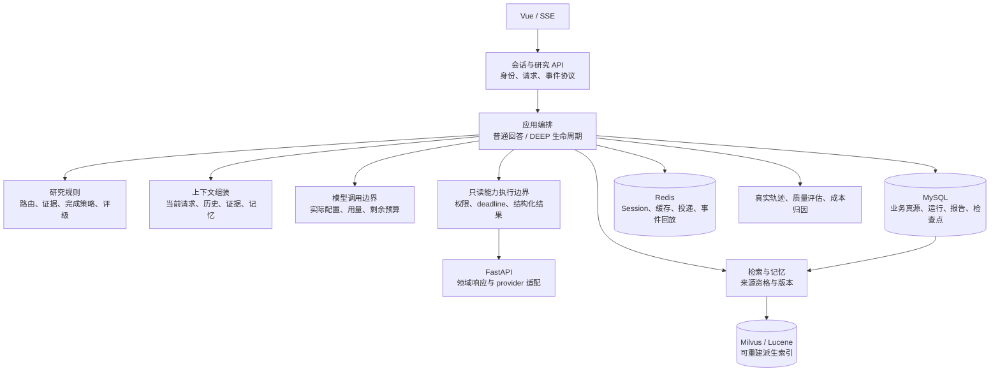

# StockSage 架构与 Agent 工程设计审查

本报告评估技术选型、代码组织、Agent、数据模型和工程治理的设计水平，提供演进方案。依据为当前工作区源码及公开的一手工程资料；不属于缺陷审计、性能测试或生产认证。本次未运行基线、构建、测试、评估或真实模型调用。历史验证与待验收状态以 [progress.md](../../progress.md) 为准，不在这里重复维护。

## 1. 总体结论

**StockSage 已经是具备较完整执行约束和恢复机制的垂直 Agent 应用，但尚未形成成熟的生产 Agent 平台。最突出的长处是执行正确性设计；最需要提升的是可演进的模块契约、真实答案质量闭环、运行可复现性和资源成本治理。**

这个判断不是根据框架数量、Agent 数量或测试数量作出。代码中已经存在服务端动作目录、证据账本、确定性评级策略、租约与 fencing、checkpoint 和原子发布；与此同时，核心编排类横跨多种职责，跨语言边界仍大量交换原始 JSON，答案质量和额外模型阶段的收益尚未形成同源、可比较的完整证据链。

仓库 [CLAUDE.md](../../CLAUDE.md) 的产品定位仍是求职导向的投研演示。本次“大厂标准”应首先落到**团队能否安全修改、解释结果、比较版本和控制成本**，并不自动授权把产品扩展为多租户生产平台。下面将近期设计改进与规模化前置条件分开。

| 维度 | 设计评价 | 主要依据与限制 |
|---|---|---|
| 技术选型与服务划分 | 方向合理，可继续使用 | Java 掌握业务与执行，Python 适配金融数据，Vue 展示；没有必要因 Agent 标签重写语言 |
| Agent 控制与恢复 | 是项目最有价值的部分 | 后端拥有动作、预算、状态与发布权；这些设计仍不能单凭源码证明生产可靠性 |
| Java 模块与代码组织 | 已有领域对象，但编排职责集中 | 类型化计划、证据与策略已存在；大类仍混合协议、业务、上下文和生命周期 |
| 数据模型与一致性 | 核心权威与事务边界清楚 | Flyway、SQL 真源、版本快照和发布事务合理；运行身份、快照升级和生命周期还需完善 |
| RAG 与记忆 | 功能完整，部署和知识资格需更明确 | 混合检索与来源发布较完整；副本同步、生成结论复用与事实支持是不同问题 |
| 质量与成本治理 | 有评估基础，尚不足以证明复杂度收益 | 组件评估、执行契约、真实回答语义质量必须分开解释 |
| 共享环境与组织协作 | 当前以本地工作台为边界 | 可复现制品、版本回退、资源公平性与组织权限需在对外服务前补齐 |

不提供没有标尺支持的百分制评分，也不声称掌握 Google、Meta、腾讯或字节跳动的内部实现。外部参照采用公开可核实原则：复杂度应带来可测收益、同时评估轨迹和结果、定义用户可感知的服务目标。见文末一手资料。

## 2. 技术选型：保留主干，修清边界

| 选型 | 判断 | 应做的改进 / 改换条件 |
|---|---|---|
| Java、Spring Boot、Spring AI | 适合业务控制、持久化和受约束 Agent 编排 | 将模型 SDK 限在调用边界，领域策略不依赖 provider 特有 DTO；不为展示框架能力改写现有控制面 |
| Spring AI Alibaba 与 OpenAI-compatible 客户端 | 当前分别承担 rerank 等能力及 chat，使用目的明确 | 维护经验证的依赖组合及升级说明；不能把“兼容接口”理解为所有 provider 行为一致 |
| 自有固定工作流 | 适合当前五类路由与只读研究 | 保留；只有任务种类、长期等待、人工暂停等能力让自维护成本显著增长时，才评估工作流引擎 |
| MVC、Flux/SSE、同步 JPA/HTTP 工具 | 混用本身不构成设计错误 | 明确这是阻塞业务执行加流式传输；统一线程、deadline、取消和限流边界。只改成 reactive 返回值不会获得端到端非阻塞能力 |
| Python FastAPI | 与 AKShare、BaoStock、Pandas 等数据生态匹配 | 固定领域响应和 provider 语义；不把用户业务、Agent 决策再迁入 Python |
| MySQL、JPA、Flyway | 足以承载当前业务和任务真源 | 保留关系字段与 JSON 快照的混合模型；以查询、约束和生命周期决定关系化范围 |
| Redis Session、缓存、Stream | 当前复用成本低且职责可解释 | 业务状态继续由 SQL 拥有；明确队列、缓存、会话各自的容量与故障语义 |
| Milvus 与进程内 Lucene | 能分别覆盖向量与词法召回 | 接受双索引运维成本就应定义同步、重建和新鲜度；没有规模证据就不再加 Elasticsearch，也不为减少一个组件立即迁库 |
| Vue 与 SSE | 满足研究进度和回答推送 | 强化事件协议、分页和可恢复状态；没有双向实时协作需求就无需换 WebSocket |
| Phoenix、OTel、Python eval | 已有可扩展基础 | 补真实模型 usage、跨服务关联与版本归因，复用现有工具，不另建通用观测或评估平台 |

依赖事实入口为 [pom.xml](../../stocksage-backend/pom.xml)、[requirements.txt](../../stocksage-data-service/requirements.txt) 和 [package.json](../../stocksage-frontend/package.json)。后端目前独立固定 Boot、Spring AI 和 Alibaba 版本，官方 [Alibaba 版本说明](https://java2ai.com/docs/versions/) 提供组合参考，并要求以 BOM/模块 POM 为准。应管理**已验证的组合**，本次静态审查没有证明当前组合不兼容，也没有必要直接追逐最新大版本。

## 3. 优先设计改进

优先级表示改进先后，不是 bug 严重度。P1 为后续 Agent 迭代最应先补的基础；P2 为领域深化或明确触发条件后的演进。下文验收标准均是未来实施时的判据，本次没有执行。

### A01 · P1：把真实答案质量作为发布依据，并证明额外模型阶段的价值

**事实。** [RagEvalService:62](../../stocksage-backend/src/main/java/com/stocksage/service/RagEvalService.java#L62) 使用独立检索与回答链，[AiConfig:160](../../stocksage-backend/src/main/java/com/stocksage/config/AiConfig.java#L160) 配置专用回答模型。生产回答还经过路由、工具、记忆和不同上下文预算，[ChatService:801](../../stocksage-backend/src/main/java/com/stocksage/conversation/ChatService.java#L801) 是实际组装入口。已有 ordinary 与 DEEP live runner，不能说项目没有端到端评估；但 [ordinary runner:78](../../rag-eval/run_ordinary_live_eval.py#L78) 明确将 `answer_quality` 记为 `NO_DATA`。

**评价。** 独立组件评估有助于定位检索问题，执行契约评估有助于验证走了正确路径；二者都不能替代真实答案的主张支持率、数字正确性、反证覆盖和有用性。大厂级设计的要求是能证明一次 prompt、模型或编排调整对实际产品的影响。

**最小方案。** 在现有真实入口回放与结果导出中增加答案质量维度，保留现有组件诊断。标注实际回答中的关键主张及其实际可见证据，分别判断引用合法、证据支持、数值/单位/期间一致、重要反证和未知项。先用小规模人工复核校准 judge，不增加每次在线请求的固定审核模型。

用同组输入与冻结证据做三项成对比较：意图识别简化方案与当前融合；普通路线单次综合与领域分析后再综合；DEEP 单次综合、一轮辩论与自适应辩论。用于调权的数据与最终验收集分开；报告样本量、任务分层与不确定性，避免一次平均分决定架构。

**验收。** 每个复杂阶段都有可解释的质量增益与延迟、成本代价；执行契约通过、引用合法和答案正确分别出数。没有收益的步骤可以裁减，有收益的步骤有明确适用范围。评估必须使用实际生产链路的模型、prompt、预算与证据，不能用评测专用强模型成绩代替。

### A02 · P1：按变化原因拆清 Java 编排职责，保持模块化单体

**事实。** [ChatService:190](../../stocksage-backend/src/main/java/com/stocksage/conversation/ChatService.java#L190) 汇集会话、RAG、路由、记忆、工具预取和事件服务；[streamChat:246](../../stocksage-backend/src/main/java/com/stocksage/conversation/ChatService.java#L246)、[提示组装:801](../../stocksage-backend/src/main/java/com/stocksage/conversation/ChatService.java#L801)、[会话管理:751](../../stocksage-backend/src/main/java/com/stocksage/conversation/ChatService.java#L751) 共同位于一个类。DEEP 的后台入口和同步入口分别位于 [DeepResearchPipeline:88](../../stocksage-backend/src/main/java/com/stocksage/research/DeepResearchPipeline.java#L88) 与 [559](../../stocksage-backend/src/main/java/com/stocksage/research/DeepResearchPipeline.java#L559)。

**评价。** 问题不在文件长，而在修改提示预算、消息持久化、SSE 生命周期或研究策略都需要理解相邻的其他机制。包名区分 controller/service/repository 还不足以表达业务模块所有权。现有大量逐字段、逐方法说明中，也应优先保留契约与约束，减少复述与历史过程注释。

**最小方案。** 先从 ChatService 分离纯上下文组装和会话操作，优先复用现有 ConversationMessageService；让入口只组织“准备请求—执行—交付”。研究应用服务拥有阶段状态，传输适配层拥有 SSE，证据模块拥有可引用性，模型适配层拥有 SDK 细节。分别明确后台与同步入口的业务差异，再复用相同阶段；不要把两条链机械合并成高度配置化执行引擎。

在现有单模块中先按 `conversation / research / evidence / knowledge / identity` 建立包边界与依赖方向，代码逐步迁移；只对确有多个实现或需替换的外部边界抽接口，不创建统一 BaseAgent/BaseService 或单实现工厂。

**验收。** 调整 SSE 不需要改证据判定；调整上下文策略不需要改任务租约；增加一个 provider 不需要改会话持久化。评估逻辑可以调用真实上下文组装，而不复制一份产品行为。已有路由、证据、发布语义保持。

### A03 · P1：建立跨语言领域契约，把数据含义放到数据边界

**事实。** [DataServiceClient:129](../../stocksage-backend/src/main/java/com/stocksage/client/DataServiceClient.java#L129) 等方法返回 JSON String，[stock.py:71](../../stocksage-data-service/app/routers/stock.py#L71) 等接口返回字典；[EvidenceEnvelopeMapper:195](../../stocksage-backend/src/main/java/com/stocksage/evidence/adapter/EvidenceEnvelopeMapper.java#L195) 再识别多个来源、时间字段名。现有 mapper 已统一 ordinary/DEEP 证据，应该复用。

**评价。** JSON 作为传输格式合理，但核心领域语义不应长期由每个消费者猜测。金融研究中的证券身份、交易市场、币种、复权口径、报告期间、业务时点、抓取时间、来源修订与数据延迟，都会改变“这份数据能说明什么”。这些比选用 gRPC 还是 HTTP 更重要。

**最小方案。** 先规范 K 线、财报、新闻三类响应：Pydantic response model 对应 Java record；固定版本、标的、provider、业务时点与抓取时间，以及明确的空结果/过期/不支持/失败状态和可重试错误。各领域保留自己的 payload，不建立万能 `Map<String,Object>` 领域模型。以实际 OpenAPI/模型为结构权威来源，迁移在现有 client/mapper 边界完成。

缓存继续复用 [ToolResultCache:50](../../stocksage-backend/src/main/java/com/stocksage/cache/ToolResultCache.java#L50)，但 TTL 只表示重新获取的频率，不能作为业务新鲜度。明确各能力允许多旧的数据、是否接受延迟数据，以及 fallback 后是否仍满足同一口径；不把所有旧数据都静默当成功。

**验收。** 新增 provider 不改变下游字段含义；相同标的、期间和口径可以直接比较；Agent 不需要从自然语言错误判断可重试性。逐类迁移并保持已有接口兼容，无需一次重写所有工具。

### A04 · P1：每次研究拥有独立运行身份和可比较的版本指纹

**事实。** [ResearchTaskService:616](../../stocksage-backend/src/main/java/com/stocksage/research/ResearchTaskService.java#L616) 构造提交身份；[672](../../stocksage-backend/src/main/java/com/stocksage/research/ResearchTaskService.java#L672) 等路径支持复用终态任务重新研究。已有数据快照、上下文哈希、策略版本与模型名，但尚未形成每次运行统一保存的执行版本契约。

**评价。** 重复投递、失败重试和用户主动重新研究是三个概念。复用 task 行可支持工作台，但不利于回答“同一个问题为什么昨天和今天不同”“升级模型后成本和质量如何变化”。仅记录 FAST/STRONG 或模型别名不足以解释变化。

**最小方案。** 重复提交附着当前 run；同一次运行的恢复属于 attempt；主动重跑建立新 run，并关联同一请求分组或前次运行。业务请求指纹用于分组，提交幂等键绑定一次主动运行：重复投递复用该键，主动重跑生成新键。先在现有任务表演进这些字段与唯一性语义，不必立即创建三套实体。每个 run 记录一个不可变的执行清单：实际生效的模型/参数、prompt 与策略哈希、能力清单版本、embedding/rerank/分块配置、数据快照和代码制品标识。provider 不提供固定模型修订时如实记录别名和时间，不能承诺位级复现。

**验收。** 每次主动研究均可独立追溯输入、结果和花费；能判断差异来自数据、模型还是策略。重试不制造新的业务研究，主动重跑不覆盖旧研究归因。迁移明确旧幂等键的映射，保留历史 ID 的查询兼容。

### A05 · P1：统一执行预算、并发和实际成本

**事实。** [AsyncConfig:31](../../stocksage-backend/src/main/java/com/stocksage/config/AsyncConfig.java#L31) 已隔离 SSE、意图与研究 worker；[CapabilityGateway:151](../../stocksage-backend/src/main/java/com/stocksage/capability/CapabilityGateway.java#L151) 使用剩余 deadline。[DataServiceClient:482](../../stocksage-backend/src/main/java/com/stocksage/client/DataServiceClient.java#L482) 与 Python provider 仍各自管理等待与重试；[ChatService:1176](../../stocksage-backend/src/main/java/com/stocksage/conversation/ChatService.java#L1176) 有字符估算 token 路径。

**评价。** 阶段有 timeout 不等于整次任务有预算。排队、重试、补证、辩论和最终综合都消耗同一个用户可接受的时间与成本；客户端停止等待也不等于底层工作已经停止。估算 token 不应作为完整多 Agent 成本账单。

**最小方案。** 复用 invocation context，把总 deadline、允许调用次数、token/费用预算和执行主体传到工具与模型边界；每次重试消耗同一预算。跨机器传递预算时定义时钟偏差或接收端剩余时长语义。在线分析与低优先级记忆更新使用有界排队，昂贵 provider 有并发上限。先解决已知资源竞争，再按负载拆队列。

沿现有 OTel/Phoenix 贯通 Java 与 Python trace context，分别记录排队、缓存、provider、模型和 fallback 耗时。模型调用保存实际 usage，并与估算明确区分；只采用低基数指标标签，不把用户、查询文本或证券全集放进指标维度。

**验收。** 可以解释一项合格研究的总成本与 P95 耗时组成；耗尽预算有明确终态；排队和 provider 故障不会无限放大上游工作。SLO 分普通首字/完成时间、DEEP 排队/完成时间及合格率，不凭空套用“所有 API 200ms”。

### A06 · P2：意图融合与多 Agent 辩论需要校准，而非增加角色

**事实。** [IntentFusionPolicy:21](../../stocksage-backend/src/main/java/com/stocksage/agent/intent/IntentFusionPolicy.java#L21) 使用固定信号权重与澄清阈值；n-gram 是 embedding 不可用时的替代信号或平局辅助，并非四个等权分类器。普通流程先领域分析再综合，见 [ToolPrefetchService:222](../../stocksage-backend/src/main/java/com/stocksage/service/ToolPrefetchService.java#L222)。DEEP 在取证后，对同一研究状态运行受控辩论，见 [ResearchDebateService:205](../../stocksage-backend/src/main/java/com/stocksage/research/ResearchDebateService.java#L205)。[AgentConfig:154](../../stocksage-backend/src/main/java/com/stocksage/config/AgentConfig.java#L154) 起的 Bull/Bear/Manager 共享强模型配置。

**评价。** 融合分数不是天然校准的正确概率；多角色不是独立事实来源；可复算评级不等于评级规则具有经验证的投资预测能力。当前结构有利于扩大论证角度和限制执行风险，但效果需要 A01 的证据。不能因研究过程更长就认定研究更深。

**最小方案。** 保留低置信澄清、后端动作目录、引用绑定、Manager 续停与 Java 裁决。分别测错误执行率、澄清率、覆盖率、有效反证增量、论点重复率与结果稳定性。对简单指标或摘要，质量非劣时才去掉中间生成；复杂任务确实缺证时，优先针对缺口取证。现有单步补证已有受控设计，扩大自主性前先证明这一小步的效果。

**验收。** 每个信号和轮次都有任务分层的收益说明；续停对应新增有效信息。固定评分阈值的含义和校准依据可解释。无需默认引入异构模型投票、更多专家或自由 ReAct。

### A07 · P2：RAG 的来源权威已经清楚，扩副本前补索引同步契约

**事实。** [RagService:389](../../stocksage-backend/src/main/java/com/stocksage/rag/RagService.java#L389) 用 SQL 镜像决定正文与版本；[KeywordSearchService:114](../../stocksage-backend/src/main/java/com/stocksage/rag/KeywordSearchService.java#L114)、[325](../../stocksage-backend/src/main/java/com/stocksage/rag/KeywordSearchService.java#L325) 从 SQL 重建本进程 Lucene，并依靠本进程提交事件更新。该权威关系应保留。

**评价。** SQL 回查限制了哪些候选可以引用，但不能让落后的副本召回刚新增的文档。进程内索引也使语料增长同时影响每个 API 实例的内存与重建时间。这是部署拓扑的设计上限，本次没有测量吞吐或认定当前容量不足。

**最小方案。** 单实例阶段保留。增加第二个检索实例前，给来源变更建立持久化版本序列/游标，各副本记录应用水位并补偿更新。通过语料规模、启动预算和检索负载决定是否独立部署检索；不因为已有 Lucene 就立即迁 Elasticsearch。

**验收。** 能回答每个副本看到哪个来源版本、索引落后多久、全量重建消耗多少资源；增删改与重启符合相同的可见性契约。embedding、分块或 rerank 改动与索引版本绑定，可回退到可解释的组合。

### A08 · P1/P2：数据库应从工作状态存储升级为可演进的运行记录

**已有基础。** [V1 schema:17](../../stocksage-backend/src/main/resources/db/migration/V1__baseline_schema.sql#L17) 有用户/会话/时间查询索引；[46](../../stocksage-backend/src/main/resources/db/migration/V1__baseline_schema.sql#L46) 的报告唯一性与 [68](../../stocksage-backend/src/main/resources/db/migration/V1__baseline_schema.sql#L68) 的任务幂等约束有明确业务含义。checkpoint 独立于任务主行，报告审核具有版本并发控制，Flyway 拥有 DDL。关系字段加报告 JSON 是合理选择。

需要分别处理以下三类数据，而不是一概“去 JSON 化”：

| 数据 | 现有设计上限 | 最小演进 |
|---|---|---|
| checkpoint | [CheckpointService:55](../../stocksage-backend/src/main/java/com/stocksage/research/ResearchTaskCheckpointService.java#L55) 直接反序列化 AnalysisState，完整格式随应用 DTO 演进 | 外层增加独立 schemaVersion，明确旧版本升级/停止恢复规则；业务策略版本不能代替存储格式版本 |
| Trace 步骤 | [TraceService:80](../../stocksage-backend/src/main/java/com/stocksage/trace/TraceService.java#L80) 每次重写整个 steps JSON，适合小规模展示，长轨迹产生累计写放大 | 当用于运营/审计时，主表保存摘要，步骤改为追加子表；稳定事件 ID/序号做幂等与顺序约束，attributes 仍可用 JSON |
| 核心关系与查询字段 | 会话、消息、任务、报告用 ID 关联，主要 schema 未使用数据库外键；部分约束留给服务层 | 明确聚合所有者与删除策略；同库且共同生命周期的关系可选择性加外键，跨历史审计保留关系则明确软删除/校验策略；只把实际筛选、排序和约束所需字段关系化 |

**评价。** 不使用外键不自动意味着设计差，但必须有人负责引用完整性；同理，没有依据要求分库分表。SQL/JPA 混合访问也可以合理：聚合写入可用 JPA，fencing、CAS 和特定查询用显式 SQL；关键是事务与数据所有者清晰。

**验收。** 首次跨版本 worker 发布前完成 checkpoint 格式契约；Trace 每步写入成本不随已存步骤数增加；列表采用有界读取，索引来自真实访问路径而不是“每字段加索引”。旧 JSON 与旧 API 采用渐进迁移，保留可读性。

### A09 · P2，批量摄取触发：把外部计算与 SQL 发布事务解耦

**事实。** [KnowledgeIngestionService:190](../../stocksage-backend/src/main/java/com/stocksage/knowledge/KnowledgeIngestionService.java#L190) 在来源锁与事务边界内组织 embedding/向量写入及来源发布。已存在版本化向量、提交后清理与补偿；[ResearchTaskPublicationTransaction:58](../../stocksage-backend/src/main/java/com/stocksage/research/ResearchTaskPublicationTransaction.java#L58) 则把报告、会话消息和任务终态保持在同库原子发布边界。

**评价。** 报告发布事务应保留。摄取策略适合低频受控写入，但外部计算耗时会延长数据库连接与锁占用；这是吞吐扩展时需要处理的边界，不应简单删掉事务。

**最小方案。** 批量/并发摄取成为真实需求时，登记带生命周期的待发布版本，在事务外完成计算，并保护准备中的向量；随后以短事务 CAS 校验版本并发布。清理仅回收已放弃或超期的待发布版本及旧版本，不能直接沿用“非当前已提交版本即清理”的规则。第二个外部投影/可靠事件订阅真正需要时，再评估事务 outbox，不默认增加消息中间件。

**验收。** SQL 事务时长与 embedding 延迟解耦；发布前旧版本仍可用；准备、发布、清理有可解释状态。这个改动涉及一致性设计，应独立实施，不能夹在类拆分中完成。

### A10 · P2：长期记忆保留知识资格，避免生成结论被逐渐当作事实

**事实。** [ResearchMemoryService:873](../../stocksage-backend/src/main/java/com/stocksage/knowledge/ResearchMemoryService.java#L873) 排除非 VERIFIED、负向审核和无证据报告，但不要求人工 APPROVED；[919](../../stocksage-backend/src/main/java/com/stocksage/knowledge/ResearchMemoryService.java#L919) 将历史评级、理由与风险组织为记忆。已有衰减、冲突、撤回、来源与“当前证据优先”提示，是应保留的基础。

**评价。** 机器契约 VERIFIED、人工复核和原始事实不是同一资格。未审核历史研究可以作为上下文，但不能因为被多次召回就获得新的事实权威。现有提示降低风险，不能替代对长期复用效果的评估。

**最小方案。** 显式保留原始来源事实、用户确认事实、历史生成结论的类别，以及来源报告、审核状态与业务时点。研究记忆服务于寻找历史结论、变化和未解决问题，不计入当前证据充分性；用户画像偏好也不应自动变成市场事实。复用现有表与来源关系，不增加图数据库或通用记忆平台。

**验收。** 旧、矛盾、撤回和未审核结论不能覆盖当前原始证据；可解释记忆为何被选中以及引用了哪次研究。通过注入/不注入的成对评估证明连续任务收益。

### A11 · P2：工具治理统一执行语义，不扩张通用 Skill DSL

**事实。** [SkillExecutionService:22](../../stocksage-backend/src/main/java/com/stocksage/skill/SkillExecutionService.java#L22) 主要承接 NEWS 内联确定性能力；[ToolPrefetchService:173](../../stocksage-backend/src/main/java/com/stocksage/service/ToolPrefetchService.java#L173) 仍直接调用其他 tools。[CapabilityPolicy:31](../../stocksage-backend/src/main/java/com/stocksage/capability/CapabilityPolicy.java#L31) 已表达 allowlist、风险和 deadline。

**评价。** 渐进迁移是合理的，直接调用不等于越权。长期需要防止普通、DEEP 与 Skill 路径各自定义权限、失败分类和观测。MCP 是工具接入协议，不能代替业务授权或编排；YAML 配置能力也不等于更高的 Agent 智能。

**最小方案。** 下一项真实能力接入复用已有调用上下文、预算、结果与观察契约，只迁移需要共同治理的边界。继续限制 Skill 为可解释的确定性能力组合；模型不获得知识库写工具，IBKR 继续只读。不要新增通用 DAG 编辑器、任意脚本步骤或为每个小工具创建独立服务。

**验收。** 同一能力从不同路径执行时，主体、权限、预算、来源、错误和指标语义相同；新增 provider 不再复制一套运行策略。

### A12 · P2，对外共享触发：资源权限、生命周期和发布成为明确契约

**事实。** 已有 [SecurityConfig:100](../../stocksage-backend/src/main/java/com/stocksage/config/SecurityConfig.java#L100)、[AuthController:91](../../stocksage-backend/src/main/java/com/stocksage/controller/AuthController.java#L91) 的 Session/CSRF/身份处理；管理操作使用 [AdminApiInterceptor:45](../../stocksage-backend/src/main/java/com/stocksage/config/AdminApiInterceptor.java#L45) 的 token 边界。任务有 Stream、SQL 状态、lease 与恢复扫描；[docker-compose.yml](../../docker-compose.yml) 则明确只部署基础设施，应用运行在宿主机。

**评价。** 这些符合本地演示定位。真正服务多个外部用户后，“Skill 能读什么”与“当前用户有权读什么”需要同时满足；SQL 可见性撤回与物理数据删除也需要分别表达。拥有 worker 并不等于已经具备跨租户公平调度。

**最小方案。** 对外共享前，明确公共市场数据、个人研究、账户信息与管理操作的归属；需要组织管理时再增加可识别主体的管理权限和审计、服务间身份。区分任务接收、排队与实际执行额度，恢复扫描分页，配额有原子性。给消息、报告、Trace、checkpoint、索引和记忆分别规定保留/撤回/删除语义，复用现有清理与重试机制。

发布采用一次构建的版本化制品、完整依赖解析记录、配置校验和可回退部署。健康检查区分存活、可接流量与能力降级；长任务发布遵守 A08 的格式兼容。共享演示环境可先用现有 Compose 思路，不需要 Kubernetes、Service Mesh 或多区域部署。

**验收。** 每次管理操作能关联主体；私有数据的查询范围由后端确定；一个用户不会耗尽全部研究容量；能区分立即不可检索与物理删除完成；同一制品可以重部署和回退。没有真实多用户需求时，不先搭组织 IAM 平台。

## 4. 目标结构

目标是一个边界清楚的模块化后端，仍保持现有三服务分工。下图表示建议的职责归属，不表示新增部署服务，也不表示全部已经实现。

业务规则依赖自己的类型，应用层调用外部适配器；模型只做被允许的决策，数据库拥有业务结果。不要将 SDK 类型、SSE chunk 或 provider 原始 JSON 当作跨模块通用领域对象。

## 5. 实施顺序与完成标准

| 顺序 | 工作包 | 可交付结果 | 不进入这一批的工作 |
|---|---|---|---|
| 1 | A01 + A04/A05 的最小归因字段 | 真实回答质量定义、固定对比集、实际模型/上下文/证据指纹及 usage 来源；能比较同一请求两个方案 | 新 Agent、新框架、模型自动路由平台 |
| 2 | A03，一次一个数据能力 | 先完成一种领域响应和新鲜度契约，再迁下一种；复用现有证据 mapper | 重写全部工具、改通信协议 |
| 3 | A02 + A08 的 checkpoint 契约 | 分离上下文和会话职责、明确模块依赖、版本化持久快照 | 微服务化、通用状态机 DSL、大规模目录搬迁 |
| 4 | A06 + A10 + A11 | 根据成对证据简化普通链/辩论或保留有效复杂度；统一能力语义与记忆资格 | 未校准的“更智能”开关、更多角色 |
| 5 | 有共享环境/负载需求后实施 A07/A09/A12 与 Trace 存储演进 | 索引同步、短摄取事务、资源公平性、可回退制品与清理契约 | 无需求的分库分表、多区域、服务网格 |

每一批只处理一个明确变化原因。契约迁移、行为优化和等价重构分开；引用合法率等关键约束不能作为降成本的交换条件。时间排期要由真实团队容量和目标部署规模决定，本报告不虚构人日。

优先回答这五个问题，项目的设计说服力会显著强于再增加一套 Agent 框架：

1. 每一个额外模型阶段，比更简单方案增加了什么可测价值？
2. 一条主张由什么原始证据支持，证据的期间、口径和版本是什么？
3. 同一个研究为何在两次运行中改变，能否归因到数据、模型或策略？
4. 任务恢复、升级与索引更新分别遵守什么契约？
5. 交付一项合格研究要花多少时间与成本，超预算时系统如何结束？

## 6. 一手工程参照

- [Anthropic：Building effective agents](https://www.anthropic.com/engineering/building-effective-agents)：区分固定 workflow 与自主 agent，强调简单组合及复杂度的可测收益；用于本报告的选型原则，不用于声称本项目效果。
- [Google ADK：Why evaluate agents](https://adk.dev/evaluate/)：分别评估执行轨迹/工具使用与最终结果；用于 A01 的评估分层。
- [Anthropic：Demystifying evals for AI agents](https://www.anthropic.com/engineering/demystifying-evals-for-ai-agents)：对多轮 Agent 建立任务、轨迹与结果层面的评估；用于成对实验与质量闭环。
- [Google SRE：Service Level Objectives](https://sre.google/sre-book/service-level-objectives/)：根据服务目标选择指标；用于 A05 的用户可感知 SLO。
- [OpenTelemetry：GenAI attributes](https://opentelemetry.io/docs/specs/semconv/registry/attributes/gen-ai/)：提供模型操作和消息观测语义，并提示内容可能包含敏感信息；用于用量与链路归因，不要求默认导出正文。
- [Spring AI Alibaba：版本说明](https://java2ai.com/docs/versions/)：用于框架依赖组合管理；实际升级仍以对应发行 BOM、模块 POM 和项目兼容验证为准。

## 7. 本次交付边界

新增本报告，并在 progress.md 登记审查和建议顺序；业务代码、依赖、schema 与功能完成状态未修改。现有 AGENTS.md 修改、RAG_EVALUATION.md 删除及本地结果文件保持原状。报告中的改进均为建议，不能读作已经实施或通过生产验收。
