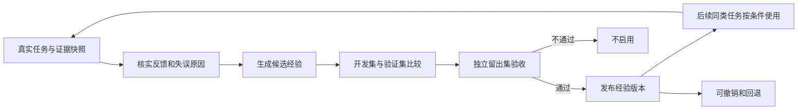

# StockSage Agent 自进化调研

本报告比较经验记忆、提示词优化、工作流优化、模型训练和代码自修改，并依据 StockSage 源码判断接入位置。论文结果仅说明对应实验中的效果，不代表 StockSage 已获得同样收益。实施建议均为提案。

## 1. 结论与优先级

**值得尝试的是“经过验证的跨任务经验更新”：从真实任务反馈中提炼处理方法，用独立样本验证，发布后让后续同类任务使用。** 保留 Java/Spring AI Alibaba 的业务执行主干，Python 继续承担离线评估和可选优化。

优先顺序：

1. **先建立真实最终答案的评价依据。** 没有这个标尺，自动修改经验或 Prompt 只是自动变化，不能证明进步。
2. **再做一个范围很小的经验闭环。** 首个候选范围是 FUNDAMENTALS 最终回答中的期间、单位和证据解释；具体选哪种错误，要由样本证明确实反复出现。
3. **经验有效后，再评估 GEPA 自动优化一个 Prompt。** 与人工修改、固定检查清单比较，验证自动搜索是否值得其调用成本。
4. **执行策略优化后置。** 只在已有可选动作和预算内实验；当前固定执行路径不能靠修改 Prompt 变成任意规划器。
5. **权重训练和代码自修改暂不进入首期。** 前者需要训练数据、奖励和可训练模型；后者还需要独立沙箱、代码验收和发布体系，超出本项目当前投研演示目标。

该顺序承接[架构审查中关于真实答案评估与归因的建议](2026-09-24-architecture-design-review.md#3-优先设计改进)，但不要求先完成所有架构重构。

## 2. 先分清什么在“进化”

工程上应问四个问题：**更新什么、根据什么反馈、影响哪些后续任务、如何证明改进。** 下表是本项目的决策分类，各类方法可以组合，不是互斥标准。

| 层次 | 改变的对象 | 代表方法及一手来源 | 对 StockSage 的判断 |
|---|---|---|---|
| 当前任务自我修订 | 本次答案或本次计划 | [Self-Refine](https://arxiv.org/abs/2303.17651) | 可作为当前回答审校；若任务结束后没有留下可复用改变，不构成跨任务进化 |
| 经验与上下文进化 | 反思记录、适用条件、处理经验 | [Reflexion](https://arxiv.org/abs/2303.11366)、[ACE](https://arxiv.org/abs/2510.04618)、[ReMe](https://arxiv.org/abs/2512.10696) | 首期可试，模型权重不变；最重要的是经验资格与收益验证 |
| Prompt 进化 | 某个模块的指令、示例或文本参数 | [GEPA 论文](https://arxiv.org/abs/2507.19457)、[官方实现](https://github.com/gepa-ai/gepa) | 可在 Python 离线搜索，Java 使用通过验证的版本；不必把应用改写为 DSPy |
| 工作流与策略进化 | 步骤连接、已有操作选择、控制流 | [AFlow](https://arxiv.org/abs/2410.10762)、[ADAS](https://arxiv.org/abs/2408.08435) | 先借鉴候选比较方式；直接接入代码生成工作流需要额外执行与验收边界 |
| 参数学习 | 可训练模型的权重 | [Agent Lightning](https://github.com/microsoft/agent-lightning) | 需要 rollout、任务奖励、训练资源；安装框架不会更新现有云模型 API 背后的权重 |
| 代码自修改 | Agent 自己的工具与执行代码 | [Darwin Gödel Machine](https://sakana.ai/dgm/) | 研究路线；暂不让在线投研 Agent 修改 Java 代码、权限或评分器 |

普通 RAG 更新让系统获得新资料；用户画像更新让系统更了解用户；程序性经验更新让系统改变处理同类任务的方法。这三者应分别评价，不能用“存了更多内容”代替学习收益。

### 2.1 经验路线：借用机制，不复制整套框架

- **Reflexion**：把任务反馈转成反思文本，保存在 episodic memory 中供后续尝试使用。它不更新权重，原论文的重试收益不能直接等同于无限跨任务学习。适合借用“失败、反馈、下次参考”的小闭环。[论文](https://arxiv.org/abs/2303.11366)
- **ACE**：把上下文当作可以逐条增补、修订和整理的经验手册，避免反复重写整段摘要丢失细节。可以借用增量管理，不必新增三个独立 Agent 服务。其金融实验包括 XBRL 实体标注与财报数值推理，不能外推为投资收益提升。[方法](https://arxiv.org/abs/2510.04618)、[实验任务](https://arxiv.org/html/2510.04618v1#S4)
- **ReMe**：强调成功与失败经验提炼、按场景复用、按效用更新或淘汰。论文和工程工具需要分别看：官方工程支持独立记忆服务及 HTTP 等接入方式，但不会自动补齐 StockSage 的租户、证据和评价契约。[论文](https://arxiv.org/abs/2512.10696)、[官方接入文档](https://github.com/agentscope-ai/ReMe/blob/main/docs/en/integrations.md)

本项目已有 MySQL、Milvus 和记忆管理。首期几条经验用版本化制品与明确匹配条件就能验证价值，无需先引入 ReMe、Letta 或 Mem0 替换存储。只有独立的记忆生命周期管理成为实际负担时，才比较外部组件。

### 2.2 Prompt 路线：GEPA 的适配价值

GEPA 利用运行反馈诊断问题、生成候选 Prompt，并在验证样本上比较与组合候选。官方提供 `GEPAAdapter`，包括 `evaluate` 和 `make_reflective_dataset`，因此不强制使用某一种业务框架。[官方适配说明](https://github.com/gepa-ai/gepa#adapters-plug-gepa-into-any-system)

StockSage 可设计为：Python 优化器调用受限评估入口，入口执行同一套 Java 生成逻辑、返回真实答案与评分；优化结果输出为待发布 Prompt 制品。**这条适配链尚未实现，也未验证兼容性。** 当前角色 Prompt 多在 [AgentConfig](../../stocksage-backend/src/main/java/com/stocksage/config/AgentConfig.java#L48) 中定义，不存在供优化器随意替换整套线上提示词的通用接口。

第一次仅开放一个模块的分析方法或表述部分。角色边界、证据规则、输出协议和权限保持由代码控制。优化目标不能只看 judge 总分，还要看数字、引用支持、必要信息覆盖与成本。

### 2.3 工作流、训练与代码路线的代价

**AFlow / ADAS。** AFlow 搜索工作流连接和节点 Prompt；ADAS 的 Meta Agent Search 直接生成 Agent 的执行函数并将候选及分数留在档案中。这些方法需要可执行候选和领域评分集。StockSage 可以先比较少量人工界定的策略候选，不必先引入任意 Python 工作流代码。[AFlow 官方仓库](https://github.com/FoundationAgents/AFlow)、[ADAS 官方仓库](https://github.com/ShengranHu/ADAS)

**Agent Lightning。** 官方训练架构由模型请求采集、rollout 控制和训练器构成，训练器更新 policy。业务 harness 可以保留，但仍需训练端可访问的模型权重和训练资源。只有明确要自部署或微调模型，并积累可靠标注/奖励后，才值得做成本比较。[官方架构](https://github.com/microsoft/agent-lightning#-architecture)

**DGM。** 用编程基准验证 Agent 对自身代码的修改，不是证明修改必然有益。官方同时报告过伪造工具执行和破坏奖励检测的现象。因此若未来实验，应在隔离分支和沙箱产出可审查补丁；评分器、凭证和业务发布权不能交给被优化对象。[官方研究说明](https://sakana.ai/dgm/)

### 2.4 Spring AI Alibaba 是否已有现成能力

官方 DeepResearch Graph 文档列出了 Reflection、HITL 和 Self-evolution Memory，并将后者描述为基于交互反馈的用户角色记忆。这是应用范例的能力说明，不是“给任何 Spring AI Alibaba 项目增加一个开关即可自进化”的承诺。[官方文档](https://java2ai.com/agents/deepresearch/graph/quick-start/)

StockSage 的真实边界由自己的 `Coordinator`、`RoutePlanCatalog` 和执行服务决定。无需为了使用“自进化”名称迁移到该范例，接入 API 前仍需核对项目实际依赖。

## 3. 项目已有的基础和缺口

以下为源码检查结论，不代表进程实际配置或在线效果；运行状态和既有验证边界以 [progress.md](../../progress.md) 为入口。

| 能力 | 已有事实 | 与自进化的差距 |
|---|---|---|
| 受控规划 | [Coordinator:170](../../stocksage-backend/src/main/java/com/stocksage/agent/Coordinator.java#L170) 将意图转成计划；[RoutePlanCatalog:50](../../stocksage-backend/src/main/java/com/stocksage/agent/RoutePlanCatalog.java#L50) 固定路由动作 | 尚无历史收益驱动的策略更新；Prompt 不能添加未实现的动作或改变硬编码顺序 |
| 历史研究记忆 | [ResearchMemoryService:186](../../stocksage-backend/src/main/java/com/stocksage/knowledge/ResearchMemoryService.java#L186) 采集报告；[资格检查:873](../../stocksage-backend/src/main/java/com/stocksage/knowledge/ResearchMemoryService.java#L873) 排除负向审核和不合格证据；[记忆正文:923](../../stocksage-backend/src/main/java/com/stocksage/knowledge/ResearchMemoryService.java#L923) 是历史结论、依据、风险与来源 | 复用的是研究内容，没有失败原因、修正方法和验证收益；机器 VERIFIED 也不是事实全对的证明 |
| 人工反馈 | [InvestmentReportVersionService:356](../../stocksage-backend/src/main/java/com/stocksage/research/InvestmentReportVersionService.java#L356) 保存审核评论与历史，并撤销负向报告记忆 | 有“反馈改变记忆可见性”的窄闭环，但没有把评论提炼成策略经验 |
| 记忆使用位置 | [ChatService:317](../../stocksage-backend/src/main/java/com/stocksage/conversation/ChatService.java#L317) 跳过 DEEP 和澄清请求；[870 行](../../stocksage-backend/src/main/java/com/stocksage/conversation/ChatService.java#L870) 注入普通最终回答 | 不会自动影响前面的领域 Agent、工具规划或 DEEP；新增经验必须接在真正需要改变的决策前 |
| 当前任务适应 | [DeepEvidenceReplanService:110](../../stocksage-backend/src/main/java/com/stocksage/research/DeepEvidenceReplanService.java#L110) 最多执行一次聚焦新闻补证；[AgentConfig:220](../../stocksage-backend/src/main/java/com/stocksage/config/AgentConfig.java#L220) 定义辩论续停决策 | 属于当前任务决策，不会从历史任务更新策略。补证配置默认关闭，未核验本次实际进程开关 |
| 运行追踪 | [TraceService:107](../../stocksage-backend/src/main/java/com/stocksage/trace/TraceService.java#L107) 区分技术状态和业务结果；[AgentTrace](../../stocksage-backend/src/main/java/com/stocksage/model/entity/AgentTrace.java) 保存步骤、时间等 | 可复用 traceId；仍需绑定最终答案、实际证据、Prompt/经验版本、评分结果和真实模型用量 |
| 现有评估 | [PlannerEvalService:150](../../stocksage-backend/src/main/java/com/stocksage/service/PlannerEvalService.java#L150) 评计划；[ordinary runner:78](../../rag-eval/run_ordinary_live_eval.py#L78) 将 answer_quality 设为 NO_DATA；[RagEvalService:61](../../stocksage-backend/src/main/java/com/stocksage/service/RagEvalService.java#L61) 用独立模型链生成评估答案 | 这些检查各有用途，不能代替真实产品最终答案质量；[现有 RAGAS runner](../../rag-eval/run_ragas_eval.py#L77) 可复用部分评分装配 |

现有研究记忆的时间衰减、冲突处理和撤销可提供设计参考，但程序性经验不宜直接套用“按股票与投资方向排序”的语义。经验应按任务类别、适用条件和相关执行版本匹配。

## 4. 最小可验证闭环

这里的自动化是“自动收集、生成候选、评估”；第一阶段保留人工审核发布。稳定后可以再定义自动发布门槛，而不是每条对话结束都改线上行为。

### 4.1 首个实验范围

先选 **FUNDAMENTALS 最终回答的证据解释**：财报数字、期间、单位有可核实依据，且已有普通路线评估入口。先收集失败样本再决定学习内容；若没有重复错误，就先不建经验系统。

例子仅说明机制，不是本轮发现的线上缺陷：

> 用户问“第三季度经营现金流为什么下降”，证据只给出前九个月累计值。一个候选经验可以规定：先确认 duration、单位和财年口径；只有同一口径的累计期间都可获得时才考虑差分，否则明确说明单季数据不足。不能将累计同比直接描述成单季同比。

事实上，现有 [Fundamentals Prompt](../../stocksage-backend/src/main/java/com/stocksage/config/AgentConfig.java#L56) 已要求区分季度与累计、财年与自然年。**再次存一句“注意口径”很可能只是重复指令。** 必须用真实失败定位：是上游数据缺失、字段含义不清、数值计算错误，还是生成阶段没有执行已有规则。前几类问题优先修数据契约或确定性代码；只有可由具体示例和处理方法改善的生成问题，才进入经验候选。

第一版只影响最终回答，不声称已改善取证策略或领域 Agent。若失败源在领域分析或 DEEP，下一轮再明确对应接入点。

### 4.2 一条经验最少需要什么

| 信息 | 作用 |
|---|---|
| ID、版本、状态 | 标识候选/启用/撤销，支持恢复旧版本 |
| 适用条件与不适用条件 | 限定 route、任务类型、数据口径和组件版本，避免全局乱用 |
| 失败现象与处理方法 | 描述怎样处理问题，而不是记住一次投资结论 |
| 来源 traceId、反馈/证据引用 | 能追溯为什么生成该经验，不重复复制全部原文 |
| 验证记录引用 | 知道在哪个数据集、评分器和基线下被比较 |

这些是逻辑字段，不要求首期建多张表。离线试验可先用一个版本化 JSON 制品；确有在线管理需求后再进入 MySQL。小经验集先按明确条件筛选，不新增向量库或知识图谱。

### 4.3 在现有工程中的接法

- **采集与评估：** 扩展 `rag-eval` 现有真实入口采集，保存实际最终答案和实际可见证据；复用 traceId。报告审核评论可作为候选来源，但“用户不喜欢”必须进一步标注原因，不能直接等同事实错误。
- **候选提炼：** 用一个离线步骤从已核实样本生成经验，允许输出“无需新增”；合并重复内容，拒绝把原网页指令、一次价格预测或用户私有信息变成全局规则。
- **注入：** 首期在 `ChatService.buildPromptMessages` 中给合格的 FUNDAMENTALS 请求增加一个有界经验区段。它与当前事实证据分开，服从既有可信系统规则，不具有工具或策略授权能力。只改这个位置不会影响此前已执行完的 specialist 或取证阶段。
- **发布：** 每次请求绑定一个明确经验版本；Trace 记录实际采用的 ID/版本。先用现有部署/制品方式启用和回退，不必建设在线配置中心。
- **后续扩展：** 若经验要影响 DEEP 补证或辩论，需在相应决策前接入，纳入任务快照及恢复语义，避免同一个 checkpoint 恢复时悄悄换规则。现有固定动作目录、Evidence ID、Java 评级裁决和 IBKR 只读边界不参与自修改。

动态记忆保留用户隔离；只有经过脱敏与审核的通用方法才可以进入共享经验。学习组件不获得运行评分器修改权。

## 5. 如何判断真的进步

采用“可核实规则 + 人工校准的模型评分”。研究 Agent 的评价需要同时看证据支持、关键事实覆盖和来源质量；流畅程度或模型自评不能单独作为发布依据。[Anthropic 研究 Agent 评估说明](https://www.anthropic.com/engineering/demystifying-evals-for-ai-agents)

| 维度 | 需要判断什么 | 防止哪种假进步 |
|---|---|---|
| 事实与口径 | ticker、期间、币种、单位、数值是否与来源一致 | 文笔更好但数字错误 |
| 引用支持 | 引用存在，且被引用内容确实支持对应主张 | 只会添加合法 Evidence ID |
| 覆盖与拒答 | 有证据时回答关键问题，没证据时指出缺口 | 全部拒答换取零幻觉 |
| 反证与边界 | 不省略已知重要反证，不把推断写成事实 | 迎合用户或固定多/空立场 |
| 错误复发 | 留出样本上的同类失误是否减少 | 只记住训练样例 |
| 成本与时延 | 模型调用、输入输出 token、端到端时延及离线优化花费 | 得分微升却显著增加资源消耗 |

具体实验约束：

1. **开发、候选选择与最终验收数据分开。** 按公司、报告期或问题模板隔离近重复；最终留出集不反馈给候选生成器。反复调过的测试集已是开发资料，不能继续宣称独立验收。
2. **同条件成对比较。** 冻结模型配置、工具响应与证据；明确冻结的是最终模型实际输入。后续做端到端 live 复核，避免把阶段回放收益等同整体产品收益。
3. **隔离会话、缓存和学习写入。** 基线与候选使用独立评估状态；固定经验版本，验收期间不得相互写入经验。报告或答案缓存不能让两组拿到同一个旧结果。
4. **至少比较原始版本、人工固定清单、自动生成经验三组。** GEPA 后续单独加入，避免同时改模型、Prompt、经验和工作流而无法归因。若固定规则同样有效，就保留固定规则。
5. **报告样本数与波动。** 小批量样本可用来验证机制，不能证明广泛效果；对关键失败做必要的重复运行，报告逐例变化和不确定性，不能靠一次平均分决定发布。
6. **收益不足就不启用。** 质量目标、不可回退的约束及调用预算应在实验前固定。越权、跨用户泄露、证据造假或硬协议破坏直接否决；普通质量收益需与新增成本一起判断。

StockSage 首期的目标是回答可验证、有用、可追溯。短期股价涨跌受大量外部因素影响，不适合作为这套回答质量闭环的直接奖励；若未来研究预测模型，需要另建带时间切分、无前视信息的金融实验，不能混进当前指标。

## 6. 可逐步交付的范围

| 阶段 | 最小交付 | 进入下一阶段的条件 |
|---|---|---|
| A：建立判断依据 | 一组真实最终答案、证据快照、人工标签和可复跑对照；补充 Prompt/模型/经验归因 | 找到重复且适合通过经验改善的错误 |
| B：经验闭环 | 单一路线、少量候选经验、条件筛选、版本发布/撤销和独立留出比较 | 优于原始版本，并证明不是简单固定清单就能解决 |
| C：Prompt 优化 | GEPA 离线优化一个允许修改的 Prompt 片段 | 在新的留出样本上取得足以覆盖优化成本的收益 |
| D：策略优化 | 在已实现动作空间内比较补证查询或续停策略 | 实际证据覆盖/任务质量改善，且预算和恢复契约保持成立 |
| E：权重或代码研究 | 独立训练/沙箱项目的可行性评估 | 数据规模、重复任务、成本目标或新能力需求足以支撑投入 |

阶段 A、B 是本次建议的首个工作包。无需同步更换 Agent 框架、新增微服务、构建通用学习平台或扩展交易权限。

## 7. 调研与验证边界

本报告检查了当前源码、功能清单、进度记录，以及论文和官方工程资料。没有运行应用基线、模型调用、自进化实验或真实收益测评；没有安装上述框架或修改业务行为。现有 `RAG_EVALUATION.md` 删除属于原工作区状态，未恢复。

后续实施的第一个明确动作是：给现有 ordinary live 评估补齐真实最终答案及证据评分，选定一种有实证的重复失败，再做经验版本的对照实验。
